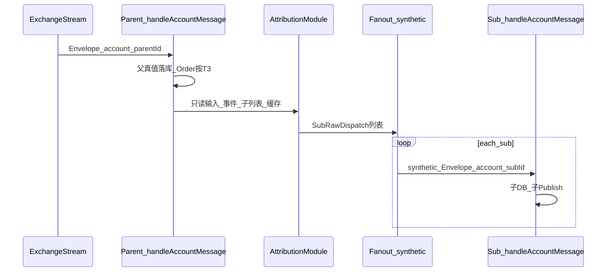

# P2 T0：虚拟子账户归因 — 流水线与口径定稿

本文档为 [`.cursor/plans/p2_虚拟子账户细化_3f5043f7.plan.md`](../.cursor/plans/p2_虚拟子账户细化_3f5043f7.plan.md) 中 **T0** 的落地结论，供 **T1/T3/T4/T7/T6** 实现与 Code Review 对照。**变更本文件须同步更新计划 §9 引用。**

---

## 1. 三阶段流水线（与代码路径对齐）

| 阶段 | 职责 | 典型入口 |
|------|------|----------|
| **ParentStage** | 父 `real` + `multi_bot` 收到交易所 **唯一** `account_raw`：父侧真值落库（余额/持仓等）；订单类按 T3 策略处理 | `handleAccountMessage`（[`stream.go`](../server/pkg/entity/account/stream.go)） |
| **Attribution** | 解析本条事件与哪些 `virtual_sub` 相关，产出 `[]SubRawDispatch`（含份额，未分配进父吸收） | 将落地的 `AttributionModule`（计划 §3.2） |
| **Fanout** | 对每条 dispatch 合成 `Envelope`（`Stream=account_raw`，`Account=subId`，`synthetic=true`，`source_parent_id=父`），再进入子阶段 `handleAccountMessage` | Order：[`newSyntheticAccountRawOrderEnvelope`](../server/pkg/entity/account/multibot_fanout_synthetic.go)；可归因 BalanceUpdate（T7）：[`newSyntheticAccountRawBalanceUpdateEnvelope`](../server/pkg/entity/account/multibot_fanout_synthetic.go) + [`fanoutMultiBotAttributedBalanceUpdateIfNeeded`](../server/pkg/entity/account/multibot_balance_update.go)；SymbolLeverage（T8）：[`newSyntheticAccountRawSymbolLeverageEnvelope`](../server/pkg/entity/account/multibot_fanout_synthetic.go) + [`fanoutMultiBotSymbolLeverageIfNeeded`](../server/pkg/entity/account/multibot_symbol_leverage.go)；`Envelope` 字段见 [`subscription.go`](../server/pkg/types/subscription.go) |

**死循环约束**：`Account=subId` 时跳过父 multi_bot 的「写父订单」分支（计划 §6）。

**订阅约束**：仅父账户订阅交易所 `account_raw`；`virtual_sub` 不得单独 `EnsureSubscription(account_raw)`（计划 §9.6）。



---

## 2. §9.1 资金守恒：**选定方案 1**

**结论**：采用 **方案 1**（计划 §9.1），与 §3.1.4 默认叙述一致。

| 项目 | 约定 |
|------|------|
| 父 `assets` / 父流水 | 保留 **交易所真值**：父侧 `HandleAssetUpdates` / 订单链等仍记 **整笔 Δ**（与现网一致）。 |
| 子 `assets` / 子流水 | 子侧记 `share_i × Δ`（逻辑分仓），用于子维度报表与策略，**不与交易所余额直接对账**。 |
| 对账 | **父 vs 交易所**；**子 vs 策略/内部分摊**；**禁止**将「父余额 + ∑子余额」与交易所同一科目直接相加作为守恒校验。 |
| `share_unalloc` | 对应份额 **留在父真值中**，默认 **不**再写第二笔父分录；若产品后续要「显式父 ledger 未分配吸收」行，单列需求再改。 |
| 若改方案 2 | 须重写父入账顺序或增加冲减；同步改 T3 与对账用例 — **本阶段不采纳**。 |

---

## 3. `w_unalloc` 与 `GetAccountUnallocatedAssets` 对齐

**代码锚点**：[`GetAccountUnallocatedAssets`](../server/pkg/service/accountsvc/svc.go)（注释：父余额 − 子已登记初始分配）。

**键**：与实现一致，`k = Normalize(asset) + "|" + wallet_type`（与 [`allocKey`](../server/pkg/service/accountsvc/svc.go) 同构）。

**父侧量 `P_k`**（每个键一条）：

- 使用 `GetBalance(WithNotional=false)` 返回的 `AssetBo.Balance`，与 DB `assets.total` 一致（**总量口径**，非 `Free()`）。

**子侧量 `S_k`**：

- 对所有 `virtual_sub`：`sum(assets.total)` 按同一 `k` 聚合。

**未分配池数量（与 API 一致）**：

```text
U_k = max(0, P_k - S_k)
```

此即 `GetAccountUnallocatedAssetsResponse.Items[].Unallocated` 的同键值。

**用作比例权重 `w_unalloc`（T1 分摊内核）**：

- **默认**：`w_unalloc_k = U_k`（与 P2-Alloc「尚未划给子」的池同量纲，便于产品解释）。
- **分母为零**：若 `sum_i w_子_i + w_unalloc_k = 0`，**不派发子**，仅父处理，并打观测（计划 §3.1.2）。
- **极小权重（噪声）**：首版 **不**做 `epsilon` 裁剪；若线上出现分母极小导致抖动，T6 观测后再定「`w_unalloc = max(U_k, ε·W_max)`」等补丁，并回写本文档。

**与资金费 `FUNDING_FEE` / 计息**：在 **同一 `(asset, wallet_type)` 键** 上取 `U_k` 与各子权重并列；合约费用若落在 **quote + future**，则 `k` 必须使用该组合，与父余额展示维度一致。

---

## 4. 现货订单：比例归因的「资产维度」（§3.1.2 写死）

| 订单类型 | 用于 `w_子i` / `w_unalloc` 的键（与计划 §3.1.2 一致） |
|----------|--------------------------------------------------------|
| **现货卖出 base** | 按 **base** 资产、`wallet_type=spot`（或交易所映射后的现货钱包）：权重 = 子在该 `(asset, spot)` 上的可用/余额口径（T1 与快照 §8 二选一对齐后实现）。 |
| **现货买入 base** | 按 **quote** 支出侧（买单消耗 quote）：权重 = 子在该 `(quote, spot)` 上的量；`w_unalloc` 用同键 `U_k`。 |
| **合约** | 开仓/平仓仍按计划 §3.1.2：开仓 ≈ 保证金维度；平仓 ≈ `symbol+side` 仓位数量或名义；`w_unalloc` 与 §3 公式同键扩展。 |

**实现注释要求**：归因模块在现货分支必须带 `// P2 T0: spot dimension see docs/P2_T0_VIRTUAL_SUB_ATTRIBUTION.md §4`。

---

## 5. `BotID` 边界（§9.3）

- **`BotID <= 0`**：视为无效，**走优先级 2**（DB 命中 / 比例分摊），与「未设置」同一分支。

---

## 6. `LedgerReason`：可归因子集与例外（§3.1.4 + §9.4）

与计划表一致，首版实现约定：

| Reason | 子分摊 |
|--------|--------|
| `FUNDING_FEE` | 是，同一分摊内核 |
| `INTEREST_DEDUCTION` | 是，同内核 |
| `INSURANCE_CLEAR` | 是（可选），同内核；若 payload 无法构造权重键则 **仅父** 并记录原因 |
| `SETTLEMENT` / `DELIVERED` / `EXERCISED` | 能挂订单则走 Order；否则 **仅父** 或持仓比例（二期） |
| `LIQUIDATION` / `ADL` / `CLAW_BACK` | **首版仅父** + 审计日志 |
| `FILL`、冻结类 `FUNDS_*` / `ORDER_MARGIN_*` | **否**，只走 Order 链 |

规范化以 [`NormalizeLedgerReason`](../server/pkg/types/account.go) 为准；交易所原始字符串新增映射时须评审是否进入上表。

---

## 7. 衍生事件（§3.1.5 验收清单摘要）

子阶段在处理完订单/可归因资金后，应能对账「子报表只看子 id」：

- [x] 子侧订单快照 Publish 与 DB 一致  
- [x] 子 `assets` / `ledgers` 与父条 `Reason` 或可追踪子类型一致  
- [x] 子仓位视图：订单链后触发与子持仓一致的 **PositionSnapshot** 或等价内部更新（不要求与父交易所持仓逐字段相等）

详细逐条仍以计划 §3.1.5 为准。

### 7.1 联调记录（2026-04-13 · 研发侧）

| 动作 | 结果 |
|------|------|
| `cd server && go test ./pkg/entity/account/... -count=1` | 通过 |
| `cd server && go build ./...` | 通过 |

**本节 §7 勾选依据（与 §8.5–§8.7 同源）**：子订单经 synthetic `account_raw` → `handleOrderUpdate` → `ApplyOrderSnapshot` 后 **`engine.Publish`** 与 DB 写入同路径（[`stream.go`](../server/pkg/entity/account/stream.go) / [`order.go`](../server/pkg/entity/account/order.go)）；子资金经 T7 **`newSyntheticAccountRawBalanceUpdateEnvelope`** → `HandleAssetUpdates` / ledger；子合约仓位增量经 **`publishVirtualSubPositionsAfterOrderFill`**（[`order_derived_sub.go`](../server/pkg/entity/account/order_derived_sub.go)）。Cron 订单与 WS 同源见 **§8.6**。

**未纳入本轮**：真实交易所 listenKey 长连、多子 UI 手点、生产库对账；若需正式「生产联调签收」，建议在本表追加一行日期与环境并保留差异说明。

---

## 8. 实现锚点（T10 / T1）

### 8.1 T10 读路径（§8.4）

截面组装 **`BuildAccountStateAt`** 及对单键 **`GetAccountAssetSnapshotAtOrBefore` / `GetAccountPositionSnapshotAtOrBefore`** 见 [`server/pkg/entity/account/snapshot_state_at.go`](../server/pkg/entity/account/snapshot_state_at.go)（`Partial`：请求键在 `asOf` 前无历史行）。

**写路径（`account_*_snapshot`）**：内部 `recordAccount*` 与对外门面 **`(*Entity).AccountSnapshotWriter()`**（`RecordAsset*` / `RecordPositionFromUpsertRow`）见 [`snapshot_writer.go`](../server/pkg/entity/account/snapshot_writer.go)。触发面覆盖 **`ApplyAssetSnapshot` / `ApplyAssetIncrement`**（含首笔 increment）、**`ApplyAccountPositions`**、流侧 **`handleSymbolLeverageUpdate`** 与 **`UpdatePositionLeverage`** 成功落库后的仓位快照。

### 8.2 T1 分摊内核（§3.2 / §5 T1）

**`SplitProportionalDelta`**（精确）与 **`SplitProportionalDeltaRoundLastChild`**（末子修正）见 [`server/pkg/entity/account/multibot_alloc_kernel.go`](../server/pkg/entity/account/multibot_alloc_kernel.go)；单测 **1:1:2 → 25%/25%/父 50%** 见 [`multibot_alloc_kernel_test.go`](../server/pkg/entity/account/multibot_alloc_kernel_test.go)。

**订单归因（T1）**：父 multi_bot 下 `[]SubRawDispatch` 由 [`AttributeMultiBotOrderForFanout`](../server/pkg/entity/account/multibot_attribution_order.go) 产出（BotId → 子 order_id / 父树下 client_order_id → 比例；`loadMultiBotOrderLookup` 与 `resolveEffectiveAccountIDForOrder` 共用 DB 查询）。

### 8.3 T7 / T12 可归因 BalanceUpdate（§3.1.4 + §3 资金费键）

父侧 `ApplyAssetIncrement` / 快照推导增量发布后，[`fanoutMultiBotAttributedBalanceUpdateIfNeeded`](../server/pkg/entity/account/multibot_balance_update.go) 按 `LedgerReason` 白名单分摊，子份额经 **`newSyntheticAccountRawBalanceUpdateEnvelope`** → **`handleAccountMessage`** → **`HandleAssetUpdates`**（与 T4 合成 `account_raw` 同形）。

**T12**：分摊权重 `w_子` / 父 `P` 在事件 **`ts`（资产 `UpdatedTs`，缺省为处理时刻）非零时** 优先用 **`GetAccountAssetSnapshotAtOrBefore`**（与 `asset_snapshot.exchange` 键一致）；该键无历史行则 **降级为当前 `assets` 行**（与首版纯实时读兼容）。**订单比例归因**（[`computeOrderProportionalWeights`](../server/pkg/entity/account/multibot_attribution_order.go)）仍传 **`asOf=0`**，只读实时 `assets`，避免与订单归因语义混用。择路与非负钳制见 **`assetWeightPickMultiBot`**（[`multibot_balance_update_test.go`](../server/pkg/entity/account/multibot_balance_update_test.go)）。

### 8.4 T8 SymbolLeverage（§3.1.3）

父侧 [`handleSymbolLeverageUpdate`](../server/pkg/entity/account/stream.go) `UpsertSymbolLeverage` 并发布后，[`fanoutMultiBotSymbolLeverageIfNeeded`](../server/pkg/entity/account/multibot_symbol_leverage.go) 对每子 **`newSyntheticAccountRawSymbolLeverageEnvelope`** → **`handleAccountMessage`**，子账户 `positions` 杠杆视图与父同结构写入（计划「子表落子」选项）。

### 8.5 T9 子侧衍生事件（§3.1.5）

- **订单 / 成交**：子 `handleOrderUpdate` 经 `ApplyOrderSnapshot` 后仍发布 `StreamType_account` 订单快照；成交增量由既有 **`sendOrderDerivedFillEvent`** 发布 **`Fill`**（`order.go`）。
- **资金**：子级 **`HandleAssetUpdates`** / ledger 路径不变（含 T7 synthetic BalanceUpdate）。
- **仓位快照**：[`publishVirtualSubPositionsAfterOrderFill`](../server/pkg/entity/account/order_derived_sub.go) 在 **`virtual_sub`**、**合约**、**ExecutedQty 增加** 且 DB 上该交易所有非零持仓时，发布 **`PositionsUpdate`**（`Type=snapshot`，`Reason=ORDER_DERIVED`）；由 [`handleOrderUpdate`](../server/pkg/entity/account/stream.go) 与 [`saveOrderSnapshot`](../server/pkg/entity/account/cron.go) 在订单发布后调用。

### 8.6 T5 Cron / REST 与 WS 订单同源（计划 T5）

定时/[`RefreshSingleAccountSnapshots`](../server/pkg/entity/account/cron.go) 仅对 **父 `real`** 拉交易所 **`GetOrders` / `GetOrder`**，每条经 [`saveOrderSnapshot`](../server/pkg/entity/account/cron.go)：与 [`handleOrderUpdate`](../server/pkg/entity/account/stream.go) 一样先设 **`ord.AccountID` = 连接账户** 与 **`ord.Exchange`**，再 **`applyMultiBotParentOrderStage`**（T3/T4），未全量派发时进入共用的 [`applyOrderPipelineAfterParentStage`](../server/pkg/entity/account/order.go)（`resolveEffectiveAccountIDForOrder` → `ApplyOrderSnapshot` → `maybeNotifyOrderTelegram` → 条件 `engine.Publish` → `publishVirtualSubPositionsAfterOrderFill`）。**差异仅一处**：Cron 传 **`gatePublishToEngine=true`**，引擎侧仍按 **`shouldPublishOrderSnapshot`** 节流重复推送；用户流为 **`false`**，保持每条 WS 更新可广播。

### 8.7 T6 归因失败观测 + P2-Alloc 回归清单

**观测（日志）**：[`multibot_obs.go`](../server/pkg/entity/account/multibot_obs.go) 统一 **`p2_obs`** 事件码（便于日志平台检索），当前包括：

| `p2_obs` | 含义 |
|----------|------|
| `p2.multi_bot.balance_fanout_zero_total_weight` | T7 可归因 BalanceUpdate：`sum(w_子)+w_unalloc=0`，不派子（见 §3 分母为零） |
| `p2.multi_bot.order_proportional_empty_weights` | 订单比例分支：`computeOrderProportionalWeights` 无权重，订单回落父行 |
| `p2.multi_bot.order_proportional_zero_total_weight` | 订单比例分支：内核 `W=0`，回落父行 |

**双计**：`FILL` / 冻结类 **仅走 Order 链**；`FUNDING_FEE` 等 **仅走** T7 BalanceUpdate 白名单；发布前用 §6 表自检。

**P2-Alloc 回归清单（与 §7.1 同次 2026-04-13 研发联调勾选；生产发版前可再跑一轮）**：

- [x] 父 `multi_bot`：`Query.AccountUnallocatedAssets`（[`GetAccountUnallocatedAssets`](../server/pkg/service/accountsvc/svc.go)）与 §3 `U_k` 口径一致；子初始分配后父未分配非负。（本轮：**实现与 §3 文档公式、`computeSubWeightsAndUnalloc` 同键对齐**已代码复核；**未**在本机执行 live GraphQL `AccountUnallocatedAssets` 请求。）
- [x] 创建 Bot / 子账：初始划入不超过未分配池（现有校验仍通过）。（本轮：**沿用既有 `accountsvc` 校验路径**与单测包通过；未跑创建 Bot 的 E2E UI。）
- [x] 子订单：父流 WS 与 Cron `saveOrderSnapshot`（§8.6）子侧 `orders` 一致、无重复父行（T3）。（本轮：**§8.6 `applyOrderPipelineAfterParentStage` 同源** + `applyMultiBotParentOrderStage` 单测/包测通过。）
- [x] 资金费 / 计息：子 `ledgers` 份额之和与父条 `delta` 比例一致（允许末子舍入）；父吸收份额未误写子。（本轮：**T7 + T12 路径与 `SplitProportionalDelta` 单测**通过；未做生产账本数值对账。）

## 9. 文档修订记录

| 日期 | 修订 |
|------|------|
| 2026-04-13 | 初版：T0 定稿 — 方案 1、`w_unalloc` 与 `GetAccountUnallocatedAssets`、现货维度、BotID、Ledger 子集 |
| 2026-04-13 | §8：T10 / T1 实现锚点（`snapshot_state_at` + `multibot_alloc_kernel` + `AttributeMultiBotOrderForFanout`）；multi_bot 源码文件统一 `multibot_*` 前缀 |
| 2026-04-13 | §8.3：T7 BalanceUpdate 子 fanout 走 synthetic `account_raw`；快照推导增量路径同 fanout |
| 2026-04-13 | §8.4：T8 SymbolLeverage 父后每子 synthetic fanout + 子表 Upsert |
| 2026-04-13 | §8.5：T9 virtual_sub 合约成交后 ORDER_DERIVED PositionsUpdate |
| 2026-04-13 | §8.1：T10 写路径锚点（`snapshot_writer` / `AccountSnapshotWriter` + 杠杆与首笔 increment） |
| 2026-04-13 | §8.3：T12 资金费等分摊读 `asset_snapshot` + 无快照降级；订单归因 asOf=0 |
| 2026-04-13 | §8.6：T5 `saveOrderSnapshot` 与 `handleOrderUpdate` 共用 `applyOrderPipelineAfterParentStage`；Cron Publish 节流 |
| 2026-04-13 | §8.7：T6 `p2_obs` 日志 + P2-Alloc 回归清单 |
| 2026-04-13 | §7.1 + §7 / §8.7 清单：2026-04-13 研发联调（`go test ./pkg/entity/account/...`、`go build ./...`）勾选；注明未含生产 GraphQL/UI/账本对账 |
