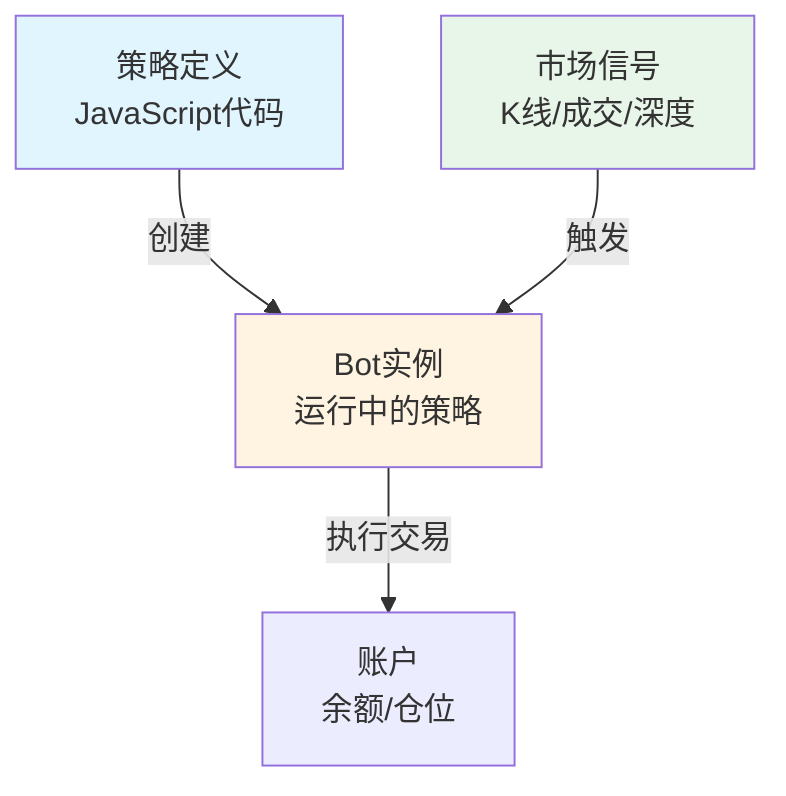
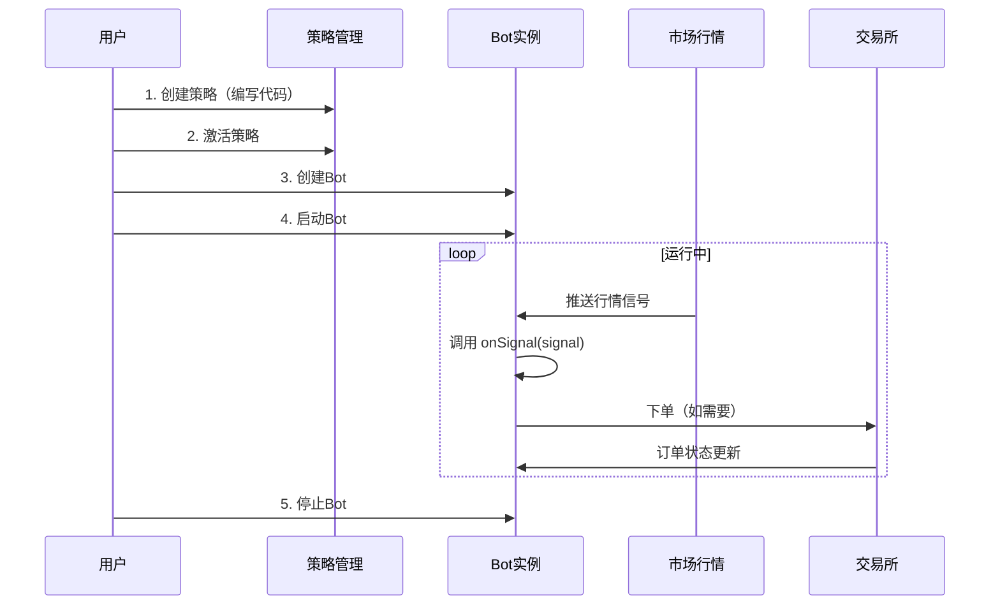
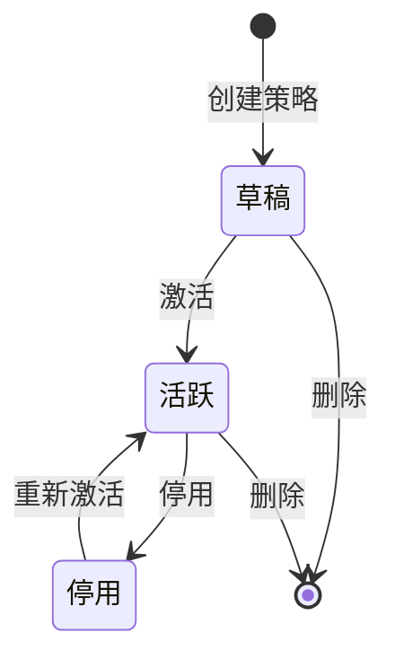
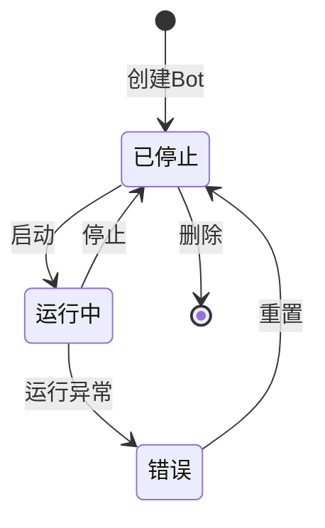
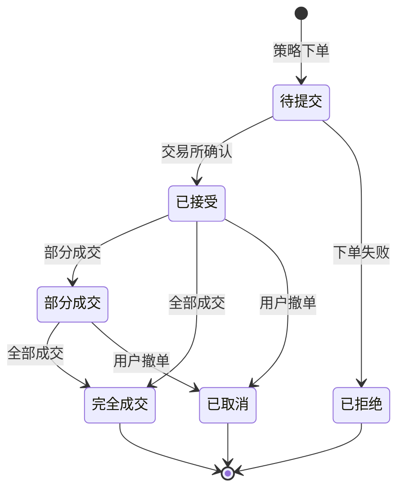
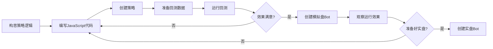

# 策略开发手册

欢迎使用 **NovaForge** 交易策略能力！本手册将帮助您使用 JavaScript 创建和管理自定义交易策略。

> **版本**: v1.1
> **更新日期**: 2026-05-03

---

## 目录

### 1. [快速开始](#1-快速开始)
- 1.1 [什么是策略？](#11-什么是策略)
- 1.2 [5分钟创建第一个策略](#12-5分钟创建第一个策略)
- 1.3 [三种运行模式](#13-三种运行模式)

### 2. [系统概览](#2-系统概览)
- 2.1 [核心概念](#21-核心概念)
- 2.2 [工作流程](#22-工作流程)
- 2.3 [支持的交易所和市场](#23-支持的交易所和市场)

### 3. [策略生命周期](#3-策略生命周期)
- 3.1 [策略状态](#31-策略状态)
- 3.2 [Bot 状态](#32-bot-状态)
- 3.3 [订单生命周期](#33-订单生命周期)

### 4. [信号与事件](#4-信号与事件)
- 4.1 [什么是信号？](#41-什么是信号)
- 4.2 [信号对象结构](#42-信号对象结构)
- 4.3 [市场信号](#43-市场信号)
  - KLINE - K线信号
  - TICKER - Ticker信号
  - DEPTH - 订单簿信号
  - TRADE - 成交信号
  - MARK_PRICE - 标记价格信号
- 4.4 [账户信号](#44-账户信号)
  - ORDER - 订单信号
  - FILL - 成交信号
  - BALANCE - 余额变动信号
  - POSITION - 仓位信号
- 4.5 [风控信号](#45-风控信号)
  - LEVERAGE - 杠杆变更信号
  - RISK - 风险事件信号
- 4.6 [系统信号](#46-系统信号)
  - TIMER - 定时器信号
- 4.7 [信号订阅配置](#47-信号订阅配置)

### 5. [JavaScript API 参考](#5-javascript-api-参考)
- 5.1 [必需函数](#51-必需函数)
  - onInit() - 初始化函数（可选）
  - onSignal(signal) - 信号处理函数（必需）
- 5.2 [全局对象](#52-全局对象)
  - params - 策略参数
  - console - 日志输出
  - time - 时间工具
  - ai - 大模型调用
  - indicator - 技术指标
- 5.3 [symbols 数组](#53-symbols-数组)
- 5.4 [交易对 API（SymbolHandle）](#54-交易对-apisymbolhandle)
  - 状态存储方法
  - 行情数据方法
  - 交易执行方法
  - 账户查询方法
  - 合约专用方法
- 5.5 [多交易对策略](#55-多交易对策略)
  - WithSymbol - 访问特定交易对
  - WithExchange - 访问交易所级别信息
- 5.6 [内置库支持](#56-内置库支持)
  - decimal.js - 高精度数值计算
  - lodash - 实用工具库
  - moment - 时间处理库
- 5.7 [安全限制](#57-安全限制)

### 6. [开发您的第一个策略](#6-开发您的第一个策略)
- 6.1 [策略开发流程](#61-策略开发流程)
- 6.2 [示例：双均线策略](#62-示例双均线策略)
  - 策略逻辑
  - 参数配置
  - 策略代码
  - 信号处理
- 6.3 [参数配置建议](#63-参数配置建议)

### 7. [调试与测试](#7-调试与测试)
- 7.1 [回测流程](#71-回测流程)
- 7.2 [模拟盘测试](#72-模拟盘测试)
- 7.3 [日志调试](#73-日志调试)

### 8. [常见问题](#8-常见问题)
- 8.1 [策略问题](#81-策略问题)
- 8.2 [Bot 问题](#82-bot-问题)
- 8.3 [性能问题](#83-性能问题)

### 9. [进阶主题](#9-进阶主题)
- 9.1 [多信号类型处理](#91-多信号类型处理)
- 9.2 [跨交易所套利](#92-跨交易所套利)
- 9.3 [风险控制](#93-风险控制)
- 9.4 [状态管理](#94-状态管理)
- 9.5 [使用定时器](#95-使用定时器)
- 9.6 [使用 lodash 优化数据处理](#96-使用-lodash-优化数据处理)
- 9.7 [使用 moment 实现时间策略](#97-使用-moment-实现时间策略)
- 9.8 [组合使用：智能数据分析策略](#98-组合使用智能数据分析策略)
- 9.9 [完整实战案例：马丁格尔合约策略](#99-完整实战案例马丁格尔合约策略)
  - 策略概述
  - 策略参数
  - 完整代码
  - 核心逻辑解析
  - 配置示例
  - 风险提示

### 附录
- [附录 A: 术语表](#附录-a-术语表)
- [附录 B: 技术指标列表](#附录-b-技术指标列表)
- [附录 C: 信号类型快速参考](#附录-c-信号类型快速参考)
- [附录 D: 完整策略模板](#附录-d-完整策略模板)

### [结语](#结语)

---

## 1. 快速开始

### 1.1 什么是策略？

策略是一段 JavaScript 代码，它可以：
- 监听市场行情（K线、成交、深度等）
- 分析数据并做出交易决策
- 自动下单买卖

### 1.2 5分钟创建第一个策略

```javascript
// 简单的均线策略
const Decimal = require("decimal.js");

function onSignal(signal) {
  // 只处理K线信号
  if (signal.type !== 'KLINE') return;
  if (!signal.isClosed) return;  // 只处理已完成的K线
  
  const price = new Decimal(signal.close);
  
  var sym = WithSymbol(signal.exchange, signal.symbol);
  if (!sym) {
    console.log('invalid symbol');
    return;
  }

  // 获取历史K线计算均线
  const klines = sym.GetKlines("1h", 20);
  if (klines.length < 5) return;
  
  // 计算5周期简单移动平均（使用 Decimal 精确计算）
  var sum = new Decimal(0);
  for (var i = klines.length - 5; i < klines.length; i++) {
    sum = sum.plus(new Decimal(klines[i].close));
  }
  const ma5 = sum.div(5);
  
  // 获取当前仓位
  const positions = sym.GetPositions();
  const hasPosition = positions && positions.length > 0 && new Decimal(positions[0].amount).gt(0);
  
  // 交易逻辑（使用 Decimal 比较）
  if (price.gt(ma5) && !hasPosition) {
    // 价格上穿均线且无仓位，买入
    sym.Buy({
      type: "MARKET",
      amount: "100"  // 买入100 USDT
    });
    console.log("买入信号 - 价格:", price.toString(), "MA5:", ma5.toString());
  } else if (price.lt(ma5) && hasPosition) {
    // 价格下穿均线且有仓位，卖出
    sym.Sell({
      type: "MARKET",
      amount: positions[0].amount
    });
    console.log("卖出信号 - 价格:", price.toString(), "MA5:", ma5.toString());
  }
}
```

### 1.3 三种运行模式

| 模式 | 说明 | 适用场景 |
|-----|------|---------|
| **回测模式** | 使用历史数据模拟 | 验证策略逻辑 |
| **模拟盘** | 实时行情 + 虚拟资金 | 测试策略效果 |
| **实盘** | 真实交易所下单 | 正式运行 |

---

## 2. 系统概览

### 2.1 核心概念



**关键术语**：

- **策略（Strategy）**: 您编写的 JavaScript 代码，包含交易逻辑
- **Bot**: 策略的运行实例，可以创建多个 Bot 运行同一个策略
- **信号（Signal）**: 市场事件（如K线更新）或账户事件（如订单成交）
- **数据源（Datasource）**: 回测时使用的历史数据

### 2.2 工作流程



### 2.3 支持的交易所和市场

#### 支持的交易所

| 交易所 | 标识符 | 说明 |
|-------|--------|------|
| 币安 | `binance` | Binance 交易所（生产环境） |
| OKX | `okx` | OKX 交易所（生产环境） |
| 币安测试网 | `binance_test` | Binance 测试网络 |
| OKX 测试网 | `okx_test` | OKX 测试网络 |

**使用示例**：
```javascript
// 访问生产环境交易所
const binance = WithSymbol("binance", "BTCUSDT:SPOT");
const okx = WithSymbol("okx", "ETHUSDT:FUTURE");

// 访问测试环境（用于开发调试）
const binanceTest = WithSymbol("binance_test", "BTCUSDT:SPOT");
const okxTest = WithSymbol("okx_test", "ETHUSDT:FUTURE");
```

#### 支持的市场类型

| 市场类型 | 标识符 | 说明 |
|---------|--------|------|
| 现货 | `SPOT` | 现货交易市场 |
| 合约 | `FUTURE` | 期货/合约交易市场 |

#### 交易对格式规范

交易对必须使用统一格式：**`{base}/{quote}:{type}`**

**格式说明**：
- `{base}`: 基础货币（如 BTC, ETH）
- `{quote}`: 计价货币（如 USDT, USD）
- `{type}`: 市场类型（SPOT 或 FUTURE，必需）
- 分隔符：使用 `/` 分隔 base 和 quote，使用 `:` 分隔交易对和类型

**格式示例**：

| 交易对 | 说明 |
|-------|------|
| `BTC/USDT:SPOT` | BTC/USDT 现货 |
| `ETH/USDT:SPOT` | ETH/USDT 现货 |
| `BTC/USDT:FUTURE` | BTC/USDT 永续合约 |
| `ETH/USDT:FUTURE` | ETH/USDT 永续合约 |

**重要提示**：
- ✅ 必须包含市场类型 `:SPOT` 或 `:FUTURE`
- ❌ 不支持简写格式（如 `BTCUSDT`）
- ✅ 正确示例：`BTC/USDT:SPOT`
- ❌ 错误示例：`BTCUSDT`, `BTC/USDT`（缺少类型）

**代码示例**：
```javascript
function onInit() {
  // ✅ 正确：完整格式
  const btcSpot = WithSymbol("binance", "BTC/USDT:SPOT");
  const ethFuture = WithSymbol("binance", "ETH/USDT:FUTURE");
  
  console.log("BTC现货:", btcSpot.symbol, btcSpot.type);  // BTC/USDT:SPOT, SPOT
  console.log("ETH合约:", ethFuture.symbol, ethFuture.type);  // ETH/USDT:FUTURE, FUTURE
  
  // ❌ 错误：不支持简写格式
  // const btc = WithSymbol("binance", "BTCUSDT");  // 错误！
}
```

---

## 3. 策略生命周期

### 3.1 策略状态



- **草稿**: 刚创建，还在编写和测试中
- **活跃**: 已激活，可以创建 Bot 运行
- **停用**: 暂时停用，不能创建新 Bot

### 3.2 Bot 状态



- **已停止**: Bot 已创建但未运行
- **运行中**: Bot 正在监听信号并执行策略
- **错误**: 运行异常（可查看错误信息）

### 3.3 订单生命周期



---

## 4. 信号与事件

### 4.1 什么是信号？

信号是触发您的策略代码执行的事件。每当有新的信号到达，系统会调用 `onSignal(signal)` 函数，并将信号对象作为参数传递。

### 4.2 信号对象结构

每个信号对象都包含以下基础字段：

```javascript
{
  // 基础字段（所有信号都有）
  id: "uuid",                    // 信号唯一标识
  type: "KLINE",                 // 信号类型（大写）
  kind: "kline",                 // 信号种类（小写，更细粒度）
  exchange: "binance",           // 交易所
  symbol: "BTCUSDT",            // 交易对
  ts: 1234567890000,            // 时间戳（毫秒）
  accountId: "account_id",      // 账户ID（账户相关信号才有）
  topic: "topic_name",          // 主题（可选）
  
  // 类型特定字段（根据 type 和 kind 不同）
  // ...
}
```

**重要**：信号的类型特定字段直接在 signal 对象的顶层，不在嵌套的 data 字段中。

### 4.3 市场信号

#### KLINE - K线信号

```javascript
{
  type: "KLINE",
  kind: "kline",
  exchange: "binance",
  symbol: "BTCUSDT",
  ts: 1234567890000,
  
  // K线特定字段
  interval: "1m",           // K线周期：1m, 5m, 15m, 1h, 4h, 1d 等
  open: "50000.00",        // 开盘价（字符串格式的 decimal）
  high: "50100.00",        // 最高价
  low: "49900.00",         // 最低价
  close: "50050.00",       // 收盘价
  volume: "123.45",        // 成交量
  openTs: 1234567800000,   // K线开始时间戳
  isClosed: true           // 是否已收盘（true表示K线完成）
}
```

**使用示例**：
```javascript
function onSignal(signal) {
  if (signal.type === 'KLINE') {
    console.log("K线收盘:", signal.close);
    console.log("周期:", signal.interval);
    console.log("是否完成:", signal.isClosed);
    
    // 计算涨跌幅（使用 Decimal 精确计算）
    const Decimal = require("decimal.js");
    const close = new Decimal(signal.close);
    const open = new Decimal(signal.open);
    const change = close.minus(open).div(open);
    console.log("涨跌幅:", change.mul(100).toFixed(2), "%");
  }
}
```

#### TICKER - Ticker行情信号

```javascript
{
  type: "TICKER",
  kind: "ticker",
  exchange: "binance",
  symbol: "BTCUSDT",
  ts: 1234567890000,
  
  // Ticker特定字段
  price: "50000.00",       // 最新价格
  volume: "1234567.89"     // 24小时成交量
}
```

#### DEPTH - 订单簿深度信号

```javascript
{
  type: "DEPTH",
  kind: "depth",
  exchange: "binance",
  symbol: "BTCUSDT",
  ts: 1234567890000,
  
  // 深度特定字段
  orderBook: {
    bids: [                 // 买单
      { price: "49999.00", size: "1.5" },
      { price: "49998.00", size: "2.3" }
    ],
    asks: [                 // 卖单
      { price: "50001.00", size: "1.2" },
      { price: "50002.00", size: "3.1" }
    ]
  }
}
```

**使用示例**：
```javascript
function onSignal(signal) {
  if (signal.type === 'DEPTH') {
    const Decimal = require("decimal.js");
    const orderBook = signal.orderBook;
    const bestBid = orderBook.bids[0];  // 买一价
    const bestAsk = orderBook.asks[0];  // 卖一价
    const spread = new Decimal(bestAsk.price).minus(new Decimal(bestBid.price));
    
    console.log("买一价:", bestBid.price, "数量:", bestBid.size);
    console.log("卖一价:", bestAsk.price, "数量:", bestAsk.size);
    console.log("价差:", spread.toString());
  }
}
```

#### TRADE - 市场成交信号

```javascript
{
  type: "TRADE",
  kind: "trade",
  exchange: "binance",
  symbol: "BTCUSDT",
  ts: 1234567890000,
  
  // 成交特定字段
  orderId: "exchange_order_id",  // 交易所订单ID
  qty: "0.1",                    // 成交数量
  price: "50000.00",             // 成交价格
  fee: "5.00"                    // 手续费
}
```

#### MARK_PRICE - 标记价格信号（合约）

```javascript
{
  type: "MARK_PRICE",
  kind: "mark_price",
  exchange: "binance",
  symbol: "BTCUSDT",
  ts: 1234567890000,
  
  // 标记价格特定字段
  price: "50000.00"              // 标记价格
}
```

### 4.4 账户信号

#### ORDER - 订单信号

订单信号有多个 kind，表示订单的不同状态：

**订单生命周期信号**（kind: "order_lifecycle"）：
```javascript
{
  type: "ORDER",
  kind: "order_lifecycle",
  exchange: "binance",
  symbol: "BTCUSDT",
  accountId: "account_id",
  ts: 1234567890000,
  
  // 订单生命周期特定字段
  orderId: "order_id",           // 订单ID
  status: "filled",              // 订单状态：accepted, filled, canceled, rejected
  code: "",                      // 交易所错误码（失败时）
  reason: ""                     // 失败原因（失败时）
}
```

**订单快照信号**（kind: "order_snapshot"）：
```javascript
{
  type: "ORDER",
  kind: "order_snapshot",
  exchange: "binance",
  symbol: "BTCUSDT",
  accountId: "account_id",
  ts: 1234567890000,
  
  // 订单快照特定字段
  orderId: "order_id",
  triggerKind: "fill",           // 触发快照的事件类型
  order: {                       // 订单完整信息
    id: "order_id",
    status: "partial_filled",
    side: "buy",
    type: "limit",
    price: "50000.00",
    quantity: "1.0",
    executedQty: "0.5",
    avgPrice: "50000.00"
    // ... 更多订单字段
  }
}
```

**使用示例**：
```javascript
function onSignal(signal) {
  if (signal.type === 'ORDER') {
    if (signal.kind === 'order_lifecycle') {
      console.log("订单状态变化:", signal.orderId, signal.status);
      
      if (signal.status === 'rejected') {
        console.error("订单被拒绝:", signal.reason);
      }
    }
    else if (signal.kind === 'order_snapshot') {
      const order = signal.order;
      console.log("订单快照:", order.id);
      console.log("已成交:", order.executedQty, "/", order.quantity);
    }
  }
}
```

#### FILL - 订单成交信号

```javascript
{
  type: "FILL",
  kind: "fill",
  exchange: "binance",
  symbol: "BTCUSDT",
  accountId: "account_id",
  ts: 1234567890000,
  
  // 成交特定字段
  orderId: "order_id",           // 订单ID
  side: "long",                  // 方向：long, short
  isBuy: true,                   // 是否买入
  qty: "0.1",                    // 成交数量
  price: "50000.00",             // 成交价格
  fee: "5.00",                   // 手续费
  asset: "USDT",                 // 手续费资产
  realizedPnl: "10.50"          // 已实现盈亏（不含手续费）
}
```

**使用示例**：
```javascript
function onSignal(signal) {
  if (signal.type === 'FILL') {
    console.log("订单成交:", signal.orderId);
    console.log("方向:", signal.isBuy ? "买入" : "卖出");
    console.log("成交价:", signal.price, "数量:", signal.qty);
    console.log("手续费:", signal.fee, signal.asset);
    console.log("已实现盈亏:", signal.realizedPnl);
    
    // 计算净收益（使用 Decimal 精确计算）
    const Decimal = require("decimal.js");
    const realizedPnl = new Decimal(signal.realizedPnl);
    const fee = new Decimal(signal.fee);
    const netProfit = realizedPnl.minus(fee);
    console.log("净收益:", netProfit.toString());
  }
}
```

#### BALANCE - 余额变动信号

**重要**：余额信号是增量（delta）语义，不是快照。

```javascript
{
  type: "BALANCE",
  kind: "balance_changed",
  exchange: "binance",
  accountId: "account_id",
  ts: 1234567890000,
  
  // 余额变动特定字段
  walletType: "spot",            // 钱包类型：spot, futures, margin
  asset: "USDT",                 // 资产
  free: "100.00",                // 可用余额变动量（正为增加，负为减少）
  frozen: "-100.00"              // 冻结余额变动量（正为增加，负为减少）
}
```

**使用示例**：
```javascript
const Decimal = require("decimal.js");

function onSignal(signal) {
  if (signal.type === 'BALANCE') {
    const freeChange = new Decimal(signal.free);
    const frozenChange = new Decimal(signal.frozen);
    
    console.log("资产:", signal.asset);
    const freeChangeStr = freeChange.gt(0) ? "+" + freeChange.toString() : freeChange.toString();
    console.log("可用余额变动:", freeChangeStr);
    console.log("冻结余额变动:", frozenChange > 0 ? "+" + frozenChange : frozenChange);
    
    // 判断是入账还是出账
    if (freeChange > 0) {
      console.log("资金入账:", freeChange.toString());
    } else if (freeChange.lt(0)) {
      console.log("资金出账:", freeChange.abs().toString());
    }
  }
}
```

#### POSITION - 仓位变动信号

**重要**：仓位信号是快照（snapshot）语义，不是增量。

```javascript
{
  type: "POSITION",
  kind: "position_changed",
  exchange: "binance",
  symbol: "BTCUSDT",
  accountId: "account_id",
  ts: 1234567890000,
  
  // 仓位特定字段
  side: "long",                  // 方向：long, short
  qty: "1.5",                    // 持仓数量（正为多头，负为空头）
  entryPrice: "50000.00"         // 持仓均价
}
```

**使用示例**：
```javascript
const Decimal = require("decimal.js");

function onSignal(signal) {
  if (signal.type === 'POSITION') {
    const qty = new Decimal(signal.qty);
    
    if (qty.eq(0)) {
      console.log("仓位已清空");
    } else {
      console.log("持仓方向:", signal.side);
      console.log("持仓数量:", signal.qty);
      console.log("持仓均价:", signal.entryPrice);
      
      // 计算浮动盈亏（需要当前价格）- 使用 Decimal 精确计算
      const Decimal = require("decimal.js");
      const ticker = symbols[0].GetTicker();
      if (ticker) {
        const currentPrice = new Decimal(ticker.last_price);
        const entryPrice = new Decimal(signal.entryPrice);
        const unrealizedPnl = currentPrice.minus(entryPrice).mul(qty);
        console.log("当前价格:", currentPrice.toString());
        console.log("浮动盈亏:", unrealizedPnl.toFixed(2));
      }
    }
  }
}
```

#### LEVERAGE - 杠杆变更信号

```javascript
{
  type: "LEVERAGE",
  kind: "leverage_changed",
  exchange: "binance",
  symbol: "BTCUSDT",
  accountId: "account_id",
  ts: 1234567890000,
  
  // 杠杆特定字段
  leverage: 10                   // 杠杆倍数
}
```

### 4.5 风控信号

#### RISK - 风控事件信号

**资金费结算**（kind: "funding_settlement"）：
```javascript
{
  type: "RISK",
  kind: "funding_settlement",
  exchange: "binance",
  symbol: "BTCUSDT",
  accountId: "account_id",
  ts: 1234567890000,
  
  // 资金费特定字段
  fundingAmount: "-5.25",        // 资金费金额（正为收入，负为支出）
  fundingRate: "0.0001",         // 资金费率
  positionQty: "1.0",            // 持仓数量
  markPrice: "50000.00"          // 标记价格
}
```

**资金费率**（kind: "funding_rate"）：
```javascript
{
  type: "RISK",
  kind: "funding_rate",
  exchange: "binance",
  symbol: "BTCUSDT",
  ts: 1234567890000,
  
  // 资金费率特定字段
  rate: "0.0001"                 // 资金费率
}
```

### 4.6 系统信号

#### TIMER - 定时器信号

```javascript
{
  type: "TIMER",
  kind: "timer",
  ts: 1234567890000,
  
  // 定时器特定字段
  time: "2026-02-17T10:00:00Z"   // 定时器时间
}
```

**使用示例**：
```javascript
function onSignal(signal) {
  if (signal.type === 'TIMER') {
    console.log("定时器触发:", new Date(signal.ts));
    
    // 执行定期任务
    checkPositions();
    rebalancePortfolio();
  }
}
```

### 4.7 信号订阅配置

在创建策略时，您需要定义订阅哪些信号：

```json
{
  "signals": [
    {
      "type": "KLINE",
      "scope": "symbol",
      "exchange": "binance",
      "symbol": "BTC/USDT:SPOT",
      "props": {
        "interval": "1m"
      }
    },
    {
      "type": "KLINE",
      "scope": "symbol",
      "exchange": "binance",
      "symbol": "ETH/USDT:FUTURE",
      "props": {
        "interval": "5m"
      }
    },
    {
      "type": "TIMER",
      "scope": "strategy",
      "props": {
        "interval": "5m"
      }
    }
  ]
}
```

**Scope 作用域**：
- `symbol`: 每个交易对独立（如 BTC/USDT:SPOT 的 K线）
- `exchange`: 每个交易所独立（如 Binance 的账户事件）
- `strategy`: 整个策略共享（如定时器）

**注意**：
- 交易所必须是支持的值：`binance`, `okx`, `binance_test`, `okx_test`
- 交易对必须使用完整格式：`{base}/{quote}:{type}`
- 市场类型：`SPOT`（现货）或 `FUTURE`（合约）
- ❌ 不支持简写格式（如 `BTCUSDT`）

---

## 5. JavaScript API 参考

### 5.1 必需函数

每个策略**必须**实现 `onSignal` 函数，`onInit` 函数可选：

```javascript
// 初始化函数（可选，Bot启动时调用一次）
function onInit() {
  console.log("策略初始化");
  console.log("订阅的交易对:", symbols.length);
}

// 信号处理函数（必需，每次收到信号时调用）
function onSignal(signal) {
  console.log("收到信号 - 类型:", signal.type, "种类:", signal.kind);
  
  // 根据信号类型处理
  if (signal.type === 'KLINE') {
    handleKline(signal);
  } else if (signal.type === 'ORDER') {
    handleOrder(signal);
  } else if (signal.type === 'FILL') {
    handleFill(signal);
  }
}

// 辅助函数（可选，自定义的函数）
function handleKline(signal) {
  console.log("K线收盘价:", signal.close);
}

function handleOrder(signal) {
  console.log("订单更新:", signal.orderId, signal.kind);
}

function handleFill(signal) {
  console.log("成交:", signal.orderId, signal.price, signal.qty);
}
```

### 5.2 全局对象

#### params（策略参数）

访问创建 Bot 时设置的自定义参数：

```javascript
function onInit() {
  const gridStep = params.gridStep || 0.01;  // 网格间隔
  const orderSize = params.orderSize || 100;  // 下单数量
  console.log("网格间隔:", gridStep);
  console.log("下单数量:", orderSize);
}
```

#### console（日志输出）

输出日志信息，方便调试：

| 方法 | 说明 | 日志级别 |
|-----|------|---------|
| `debug(...args)` | 调试日志 | DEBUG |
| `log(...args)` | 信息日志 | INFO |
| `warn(...args)` | 警告日志 | WARN |
| `error(...args)` | 错误日志 | ERROR |

```javascript
function onSignal(signal) {
  // 调试日志（开发时使用）
  console.debug("收到信号:", signal.type, signal.kind);
  
  // 信息日志（正常运行日志）
  console.log("价格:", signal.close);
  
  // 警告日志（需要注意的情况）
  if (signal.close < 30000) {
    console.warn("价格低于30000，请注意风险");
  }
  
  // 错误日志（异常情况）
  if (!signal.exchange || !signal.symbol) {
    console.error("信号缺少必需字段");
    return;
  }
  
  // 支持多个参数
  console.log("交易对:", signal.exchange, signal.symbol);
  console.log("OHLC:", signal.open, signal.high, signal.low, signal.close);
  
  // 输出对象（会自动转为字符串）
  var sym = WithSymbol(signal.exchange, signal.symbol);
  const ticker = sym.GetTicker();
  console.log("Ticker数据:", JSON.stringify(ticker));
}
```

#### time（时间工具）

获取当前时间：

| 方法 | 说明 | 返回值 |
|-----|------|--------|
| `now()` | 获取当前时间戳 | 毫秒时间戳（整数） |
| `nowISO()` | 获取当前时间ISO字符串 | ISO 8601 格式字符串 |

```javascript
function onSignal(signal) {
  // 获取当前时间戳（毫秒）
  const now = time.now();
  console.log("当前时间戳:", now);
  
  // 获取ISO格式时间字符串
  const nowISO = time.nowISO();
  console.log("ISO时间:", nowISO);  // 如: "2026-02-17T10:30:45.123Z"
  
  // 信号时间
  console.log("信号时间戳:", signal.ts);
  
  // 计算时间差
  const delay = now - signal.ts;
  console.log("信号延迟:", delay, "毫秒");
  
  // 时间比较
  const oneHourAgo = now - 60 * 60 * 1000;
  if (signal.ts > oneHourAgo) {
    console.log("这是最近1小时内的信号");
  }
}
```

#### ai（大模型调用）

`ai.complete(options)` 用于在策略中调用后端受控的大模型网关，适合让模型对当前行情、仓位、账户状态和策略约束生成交易建议。

> **重要**：`ai.complete` 只返回模型建议，不会直接下单。策略代码必须自行判断置信度、风险约束和仓位限制，再通过 `SymbolHandle.Buy()` / `SymbolHandle.Sell()` 执行交易。

**语法**：
```javascript
const decision = ai.complete(options)
```

**参数**：

| 字段 | 类型 | 必填 | 说明 |
|-----|------|------|------|
| `prompt` | string | 与 `messages` 二选一 | 用户提示词。适合把行情、仓位、约束序列化成 JSON 字符串传入 |
| `messages` | array | 与 `prompt` 二选一 | Chat messages，元素格式为 `{ role, content }`，`role` 支持 `system`、`user`、`assistant` |
| `model` | string | 否 | 模型名称。未传时使用系统默认模型配置 |
| `json` | boolean | 否 | 为 `true` 时要求模型返回 JSON，并把 `result` 解析成对象 |
| `responseFormat` | string | 否 | 当前支持 `"json_object"`，等价于 `json: true` |
| `timeoutMs` | number | 否 | 本次 AI 调用超时（毫秒），不能超过 Bot 运行时配置的 `maxAITimeoutMs` |

**返回值**：

| 字段 | 类型 | 说明 |
|-----|------|------|
| `result` | string 或 object | 模型结果。`json: true` 时为解析后的 JSON 对象，否则为文本 |
| `text` | string | 模型返回的原始文本 |
| `json` | object | `json: true` 时的解析对象，和 `result` 相同 |
| `model` | string | 实际使用的模型 |
| `duration` | number | 调用耗时（毫秒） |
| `usage` | object | Token 使用统计（如 provider 返回） |

**基础示例：AI 生成交易建议**

```javascript
function onSignal(signal) {
  if (signal.type !== 'TIMER') return;

  const sym = symbols[0];
  const ticker = sym.GetTicker();
  const positions = sym.GetPositions();
  const account = sym.GetAccount();

  const decision = ai.complete({
    model: params.aiModel,      // 可选：不填则使用系统默认模型
    json: true,
    timeoutMs: 15000,
    prompt: JSON.stringify({
      task: "Return a trading decision as JSON.",
      schema: {
        action: "buy | sell | hold",
        confidence: "0.0 - 1.0",
        reason: "string"
      },
      market: {
        exchange: sym.exchange,
        symbol: sym.symbol,
        ticker: ticker
      },
      account: account,
      positions: positions,
      constraints: {
        allowedActions: ["buy", "sell", "hold"],
        orderAmount: params.orderAmount || "50",
        minConfidence: params.minConfidence || 0.8
      }
    })
  });

  console.log("AI 决策:", JSON.stringify(decision.result));

  if (decision.result.action === "buy" && decision.result.confidence >= (params.minConfidence || 0.8)) {
    sym.Buy({
      type: "MARKET",
      amount: params.orderAmount || "50"
    });
  }
}
```

**messages 示例：分离 system / user 提示词**

```javascript
const decision = ai.complete({
  json: true,
  timeoutMs: 10000,
  messages: [
    {
      role: "system",
      content: "You are a conservative crypto trading assistant. Only return JSON."
    },
    {
      role: "user",
      content: JSON.stringify({
        symbol: signal.symbol,
        ticker: symbols[0].GetTicker(),
        instruction: "Choose buy, sell, or hold."
      })
    }
  ]
});
```

**超时与 Bot runtime 配置**：

创建或修改 Bot 时可以在运行时配置中设置：

```json
{
  "runtime": {
    "signalTimeoutMs": 30000,
    "aiTimeoutMs": 15000,
    "maxAITimeoutMs": 30000
  }
}
```

- `signalTimeoutMs`：单次 `onInit` / `onSignal` 的最大执行时间。
- `aiTimeoutMs`：`ai.complete` 未指定 `timeoutMs` 时使用的默认 AI 超时。
- `maxAITimeoutMs`：策略可在 `ai.complete({ timeoutMs })` 中指定的最大 AI 超时。

> **建议**：`signalTimeoutMs` 应大于或等于 `maxAITimeoutMs`，并预留行情查询、JSON 解析和交易判断的时间。高频行情信号不建议每条都调用 AI，优先使用 `TIMER` 信号或通过 `SymbolHandle.Get()` / `SymbolHandle.Set()` 记录上次调用时间来节流。

#### indicator（技术指标）

计算技术指标：

> **注意**：当前技术指标 API 为简化实现，主要用于演示。实际使用建议自行实现指标计算或通过历史K线数据计算。

| 方法 | 说明 | 参数 | 返回值 |
|-----|------|------|--------|
| `MA(data, period)` | 简单移动平均线 | data: 价格数组<br/>period: 周期 | 结果数组 |
| `EMA(data, period)` | 指数移动平均线 | data: 价格数组<br/>period: 周期 | 结果数组 |
| `RSI(data, period)` | 相对强弱指标 | data: 价格数组<br/>period: 周期 | 结果数组 |
| `MACD(data, ...)` | MACD指标 | data: 价格数组<br/>其他参数 | MACD对象 |

```javascript
function onSignal(signal) {
  if (signal.type !== 'KLINE') return;
  
  var sym = WithSymbol(signal.exchange, signal.symbol);
  
  // 获取历史K线
  const klines = sym.GetKlines("1h", 100);
  
  // 提取收盘价数组（直接使用字符串，无需转换）
  const closes = [];
  for (let i = 0; i < klines.length; i++) {
    closes.push(klines[i].close);
  }
  
  // 计算技术指标
  const ma5 = indicator.MA(closes, 5);
  const ma20 = indicator.MA(closes, 20);
  const ema12 = indicator.EMA(closes, 12);
  const rsi14 = indicator.RSI(closes, 14);
  
  console.log("MA5:", ma5);
  console.log("MA20:", ma20);
  console.log("RSI14:", rsi14);
}
```

**自定义指标计算示例**：

由于内置指标功能有限，建议使用 `require("decimal.js")` 自行实现：

```javascript
const Decimal = require("decimal.js");

// 计算简单移动平均线
function calculateSMA(prices, period) {
  if (prices.length < period) return null;
  
  var sum = new Decimal(0);
  for (var i = prices.length - period; i < prices.length; i++) {
    sum = sum.plus(new Decimal(prices[i]));
  }
  return sum.div(period).toNumber();
}

function onSignal(signal) {
  if (signal.type !== 'KLINE') return;
  
  var sym = WithSymbol(signal.exchange, signal.symbol);
  const klines = sym.GetKlines("1h", 100);
  
  const closes = [];
  for (let i = 0; i < klines.length; i++) {
    closes.push(klines[i].close);
  }
  
  const ma5 = calculateSMA(closes, 5);
  const ma20 = calculateSMA(closes, 20);
  
  console.log("MA5:", ma5, "MA20:", ma20);
  
  // 均线交叉策略（使用 Decimal 比较）
  if (ma5 && ma20) {
    const ma5Dec = new Decimal(ma5);
    const ma20Dec = new Decimal(ma20);
    if (ma5Dec.gt(ma20Dec)) {
      console.log("金叉信号 - MA5上穿MA20");
    }
  }
}
```

### 5.3 symbols 数组

访问所有订阅的交易对：

```javascript
function onInit() {
  console.log("订阅的交易对数量:", symbols.length);
  
  // 遍历所有交易对
  for (let i = 0; i < symbols.length; i++) {
    const sym = symbols[i];
    console.log("交易对:", sym.symbol, "交易所:", sym.exchange);
  }
}
```

### 5.4 交易对 API（SymbolHandle）

通过 `WithSymbol(exchange, symbol)` 或 `symbols[i]` 获取的 SymbolHandle 对象提供以下方法：

#### 状态存储方法

```javascript
// 存储自定义状态（绑定到该 SymbolHandle 实例）
sym.Set("lastPrice", "50000");
sym.Set("counter", 10);

// 读取自定义状态
const lastPrice = sym.Get("lastPrice");  // "50000"
const counter = sym.Get("counter");      // 10
const notExist = sym.Get("notExist");    // undefined
```

#### 行情数据方法

| 方法 | 说明 | 参数 | 返回值 |
|-----|------|------|--------|
| `GetTicker(period)` | 获取 Ticker 数据 | period: 时间窗口（可选，如 "5m"） | Ticker 对象 |
| `GetDepth(depth)` | 获取订单簿深度 | depth: 深度档位（可选，默认20） | OrderBook 对象 |
| `GetKlines(interval, limit, start, end)` | 获取历史K线 | interval: 周期（必需，如 "1h"）<br/>limit: 数量（可选，默认100）<br/>start/end: 毫秒时间戳（可选） | K线数组 |
| `GetTrades(period)` | 获取最新成交 | period: 时间窗口（可选，如 "1h"） | 成交数组 |

```javascript
function onSignal(signal) {
  var sym = WithSymbol(signal.exchange, signal.symbol);
  if (!sym) {
    console.log('invalid symbol');
    return;
  }
  
  // 获取 Ticker 数据
  const ticker = sym.GetTicker();
  console.log("最新价:", ticker.last_price);
  console.log("标记价:", ticker.mark_price);
  console.log("买一价:", ticker.bid_price);
  console.log("卖一价:", ticker.ask_price);
  console.log("24h成交量:", ticker.volume_24h);
  
  // 获取指定时间窗口的 Ticker（5分钟内的数据）
  const ticker5m = sym.GetTicker("5m");
  
  // 获取历史K线（interval 参数必需）
  const klines = sym.GetKlines("1h", 100);  // 最近100根1小时K线
  console.log("K线数量:", klines.length);
  if (klines.length > 0) {
    const lastKline = klines[klines.length - 1];
    console.log("最新K线 - 开:", lastKline.open, "收:", lastKline.close);
    console.log("高:", lastKline.high, "低:", lastKline.low);
    console.log("成交量:", lastKline.volume);
    console.log("是否已收盘:", lastKline.isClosed);
  }
  
  // 获取指定时间范围的K线（毫秒时间戳）
  const start = Date.now() - 7 * 24 * 3600 * 1000;  // 7天前
  const end = Date.now();
  const klinesRange = sym.GetKlines("1d", 100, start, end);
  
  // 获取订单簿（默认20档深度）
  const orderbook = sym.GetDepth();
  console.log("买盘:");
  orderbook.bids.forEach((bid, i) => {
    console.log(`  买${i+1}:`, bid.price, "数量:", bid.size);
  });
  console.log("卖盘:");
  orderbook.asks.forEach((ask, i) => {
    console.log(`  卖${i+1}:`, ask.price, "数量:", ask.size);
  });
  
  // 获取订单簿（指定50档深度）
  const orderbook50 = sym.GetDepth(50);
  
  // 获取最新成交记录
  const trades = sym.GetTrades();
  console.log("成交记录数:", trades.length);
  if (trades.length > 0) {
    const lastTrade = trades[0];
    console.log("最新成交 - 价格:", lastTrade.price);
    console.log("数量:", lastTrade.size, "买卖方向:", lastTrade.is_buy ? "买" : "卖");
  }
  
  // 获取指定时间窗口的成交（最近1小时）
  const trades1h = sym.GetTrades("1h");
}
```

#### 交易执行方法

| 方法 | 说明 | 参数 | 返回值 |
|-----|------|------|--------|
| `Buy(opts)` | 买入 | opts: 订单参数对象 | 订单对象 |
| `Sell(opts)` | 卖出 | opts: 订单参数对象 | 订单对象 |
| `CancelOrder(orderId)` | 撤销订单 | orderId: 订单ID | true/false |

**opts 参数说明**：

| 字段 | 类型 | 必需 | 说明 |
|-----|------|------|------|
| `type` | string | 否 | 订单类型："MARKET"（市价，默认）, "LIMIT"（限价） |
| `price` | string/number | 限价必需 | 限价单价格 |
| `amount` | string/number | 是 | 下单数量（现货）或张数（合约） |
| `side` | string | 合约必需 | 仓位方向："LONG"（做多）, "SHORT"（做空） |
| `reduceOnly` | boolean | 否 | 只减仓（合约专用） |
| `positionSide` | string | 否 | 持仓方向（双向持仓模式） |

```javascript
function onSignal(signal) {
  var sym = WithSymbol(signal.exchange, signal.symbol);
  if (!sym) {
    console.log('invalid symbol');
    return;
  }
  
  // 现货市价买入
  const order1 = sym.Buy({
    type: "MARKET",
    amount: "100"  // 买入100 USDT
  });
  console.log("订单ID:", order1.id);
  
  // 现货限价买入
  const order2 = sym.Buy({
    type: "LIMIT",
    price: "50000",
    amount: "0.001"
  });
  
  // 合约做多（市价）
  const order3 = sym.Buy({
    type: "MARKET",
    amount: "10",      // 10张合约
    side: "LONG"       // 做多
  });
  
  // 合约做多（限价）
  const order4 = sym.Buy({
    type: "LIMIT",
    price: "50000",
    amount: "10",
    side: "LONG"
  });
  
  // 现货市价卖出
  const order5 = sym.Sell({
    type: "MARKET",
    amount: "0.001"
  });
  
  // 现货限价卖出
  const order6 = sym.Sell({
    type: "LIMIT",
    price: "51000",
    amount: "0.001"
  });
  
  // 合约平多仓（市价）
  const order7 = sym.Sell({
    type: "MARKET",
    amount: "10",
    side: "LONG",
    reduceOnly: true   // 只减仓
  });
  
  // 合约做空（市价）
  const order8 = sym.Sell({
    type: "MARKET",
    amount: "10",
    side: "SHORT"      // 做空
  });
  
  // 撤销订单
  sym.CancelOrder(order2.id);
}
```

#### 账户查询方法

| 方法 | 说明 | 参数 | 返回值 |
|-----|------|------|--------|
| `GetOrders()` | 获取当前未成交订单 | 无 | 订单数组 |
| `GetOrder(orderId)` | 获取指定订单 | orderId: 订单ID | 订单对象 |
| `GetFills(period)` | 获取成交记录 | period: 时间窗口（可选） | 成交数组 |
| `GetPositions(side)` | 获取仓位 | side: 仓位方向（可选） | 仓位数组 |
| `GetAccount()` | 获取账户信息 | 无 | 账户对象 |
| `GetAsset(asset)` | 获取资产信息 | asset: 资产名称（可选） | 资产对象 |

```javascript
function onSignal(signal) {
  var sym = WithSymbol(signal.exchange, signal.symbol);
  if (!sym) {
    console.log('invalid symbol');
    return;
  }
  
  // 获取未成交订单
  const orders = sym.GetOrders();
  console.log("未成交订单数:", orders.length);
  orders.forEach(order => {
    console.log("订单ID:", order.id);
    console.log("类型:", order.type, "状态:", order.status);
    console.log("价格:", order.price, "数量:", order.amount);
  });
  
  // 获取指定订单
  const orderId = "123456";
  const order = sym.GetOrder(orderId);
  if (order) {
    console.log("订单状态:", order.status);
    console.log("已成交数量:", order.filled_amount);
  }
  
  // 获取成交记录
  const fills = sym.GetFills();
  console.log("成交记录数:", fills.length);
  fills.forEach(fill => {
    console.log("成交ID:", fill.id);
    console.log("订单ID:", fill.order_id);
    console.log("成交价:", fill.price, "成交量:", fill.qty);
    console.log("手续费:", fill.fee, "币种:", fill.fee_asset);
  });
  
  // 获取指定时间窗口的成交（最近1小时）
  const fills1h = sym.GetFills("1h");
  
  // 获取仓位（合约专用）
  const positions = sym.GetPositions();
  console.log("仓位数:", positions.length);
  positions.forEach(pos => {
    console.log("交易对:", pos.symbol);
    console.log("方向:", pos.side);  // "LONG" 或 "SHORT"
    console.log("持仓数量:", pos.amount);
    console.log("开仓均价:", pos.entry_price);
    console.log("未实现盈亏:", pos.unrealized_pnl);
    console.log("杠杆倍数:", pos.leverage);
  });
  
  // 获取指定方向的仓位
  const longPositions = sym.GetPositions("LONG");
  const shortPositions = sym.GetPositions("SHORT");
  
  // 获取账户信息
  const account = sym.GetAccount();
  console.log("账户信息:", JSON.stringify(account));
  
  // 获取资产信息
  const asset = sym.GetAsset("USDT");
  if (asset) {
    console.log("资产:", asset.asset);
    console.log("可用余额:", asset.free);
    console.log("冻结余额:", asset.frozen);
    console.log("总余额:", asset.total);
  }
}
```

#### 合约专用方法

| 方法 | 说明 | 参数 | 返回值 |
|-----|------|------|--------|
| `GetLeverage()` | 获取当前杠杆倍数 | 无 | 杠杆倍数（整数） |
| `SetLeverage(leverage)` | 设置杠杆倍数 | leverage: 杠杆倍数 | true/false |
| `GetFundings(period)` | 获取资金费率历史 | period: 时间窗口（可选） | 资金费率数组 |

```javascript
function onSignal(signal) {
  // 仅对合约交易对有效
  var sym = WithSymbol("binance", "BTC/USDT:FUTURE");
  if (!sym) {
    console.log('invalid symbol');
    return;
  }
  
  // 获取当前杠杆倍数
  const leverage = sym.GetLeverage();
  console.log("当前杠杆:", leverage + "x");
  
  // 设置杠杆倍数
  const success = sym.SetLeverage(10);
  if (success) {
    console.log("杠杆已设置为 10x");
  }
  
  // 获取资金费率历史
  const fundings = sym.GetFundings();
  console.log("资金费率记录数:", fundings.length);
  fundings.forEach(f => {
    console.log("时间:", f.ts, "费率:", f.rate);
  });
  
  // 获取最近24小时的资金费率
  const fundings24h = sym.GetFundings("24h");
}
```

### 5.5 多交易对策略

#### WithSymbol - 访问特定交易对

`WithSymbol(exchange, symbol)` 用于访问特定交易所的特定交易对，返回一个 SymbolHandle 对象。

**语法**：
```javascript
const handle = WithSymbol(exchange, symbol)
```

**参数**：
- `exchange` (string): 交易所名称
  - 支持的值：`binance`, `okx`, `binance_test`, `okx_test`
- `symbol` (string): 交易对名称（必须使用完整格式）
  - 格式：`{base}/{quote}:{type}`
  - 示例：`"BTC/USDT:SPOT"`, `"ETH/USDT:FUTURE"`
  - 市场类型：`SPOT`（现货）, `FUTURE`（合约）
  - **注意**：必须包含 `:SPOT` 或 `:FUTURE` 后缀

**返回值**：SymbolHandle 对象，包含以下属性和方法

**属性**：
- `exchange` (string): 交易所名称
- `symbol` (string): 交易对名称
- `base` (string): 基础货币（如 "BTC"）
- `quote` (string): 计价货币（如 "USDT"）
- `type` (string): 交易对类型（如 "spot", "futures"）

**方法**：与 `symbols[i]` 对象相同，包括 Get, GetTicker, GetDepth, Buy, Sell 等

**使用示例**：
```javascript
const Decimal = require("decimal.js");

function onSignal(signal) {
  // 访问现货市场
  const btcSpot = WithSymbol("binance", "BTC/USDT:SPOT");
  const ethSpot = WithSymbol("binance", "ETH/USDT:SPOT");
  
  // 访问合约市场
  const btcFuture = WithSymbol("binance", "BTC/USDT:FUTURE");
  const ethFuture = WithSymbol("binance", "ETH/USDT:FUTURE");
  
  console.log("BTC现货:", btcSpot.symbol, "类型:", btcSpot.type);  // BTC/USDT:SPOT, SPOT
  console.log("BTC合约:", btcFuture.symbol, "类型:", btcFuture.type);  // BTC/USDT:FUTURE, FUTURE
  
  // 获取价格（从 ticker 获取）
  const spotTicker = btcSpot.GetTicker();
  const futureTicker = btcFuture.GetTicker();
  
  const spotPrice = new Decimal(spotTicker.last_price);
  const futurePrice = new Decimal(futureTicker.last_price);
  
  console.log("现货价格:", spotPrice.toString(), "合约价格:", futurePrice.toString());
  
  // 计算现货-合约价差（使用 Decimal 精确计算）
  const spread = futurePrice.minus(spotPrice);
  console.log("价差:", spread.toString());
  
  // 计算 BTC/ETH 比率（使用 Decimal 精确计算）
  const btcTicker = btcSpot.GetTicker();
  const ethTicker = ethSpot.GetTicker();
  const btcPrice = new Decimal(btcTicker.last_price);
  const ethPrice = new Decimal(ethTicker.last_price);
  const ratio = btcPrice.div(ethPrice);
  console.log("BTC/ETH 比率:", ratio.toFixed(4));
}
```

**跨交易所套利示例**：
```javascript
const Decimal = require("decimal.js");

function onSignal(signal) {
  if (signal.type !== 'TICKER') return;
  
  // 访问不同交易所的同一交易对
  const binanceBtc = WithSymbol("binance", "BTC/USDT:SPOT");
  const okxBtc = WithSymbol("okx", "BTC/USDT:SPOT");
  
  const binanceTicker = binanceBtc.GetTicker();
  const okxTicker = okxBtc.GetTicker();
  
  const binancePrice = new Decimal(binanceTicker.last_price);
  const okxPrice = new Decimal(okxTicker.last_price);
  
  // 计算价差百分比（使用 Decimal 精确计算）
  const spread = binancePrice.minus(okxPrice).div(okxPrice);
  const spreadPercent = spread.mul(100);
  
  // 价差超过1%
  if (spread.gt(0.01)) {
    console.log("套利机会 - Binance:", binancePrice.toString(), "OKX:", okxPrice.toString());
    console.log("价差:", spreadPercent.toFixed(2), "%");
    
    // 在币安卖出，在OKX买入
    const tradeAmount = new Decimal("0.01");
    binanceBtc.Sell({
      type: "MARKET",
      amount: tradeAmount.toString()
    });
    const buyAmount = tradeAmount.mul(okxPrice);
    okxBtc.Buy({
      type: "MARKET",
      amount: buyAmount.toString()
    });
  }
  else if (spread.lt(-0.01)) {
    console.log("反向套利机会 - 价差:", spreadPercent.abs().toFixed(2), "%");
    
    // 在OKX卖出，在币安买入
    const tradeAmount = new Decimal("0.01");
    okxBtc.Sell({
      type: "MARKET",
      amount: tradeAmount.toString()
    });
    const buyAmount = tradeAmount.mul(binancePrice);
    binanceBtc.Buy({
      type: "MARKET",
      amount: buyAmount.toString()
    });
  }
}
```

**缓存机制**：
`WithSymbol` 内部有缓存机制，多次调用相同的 `exchange` 和 `symbol` 参数会返回同一个对象实例，提高性能。

```javascript
function onSignal(signal) {
  const btc1 = WithSymbol("binance", "BTC/USDT:SPOT");
  const btc2 = WithSymbol("binance", "BTC/USDT:SPOT");
  
  // btc1 和 btc2 是同一个对象（缓存）
  console.log("是否相同:", btc1 === btc2);  // true
}
```

#### WithExchange - 访问交易所级别信息

`WithExchange(exchange)` 用于访问交易所级别的信息，返回一个 ExchangeHandle 对象。

**语法**：
```javascript
const handle = WithExchange(exchange)
```

**参数**：
- `exchange` (string): 交易所名称
  - 支持的值：`binance`, `okx`, `binance_test`, `okx_test`

**返回值**：ExchangeHandle 对象，包含以下属性和方法

**属性**：
- `exchange` (string): 交易所名称
- `symbols` (array): 该交易所的所有已订阅交易对列表

**方法**：
- `GetMarkets(marketType)`: 获取市场列表
  - `marketType` (string, 可选): 市场类型
    - `"SPOT"` 或 `"spot"`: 现货市场
    - `"FUTURE"` 或 `"futures"`: 合约市场
    - `"all"`: 所有市场（默认）
  - 返回：市场信息数组
  
- `GetTickers(period)`: 获取该交易所所有已订阅交易对的 ticker 数据
  - `period` (string, 可选): 时间周期，如 "24h"
  - 返回：ticker 数据对象（key 为交易对名称）
  
- `GetExchange()`: 获取交易所名称
  - 返回：交易所名称字符串

**使用示例1：获取交易所信息**
```javascript
function onInit() {
  const binance = WithExchange("binance");
  
  console.log("交易所:", binance.exchange);
  console.log("已订阅的交易对:", binance.symbols);
  console.log("交易对数量:", binance.symbols.length);
  
  // 遍历所有交易对
  for (let i = 0; i < binance.symbols.length; i++) {
    console.log("交易对", i, ":", binance.symbols[i]);
  }
}
```

**使用示例2：获取市场列表**
```javascript
function onInit() {
  const binance = WithExchange("binance");
  
  // 获取所有市场
  const allMarkets = binance.GetMarkets("all");
  console.log("所有市场数量:", allMarkets.length);
  
  // 获取现货市场
  const spotMarkets = binance.GetMarkets("SPOT");
  console.log("现货市场数量:", spotMarkets.length);
  
  // 获取合约市场
  const futureMarkets = binance.GetMarkets("FUTURE");
  console.log("合约市场数量:", futureMarkets.length);
  
  // 遍历现货市场
  spotMarkets.forEach(market => {
    console.log("现货交易对:", market.symbol);
  });
}
```

**使用示例3：获取批量 Ticker**
```javascript
function onSignal(signal) {
  if (signal.type !== 'TIMER') return;
  
  const binance = WithExchange("binance");
  
  // 获取所有已订阅交易对的 ticker
  const tickers = binance.GetTickers("24h");
  
  // tickers 是一个对象，key 为交易对名称
  console.log("Ticker 数据:", JSON.stringify(tickers));
  
  // 遍历 tickers
  for (const symbol in tickers) {
    const ticker = tickers[symbol];
    console.log(symbol, "价格:", ticker.price, "成交量:", ticker.volume);
  }
}
```

**使用示例4：多交易所监控**
```javascript
function onSignal(signal) {
  if (signal.type !== 'TIMER') return;
  
  const binance = WithExchange("binance");
  const okx = WithExchange("okx");
  
  console.log("Binance 交易对:", binance.symbols);
  console.log("OKX 交易对:", okx.symbols);
  
  // 获取两个交易所的 ticker
  const binanceTickers = binance.GetTickers();
  const okxTickers = okx.GetTickers();
  
  // 比较价格
  for (let i = 0; i < binance.symbols.length; i++) {
    const symbol = binance.symbols[i];
    const binancePrice = binanceTickers[symbol]?.price;
    const okxPrice = okxTickers[symbol]?.price;
    
    if (binancePrice && okxPrice) {
      const Decimal = require("decimal.js");
      const bPrice = new Decimal(binancePrice);
      const oPrice = new Decimal(okxPrice);
      const spread = bPrice.minus(oPrice).div(oPrice);
      if (spread.abs().gt(0.005)) {  // 价差超过0.5%
        console.log(symbol, "价差:", spread.mul(100).toFixed(2), "%");
      }
    }
  }
}
```

#### 总结：WithSymbol vs WithExchange

| 特性 | WithSymbol | WithExchange |
|-----|-----------|-------------|
| 参数 | `(exchange, symbol)` | `(exchange)` |
| 返回 | SymbolHandle | ExchangeHandle |
| 用途 | 访问特定交易对 | 访问交易所级别信息 |
| 交易功能 | ✅ 可以下单交易 | ❌ 不能直接交易 |
| 获取价格 | ✅ Get(), GetTicker() | ✅ GetTickers()（批量） |
| 适用场景 | 单个交易对操作 | 批量查询、市场扫描 |

### 5.6 内置库支持

策略支持使用 `require()` 加载系统内置的第三方库：

#### decimal.js - 高精度数值计算

用于金融级别的精确计算，避免浮点数精度问题。

```javascript
const Decimal = require("decimal.js");

function onSignal(signal) {
  if (signal.type !== 'KLINE') return;
  
  // 创建 Decimal 对象
  var price = new Decimal(signal.close);
  var amount = new Decimal("100.123456789");
  
  // 精确运算
  var total = price.mul(amount);
  console.log("总价值:", total.toFixed(8));
  
  // 比较运算
  if (price.gt(50000)) {
    console.log("价格大于 50000");
  }
  
  // 常用方法
  var sum = price.plus(amount);      // 加法
  var diff = price.minus(amount);    // 减法
  var product = price.mul(amount);   // 乘法
  var quotient = price.div(amount);  // 除法
  
  // 转换
  console.log("字符串:", total.toString());
  console.log("数字:", total.toNumber());
  console.log("保留2位:", total.toFixed(2));
}
```

**主要方法**：

| 方法 | 说明 | 示例 |
|-----|------|------|
| `new Decimal(value)` | 创建 Decimal 对象 | `new Decimal("123.45")` |
| `.plus(n)` | 加法 | `a.plus(b)` |
| `.minus(n)` | 减法 | `a.minus(b)` |
| `.mul(n)` | 乘法 | `a.mul(b)` |
| `.div(n)` | 除法 | `a.div(b)` |
| `.gt(n)` | 大于 | `a.gt(b)` |
| `.gte(n)` | 大于等于 | `a.gte(b)` |
| `.lt(n)` | 小于 | `a.lt(b)` |
| `.lte(n)` | 小于等于 | `a.lte(b)` |
| `.eq(n)` | 等于 | `a.eq(b)` |
| `.toFixed(dp)` | 转为字符串（指定小数位） | `a.toFixed(2)` |
| `.toNumber()` | 转为 JavaScript 数字 | `a.toNumber()` |
| `.toString()` | 转为字符串 | `a.toString()` |

**文档链接**：[decimal.js 官方文档](https://github.com/MikeMcl/decimal.js)

#### lodash - 实用工具库

提供了丰富的数组、对象、字符串等操作方法，简化数据处理。

```javascript
const _ = require("lodash");

function onSignal(signal) {
  if (signal.type !== 'KLINE') return;
  
  var sym = WithSymbol(signal.exchange, signal.symbol);
  const klines = sym.GetKlines("1h", 100);
  
  // 数组操作
  const closes = _.map(klines, 'close');  // 提取所有收盘价
  const last10 = _.takeRight(closes, 10);  // 取最后10个
  
  // 数值计算
  const avgPrice = _.mean(closes);  // 平均值
  const maxPrice = _.max(closes);   // 最大值
  const minPrice = _.min(closes);   // 最小值
  
  console.log("平均价:", avgPrice);
  console.log("最高价:", maxPrice);
  console.log("最低价:", minPrice);
  
  // 数组分组
  const grouped = _.groupBy(klines, k => k.isClosed ? 'closed' : 'open');
  console.log("已完成K线数:", grouped.closed?.length || 0);
  
  // 去重
  const uniqueVolumes = _.uniq(_.map(klines, 'volume'));
  
  // 数组过滤
  const highVolume = _.filter(klines, k => parseFloat(k.volume) > 1000);
  console.log("高成交量K线数:", highVolume.length);
  
  // 对象操作
  const ticker = sym.GetTicker();
  const picked = _.pick(ticker, ['last_price', 'volume_24h']);  // 选择字段
  console.log("简化数据:", JSON.stringify(picked));
  
  // 深拷贝
  const state = { positions: {}, orders: [] };
  const stateCopy = _.cloneDeep(state);
  
  // 防抖/节流（在定时器信号中使用）
  const debouncedLog = _.debounce(() => {
    console.log("防抖日志");
  }, 1000);
}
```

**常用方法**：

| 分类 | 方法 | 说明 | 示例 |
|-----|------|------|------|
| **数组** | `_.map(arr, fn)` | 映射数组 | `_.map([1,2,3], x => x*2)` |
| | `_.filter(arr, fn)` | 过滤数组 | `_.filter([1,2,3], x => x>1)` |
| | `_.find(arr, fn)` | 查找元素 | `_.find([1,2,3], x => x>1)` |
| | `_.take(arr, n)` | 取前n个 | `_.take([1,2,3], 2)` |
| | `_.takeRight(arr, n)` | 取后n个 | `_.takeRight([1,2,3], 2)` |
| | `_.uniq(arr)` | 去重 | `_.uniq([1,1,2,3])` |
| | `_.sortBy(arr, fn)` | 排序 | `_.sortBy([3,1,2])` |
| | `_.groupBy(arr, fn)` | 分组 | `_.groupBy([1,2,3], x => x%2)` |
| **数值** | `_.sum(arr)` | 求和 | `_.sum([1,2,3])` |
| | `_.mean(arr)` | 平均值 | `_.mean([1,2,3])` |
| | `_.max(arr)` | 最大值 | `_.max([1,2,3])` |
| | `_.min(arr)` | 最小值 | `_.min([1,2,3])` |
| **对象** | `_.pick(obj, keys)` | 选择字段 | `_.pick({a:1,b:2}, ['a'])` |
| | `_.omit(obj, keys)` | 排除字段 | `_.omit({a:1,b:2}, ['a'])` |
| | `_.get(obj, path)` | 安全取值 | `_.get(obj, 'a.b.c', 0)` |
| | `_.set(obj, path, val)` | 设置值 | `_.set(obj, 'a.b', 1)` |
| | `_.cloneDeep(obj)` | 深拷贝 | `_.cloneDeep({a:{b:1}})` |
| **字符串** | `_.camelCase(str)` | 驼峰命名 | `_.camelCase('foo bar')` |
| | `_.upperFirst(str)` | 首字母大写 | `_.upperFirst('hello')` |
| **函数** | `_.debounce(fn, ms)` | 防抖 | `_.debounce(fn, 300)` |
| | `_.throttle(fn, ms)` | 节流 | `_.throttle(fn, 1000)` |

**文档链接**：[lodash 官方文档](https://lodash.com/docs/)

#### moment - 时间处理库

强大的时间日期处理库，支持格式化、计算、比较等操作。

```javascript
const moment = require("moment");

function onSignal(signal) {
  // 获取当前时间
  const now = moment();
  console.log("当前时间:", now.format('YYYY-MM-DD HH:mm:ss'));
  
  // 解析时间戳
  const signalTime = moment(signal.ts);
  console.log("信号时间:", signalTime.format('YYYY-MM-DD HH:mm:ss'));
  
  // 时间计算
  const oneHourAgo = moment().subtract(1, 'hours');
  const tomorrow = moment().add(1, 'days');
  
  console.log("1小时前:", oneHourAgo.format('HH:mm:ss'));
  console.log("明天:", tomorrow.format('YYYY-MM-DD'));
  
  // 时间比较
  if (signalTime.isAfter(oneHourAgo)) {
    console.log("这是最近1小时内的信号");
  }
  
  // 时间差计算
  const diff = moment().diff(signalTime, 'minutes');
  console.log("信号延迟:", diff, "分钟");
  
  // 获取时间单位
  const hour = moment().hour();      // 小时 (0-23)
  const minute = moment().minute();  // 分钟 (0-59)
  const day = moment().day();        // 星期几 (0-6, 0=周日)
  
  console.log("当前时间:", hour, ":", minute);
  console.log("今天是星期:", day === 0 ? '日' : day);
  
  // 判断时间范围
  const isTradeTime = hour >= 9 && hour < 21;
  if (!isTradeTime) {
    console.log("非交易时间");
    return;
  }
  
  // 格式化显示
  console.log("ISO格式:", moment().toISOString());
  console.log("Unix时间戳:", moment().unix());  // 秒
  console.log("毫秒时间戳:", moment().valueOf());
  
  // 相对时间
  console.log("相对时间:", signalTime.fromNow());  // "3 minutes ago"
  
  // 时间段判断
  const startOfDay = moment().startOf('day');
  const endOfDay = moment().endOf('day');
  
  if (moment().isBetween(startOfDay, endOfDay)) {
    console.log("在今天之内");
  }
}
```

**常用方法**：

| 分类 | 方法 | 说明 | 示例 |
|-----|------|------|------|
| **创建** | `moment()` | 当前时间 | `moment()` |
| | `moment(ms)` | 从时间戳创建 | `moment(1609459200000)` |
| | `moment(str)` | 从字符串解析 | `moment('2024-01-01')` |
| **格式化** | `.format(fmt)` | 格式化输出 | `.format('YYYY-MM-DD')` |
| | `.toISOString()` | ISO 8601 格式 | `.toISOString()` |
| | `.unix()` | Unix 时间戳（秒） | `.unix()` |
| | `.valueOf()` | 毫秒时间戳 | `.valueOf()` |
| **获取** | `.year()` | 年份 | `.year()` |
| | `.month()` | 月份 (0-11) | `.month()` |
| | `.date()` | 日期 (1-31) | `.date()` |
| | `.hour()` | 小时 (0-23) | `.hour()` |
| | `.minute()` | 分钟 (0-59) | `.minute()` |
| | `.day()` | 星期 (0-6) | `.day()` |
| **设置** | `.year(n)` | 设置年份 | `.year(2024)` |
| | `.month(n)` | 设置月份 | `.month(0)` |
| | `.date(n)` | 设置日期 | `.date(15)` |
| **计算** | `.add(n, unit)` | 增加时间 | `.add(1, 'days')` |
| | `.subtract(n, unit)` | 减少时间 | `.subtract(1, 'hours')` |
| | `.diff(m, unit)` | 时间差 | `.diff(other, 'minutes')` |
| **比较** | `.isBefore(m)` | 是否早于 | `.isBefore(other)` |
| | `.isAfter(m)` | 是否晚于 | `.isAfter(other)` |
| | `.isSame(m)` | 是否相同 | `.isSame(other, 'day')` |
| | `.isBetween(a, b)` | 是否在之间 | `.isBetween(start, end)` |
| **边界** | `.startOf(unit)` | 时间单位开始 | `.startOf('day')` |
| | `.endOf(unit)` | 时间单位结束 | `.endOf('month')` |
| **相对** | `.fromNow()` | 相对现在 | `.fromNow()` // "3 days ago" |
| | `.from(m)` | 相对指定时间 | `.from(other)` |

**时间单位**：`'years'`, `'months'`, `'weeks'`, `'days'`, `'hours'`, `'minutes'`, `'seconds'`, `'milliseconds'`

**文档链接**：[moment 官方文档](https://momentjs.com/docs/)

### 5.7 安全限制

为了保护系统安全，JavaScript 运行环境有以下限制：

- ❌ 不能访问文件系统
- ❌ 不能直接发起网络请求
- ❌ 不能使用 `eval()` 或 `Function()` 构造器
- ❌ 不能访问全局对象（如 `process`、`global`）
- ❌ 不能使用 `require()` 加载自定义模块
- ✅ 只能使用提供的 API 和内置库
- ✅ 可以通过受控的 `ai.complete()` 调用后端大模型网关（不暴露 API Key）

**运行时超时**：

- 单次 `onInit` / `onSignal` 会受到 Bot runtime 的 `signalTimeoutMs` 限制。
- `ai.complete()` 也有独立超时，默认使用 `runtime.aiTimeoutMs`，并且不能超过 `runtime.maxAITimeoutMs`。
- 如果 `ai.complete({ timeoutMs })` 设置得过长，或外层 `signalTimeoutMs` 太短，当前信号处理会失败并记录错误。

**支持的内置库**：
- `decimal.js` - 高精度数值计算
- `lodash` - 实用工具库
- `moment` - 时间处理库

---

## 6. 开发您的第一个策略

### 6.1 策略开发流程



### 6.2 示例：双均线策略

这是一个经典的趋势跟踪策略：当短期均线上穿长期均线时买入，下穿时卖出。

#### 策略定义

```json
{
  "name": "双均线策略",
  "description": "MA5上穿MA20买入，下穿卖出",
  "signals": [
    {
      "type": "KLINE",
      "scope": "symbol",
      "exchange": "binance",
      "symbol": "BTC/USDT:SPOT",
      "props": {
        "interval": "1h"
      }
    }
  ]
}
```

#### 策略代码

```javascript
const Decimal = require("decimal.js");

// 全局变量
let lastCrossState = null;  // 上次交叉状态: 'golden' | 'death' | null

function onInit() {
  console.log("双均线策略初始化");
  console.log("参数 - 短期周期:", params.shortPeriod || 5);
  console.log("参数 - 长期周期:", params.longPeriod || 20);
  console.log("参数 - 下单金额:", params.orderAmount || 100, "USDT");
}

function onSignal(signal) {
  // 只处理K线信号
  if (signal.type !== 'KLINE') {
    handleAccountSignals(signal);
    return;
  }
  
  // 只处理已完成的K线
  if (!signal.isClosed) {
    console.log("K线未完成，跳过");
    return;
  }
  
  // 获取参数
  const shortPeriod = params.shortPeriod || 5;
  const longPeriod = params.longPeriod || 20;
  const orderAmount = params.orderAmount || 100;
  
  // 获取历史K线并计算双均线（使用 Decimal 精确计算）
  const sym = symbols[0];
  const klines = sym.GetKlines("1h", Math.max(shortPeriod, longPeriod) + 10);
  
  if (klines.length < longPeriod) {
    console.log("等待足够的历史数据...");
    return;
  }
  
  // 计算短期均线
  var sumShort = new Decimal(0);
  for (var i = klines.length - shortPeriod; i < klines.length; i++) {
    sumShort = sumShort.plus(new Decimal(klines[i].close));
  }
  const ma5 = sumShort.div(shortPeriod);
  
  // 计算长期均线
  var sumLong = new Decimal(0);
  for (var j = klines.length - longPeriod; j < klines.length; j++) {
    sumLong = sumLong.plus(new Decimal(klines[j].close));
  }
  const ma20 = sumLong.div(longPeriod);
  
  console.log("价格:", signal.close, "MA5:", ma5.toString(), "MA20:", ma20.toString());
  
  // 判断交叉状态（使用 Decimal 比较）
  const currentCrossState = ma5.gt(ma20) ? 'golden' : 'death';
  
  // 检测交叉信号
  if (lastCrossState !== currentCrossState) {
    if (currentCrossState === 'golden') {
      // 金叉：买入信号
      console.log("金叉信号 - 准备买入");
      executeBuy(orderAmount);
    } else {
      // 死叉：卖出信号
      console.log("死叉信号 - 准备卖出");
      executeSell();
    }
    
    lastCrossState = currentCrossState;
  }
}

function executeBuy(amount) {
  const sym = symbols[0];
  const positions = sym.GetPositions();
  
  // 检查是否已有仓位（使用 Decimal 比较）
  if (positions && positions.length > 0) {
    const posAmount = new Decimal(positions[0].amount);
    if (posAmount.gt(0)) {
      console.log("已有仓位，跳过买入");
      return;
    }
  }
  
  // 市价买入
  console.log("执行买入，金额:", amount, "USDT");
  sym.Buy({
    type: "MARKET",
    amount: amount.toString()
  });
}

function executeSell() {
  const sym = symbols[0];
  const positions = sym.GetPositions();
  
  // 检查是否有仓位（使用 Decimal 比较）
  if (!positions || positions.length === 0) {
    console.log("无仓位，跳过卖出");
    return;
  }
  
  const posAmount = new Decimal(positions[0].amount);
  if (posAmount.lte(0)) {
    console.log("无仓位，跳过卖出");
    return;
  }
  
  // 市价卖出全部
  console.log("执行卖出，数量:", positions[0].amount);
  sym.Sell({
    type: "MARKET",
    amount: positions[0].amount
  });
}

function handleAccountSignals(signal) {
  // 处理订单信号
  if (signal.type === 'ORDER') {
    if (signal.kind === 'order_lifecycle') {
      console.log("订单状态更新:", signal.orderId, signal.status);
    }
  }
  // 处理成交信号
  else if (signal.type === 'FILL') {
    console.log("订单成交:", signal.orderId, "价格:", signal.price, "数量:", signal.qty);
    console.log("手续费:", signal.fee, signal.asset);
  }
  // 处理仓位信号
  else if (signal.type === 'POSITION') {
    console.log("仓位变动 - 数量:", signal.qty, "均价:", signal.entryPrice);
  }
}
```

### 6.3 参数配置建议

创建 Bot 时，可以配置以下参数：

```json
{
  "shortPeriod": 5,      // 短期均线周期
  "longPeriod": 20,      // 长期均线周期
  "orderAmount": 100     // 每次下单金额（USDT）
}
```

---

## 7. 调试与测试

### 7.1 回测流程

**步骤1: 创建策略**

在策略管理界面创建策略，填写名称、描述，定义信号订阅，编写代码。

**步骤2: 准备回测数据**

创建数据源（Datasource），选择：
- 交易所和交易对
- 时间范围（开始-结束）
- K线周期

**步骤3: 运行回测**

选择策略和数据源，运行回测。系统会：
1. 加载历史数据
2. 模拟信号推送
3. 执行策略代码
4. 记录交易和收益

**步骤4: 分析结果**

查看回测报告：
- 总收益率
- 胜率
- 最大回撤
- 交易次数
- 权益曲线

### 7.2 模拟盘测试

回测通过后，创建模拟盘 Bot：

```json
{
  "strategyId": "策略ID",
  "mode": "paper",
  "exchange": "binance",
  "symbol": "BTC/USDT:SPOT",
  "params": {
    "shortPeriod": 5,
    "longPeriod": 20,
    "orderAmount": 100
  }
}
```

模拟盘特点：
- ✅ 实时行情
- ✅ 模拟撮合（不花真钱）
- ✅ 验证策略实时表现
- ✅ 测试滑点和延迟影响

### 7.3 日志调试

#### 使用 console.log

```javascript
function onSignal(signal) {
  console.log("收到信号:", {
    type: signal.type,
    kind: signal.kind,
    symbol: signal.symbol,
    ts: signal.ts
  });
  
  if (signal.type === 'KLINE') {
    console.debug("K线详情:", {
      interval: signal.interval,
      close: signal.close,
      volume: signal.volume,
      isClosed: signal.isClosed
    });
    
    const ma5 = indicator.sma(5);
    console.debug("MA5计算结果:", ma5);
  }
}
```

#### 查看日志

在 Bot 详情页面查看实时日志，支持：
- 按日志级别筛选（debug/info/warn/error）
- 按时间范围筛选
- 关键字搜索

#### 信号追踪

打印接收到的所有信号类型：

```javascript
function onSignal(signal) {
  console.log("信号追踪 - 类型:", signal.type, "种类:", signal.kind, 
              "交易对:", signal.symbol, "时间:", new Date(signal.ts));
  
  // 继续处理信号
  if (signal.type === 'KLINE') {
    // ...
  }
}
```

---

## 8. 常见问题

### 8.1 策略问题

#### Q1: 策略无法创建

**可能原因**：
- 代码语法错误
- 信号定义不完整
- 缺少必需函数 `onSignal`

**解决方法**：
1. 检查 JavaScript 语法
2. 确保定义了 `onSignal(signal)` 函数
3. 检查信号定义是否完整（type、scope、props）

#### Q2: 回测运行失败

**可能原因**：
- 数据源时间范围无数据
- 策略代码有运行时错误
- 参数配置错误

**解决方法**：
1. 检查数据源是否有数据
2. 查看错误日志定位问题
3. 使用 `console.log` 调试

#### Q3: 信号字段无法访问

**可能原因**：
- 使用了错误的字段路径（如 `signal.data.close` 而不是 `signal.close`）
- 信号类型不匹配（如在 TICKER 信号上访问 close 字段）

**解决方法**：
1. 直接访问信号顶层字段，不要使用 `signal.data`
2. 检查信号类型后再访问特定字段
3. 参考本手册第4章的信号结构定义

### 8.2 Bot 问题

#### Q4: Bot 启动失败

**可能原因**：
- 策略未激活
- 交易对配置错误
- 交易所连接失败

**解决方法**：
1. 确保策略状态为"活跃"
2. 检查交易对拼写（大小写敏感）
3. 查看系统日志

#### Q5: Bot 运行后没有日志

**可能原因**：
- 信号未到达（如K线周期太长）
- `onSignal` 函数没有输出日志
- 日志级别设置过滤了信息

**解决方法**：
1. 等待信号到达（1m K线需等待1分钟）
2. 在 `onSignal` 开头添加 `console.log("收到信号:", signal.type, signal.kind)`
3. 调整日志级别为 debug

#### Q6: 订单未执行

**可能原因**：
- 余额不足
- 价格/数量不符合交易所规则
- 风控限制

**解决方法**：
1. 检查账户余额
2. 查看交易对最小下单量
3. 查看风控日志

### 8.3 性能问题

#### Q7: 回测速度慢

**可能原因**：
- 历史数据量太大
- 策略计算复杂度高
- 订阅信号过多

**优化方法**：
1. 减小回测时间范围
2. 优化指标计算
3. 只订阅必需的信号

#### Q8: 实盘延迟大

**可能原因**：
- 策略计算时间长
- 网络延迟
- 交易所限流

**优化方法**：
1. 简化策略逻辑
2. 使用限价单而非市价单
3. 避免频繁下单

---

## 9. 进阶主题

### 9.1 多信号类型处理

处理多种信号类型的标准模式：

```javascript
function onSignal(signal) {
  // 市场信号
  if (signal.type === 'KLINE') {
    handleKline(signal);
  }
  else if (signal.type === 'TICKER') {
    handleTicker(signal);
  }
  else if (signal.type === 'DEPTH') {
    handleDepth(signal);
  }
  // 账户信号
  else if (signal.type === 'FILL') {
    handleFill(signal);
  }
  else if (signal.type === 'POSITION') {
    handlePosition(signal);
  }
  else if (signal.type === 'BALANCE') {
    handleBalance(signal);
  }
  // 订单信号（需要根据 kind 进一步区分）
  else if (signal.type === 'ORDER') {
    if (signal.kind === 'order_lifecycle') {
      handleOrderLifecycle(signal);
    }
    else if (signal.kind === 'order_snapshot') {
      handleOrderSnapshot(signal);
    }
  }
  // 系统信号
  else if (signal.type === 'TIMER') {
    handleTimer(signal);
  }
}

function handleKline(signal) {
  // 检查是否已收盘
  if (!signal.isClosed) return;
  
  console.log("K线收盘 - 周期:", signal.interval, "价格:", signal.close);
  // 策略逻辑...
}

function handleTicker(signal) {
  console.log("Ticker更新 - 价格:", signal.price);
}

function handleDepth(signal) {
  const Decimal = require("decimal.js");
  const orderBook = signal.orderBook;
  const askPrice = new Decimal(orderBook.asks[0].price);
  const bidPrice = new Decimal(orderBook.bids[0].price);
  const spread = askPrice.minus(bidPrice);
  console.log("价差:", spread.toString());
}

function handleFill(signal) {
  console.log("成交 -", signal.isBuy ? "买入" : "卖出", signal.qty, "@", signal.price);
}

function handlePosition(signal) {
  console.log("仓位快照 - 数量:", signal.qty, "均价:", signal.entryPrice);
}

function handleBalance(signal) {
  console.log("余额变动 - 资产:", signal.asset, "可用变动:", signal.free);
}

function handleOrderLifecycle(signal) {
  console.log("订单状态:", signal.orderId, signal.status);
}

function handleOrderSnapshot(signal) {
  const order = signal.order;
  console.log("订单快照 - 已成交:", order.executedQty, "/", order.quantity);
}

function handleTimer(signal) {
  console.log("定时器触发");
  // 定期任务...
}
```

### 9.2 跨交易所套利

利用不同交易所的价差：

```javascript
function onSignal(signal) {
  // 只处理Ticker信号
  if (signal.type !== 'TICKER') return;
  
  // 使用 WithSymbol 访问不同交易所的同一交易对
  const Decimal = require("decimal.js");
  const binanceBtc = WithSymbol("binance", "BTC/USDT:SPOT");
  const okxBtc = WithSymbol("okx", "BTC/USDT:SPOT");
  
  const binanceTicker = binanceBtc.GetTicker();
  const okxTicker = okxBtc.GetTicker();
  
  const binancePrice = new Decimal(binanceTicker.last_price);
  const okxPrice = new Decimal(okxTicker.last_price);
  
  const spread = binancePrice.minus(okxPrice).div(okxPrice);
  
  // 价差超过1%
  if (spread.gt(0.01)) {
    console.log("套利机会:", spread.mul(100).toFixed(2), "%");
    // 在币安卖出，在OKX买入
    const tradeAmount = new Decimal("0.01");
    binanceBtc.Sell({
      type: "MARKET",
      amount: tradeAmount.toString()
    });
    okxBtc.Buy({
      type: "MARKET",
      amount: tradeAmount.mul(okxPrice).toString()
    });
  }
  else if (spread.lt(-0.01)) {
    console.log("反向套利机会:", spread.abs().mul(100).toFixed(2), "%");
    // 在OKX卖出，在币安买入
    const tradeAmount = new Decimal("0.01");
    okxBtc.Sell({
      type: "MARKET",
      amount: tradeAmount.toString()
    });
    binanceBtc.Buy({
      type: "MARKET",
      amount: tradeAmount.mul(binancePrice).toString()
    });
  }
}
```

### 9.3 风险控制

实现止损和止盈：

```javascript
const Decimal = require("decimal.js");

let entryPrice = null;
const stopLossRatio = new Decimal("0.02");    // 2%止损
const takeProfitRatio = new Decimal("0.05");  // 5%止盈

function onSignal(signal) {
  // 处理成交信号，记录入场价
  if (signal.type === 'FILL' && signal.isBuy) {
    entryPrice = new Decimal(signal.price);
    console.log("记录入场价:", entryPrice.toString());
    return;
  }
  
  // 处理K线信号，检查止损止盈
  if (signal.type === 'KLINE' && signal.isClosed) {
    if (!entryPrice) return;
    
    const currentPrice = new Decimal(signal.close);
    // 计算盈亏比例（使用 Decimal 精确计算）
    const profit = currentPrice.minus(entryPrice).div(entryPrice);
    
    const sym = symbols[0];
    const positions = sym.GetPositions();
    
    if (!positions || positions.length === 0) {
      entryPrice = null;
      return;
    }
    
    const posAmount = new Decimal(positions[0].amount);
    if (posAmount.lte(0)) {
      entryPrice = null;
      return;
    }
    
    // 止损（使用 Decimal 比较）
    if (profit.lt(stopLossRatio.neg())) {
      const profitPercent = profit.mul(100);
      console.log("触发止损, 亏损:", profitPercent.toFixed(2), "%");
      sym.Sell({
        type: "MARKET",
        amount: positions[0].amount
      });
      entryPrice = null;
    }
    // 止盈（使用 Decimal 比较）
    else if (profit.gt(takeProfitRatio)) {
      const profitPercent = profit.mul(100);
      console.log("触发止盈, 盈利:", profitPercent.toFixed(2), "%");
      sym.Sell({
        type: "MARKET",
        amount: positions[0].amount
      });
      entryPrice = null;
    }
  }
}
```

### 9.4 状态管理

使用全局变量管理策略状态：

```javascript
// 全局状态
let state = {
  positions: {},      // 各交易对的仓位信息
  lastSignals: {},    // 最近的信号
  statistics: {       // 统计信息
    totalTrades: 0,
    winTrades: 0,
    lossTrades: 0
  }
};

function onInit() {
  console.log("初始化状态管理");
  
  // 初始化各交易对状态
  for (let i = 0; i < symbols.length; i++) {
    const sym = symbols[i];
    state.positions[sym.symbol] = {
      entryPrice: null,
      entryTime: null,
      qty: 0
    };
  }
}

function onSignal(signal) {
  // 记录信号
  if (!state.lastSignals[signal.symbol]) {
    state.lastSignals[signal.symbol] = {};
  }
  state.lastSignals[signal.symbol][signal.type] = {
    kind: signal.kind,
    ts: signal.ts
  };
  
  // 处理成交信号，更新统计
  if (signal.type === 'FILL') {
    updateStatistics(signal);
  }
  
  // 处理仓位信号，更新状态
  if (signal.type === 'POSITION') {
    updatePositionState(signal);
  }
  
  // 处理K线
  if (signal.type === 'KLINE' && signal.isClosed) {
    // 策略逻辑...
  }
}

function updateStatistics(fillSignal) {
  if (!fillSignal.isBuy) {  // 卖出成交
    const Decimal = require("decimal.js");
    state.statistics.totalTrades++;
    
    const realizedPnl = new Decimal(fillSignal.realizedPnl);
    if (realizedPnl.gt(0)) {
      state.statistics.winTrades++;
    } else if (realizedPnl.lt(0)) {
      state.statistics.lossTrades++;
    }
    
    const winRate = state.statistics.totalTrades > 0 
      ? new Decimal(state.statistics.winTrades).div(state.statistics.totalTrades).mul(100).toFixed(2)
      : "0";
    
    console.log("统计 - 总交易:", state.statistics.totalTrades, 
                "胜率:", winRate, "%");
  }
}

function updatePositionState(posSignal) {
  const Decimal = require("decimal.js");
  const pos = state.positions[posSignal.symbol];
  if (pos) {
    pos.qty = new Decimal(posSignal.qty);
    pos.entryPrice = new Decimal(posSignal.entryPrice);
    pos.entryTime = posSignal.ts;
  }
}
```

### 9.5 使用定时器

定期执行任务：

```javascript
// 策略定义中添加定时器信号
// {
//   "type": "TIMER",
//   "scope": "strategy",
//   "props": {
//     "interval": "5m"
//   }
// }

const Decimal = require("decimal.js");

function onSignal(signal) {
  // 处理定时器信号
  if (signal.type === 'TIMER') {
    console.log("定时检查 - 当前时间:", new Date(signal.ts));
    
    // 遍历所有交易对，检查仓位
    for (let i = 0; i < symbols.length; i++) {
      const sym = symbols[i];
      const positions = sym.GetPositions();
      
      if (positions && positions.length > 0) {
        const posAmount = new Decimal(positions[0].amount);
        if (posAmount.gt(0)) {
          const position = positions[0];
          const entryTime = position.entryTime || signal.ts;
          const holdingTime = signal.ts - entryTime;
          
          // 持仓超过1小时，强制平仓
          if (holdingTime > 3600000) {
            console.log("持仓时间过长，平仓:", sym.symbol);
            sym.Sell({
              type: "MARKET",
              amount: position.amount
            });
          }
        }
      }
    }
    return;
  }
  
  // 处理其他信号
  if (signal.type === 'KLINE' && signal.isClosed) {
    // ... K线处理逻辑 ...
  }
}
```

### 9.6 使用 lodash 优化数据处理

利用 lodash 简化复杂的数据操作：

```javascript
const _ = require("lodash");
const Decimal = require("decimal.js");

function onSignal(signal) {
  if (signal.type !== 'KLINE' || !signal.isClosed) return;
  
  var sym = WithSymbol(signal.exchange, signal.symbol);
  const klines = sym.GetKlines("1h", 100);
  
  // 1. 使用 lodash 提取和计算
  const closes = _.map(klines, k => new Decimal(k.close));
  const volumes = _.map(klines, k => new Decimal(k.volume));
  
  // 计算最近20根K线的平均成交量
  const recent20Volumes = _.takeRight(volumes, 20);
  var totalVolume = _.reduce(recent20Volumes, (sum, v) => sum.plus(v), new Decimal(0));
  const avgVolume = totalVolume.div(20);
  
  // 2. 找出异常K线（成交量超过平均值2倍）
  const abnormalKlines = _.filter(klines, k => {
    return new Decimal(k.volume).gt(avgVolume.mul(2));
  });
  
  if (abnormalKlines.length > 0) {
    console.log("发现", abnormalKlines.length, "根异常K线");
  }
  
  // 3. 按涨跌分组
  const grouped = _.groupBy(_.takeRight(klines, 20), k => {
    const open = new Decimal(k.open);
    const close = new Decimal(k.close);
    return close.gt(open) ? 'up' : 'down';
  });
  
  const upCount = (grouped.up || []).length;
  const downCount = (grouped.down || []).length;
  
  console.log("最近20根K线 - 上涨:", upCount, "下跌:", downCount);
  
  // 4. 找出最高和最低价的K线
  const maxKline = _.maxBy(klines, k => parseFloat(k.high));
  const minKline = _.minBy(klines, k => parseFloat(k.low));
  
  console.log("最高价K线时间:", new Date(maxKline.openTs));
  console.log("最低价K线时间:", new Date(minKline.openTs));
  
  // 5. 计算趋势强度（连续上涨/下跌K线数）
  var trendStrength = 0;
  var lastDirection = null;
  
  _.forEachRight(_.takeRight(klines, 20), k => {
    const open = new Decimal(k.open);
    const close = new Decimal(k.close);
    const direction = close.gt(open) ? 'up' : 'down';
    
    if (lastDirection === null) {
      lastDirection = direction;
      trendStrength = 1;
    } else if (lastDirection === direction) {
      trendStrength++;
    } else {
      return false;  // 退出循环
    }
  });
  
  console.log("当前趋势:", lastDirection, "强度:", trendStrength);
}
```

### 9.7 使用 moment 实现时间策略

基于时间的交易策略示例：

```javascript
const moment = require("moment");
const Decimal = require("decimal.js");

// 交易时间段配置
const TRADE_SESSIONS = [
  { start: 9, end: 11, name: '早盘' },
  { start: 13, end: 15, name: '午盘' },
  { start: 21, end: 23, name: '晚盘' }
];

function onSignal(signal) {
  if (signal.type !== 'KLINE' || !signal.isClosed) return;
  
  const now = moment();
  const hour = now.hour();
  
  // 1. 检查是否在交易时间段
  const currentSession = _.find(TRADE_SESSIONS, s => hour >= s.start && hour < s.end);
  
  if (!currentSession) {
    console.log("当前不在交易时间段，跳过");
    return;
  }
  
  console.log("当前交易时段:", currentSession.name);
  
  // 2. 避免周末交易（假设是股票市场）
  const dayOfWeek = now.day();
  if (dayOfWeek === 0 || dayOfWeek === 6) {
    console.log("周末不交易");
    return;
  }
  
  // 3. 月初月末策略（月初更激进，月末更保守）
  const dayOfMonth = now.date();
  const isMonthStart = dayOfMonth <= 5;
  const isMonthEnd = dayOfMonth >= 25;
  
  var positionSizeMultiplier = new Decimal(1);
  if (isMonthStart) {
    positionSizeMultiplier = new Decimal(1.2);  // 月初增加20%仓位
    console.log("月初策略：增加仓位");
  } else if (isMonthEnd) {
    positionSizeMultiplier = new Decimal(0.8);  // 月末减少20%仓位
    console.log("月末策略：降低仓位");
  }
  
  // 4. 检查持仓时间，自动止损
  var sym = WithSymbol(signal.exchange, signal.symbol);
  const positions = sym.GetPositions();
  
  if (positions && positions.length > 0) {
    const posAmount = new Decimal(positions[0].amount);
    if (posAmount.gt(0)) {
      const entryTime = sym.Get("entryTime");
      if (entryTime) {
        const entry = moment(entryTime);
        const holdingHours = moment().diff(entry, 'hours');
        
        console.log("持仓时间:", holdingHours, "小时");
        
        // 持仓超过24小时，强制平仓
        if (holdingHours >= 24) {
          console.log("持仓时间过长，执行止损");
          sym.Sell({
            type: "MARKET",
            amount: positions[0].amount
          });
          sym.Set("entryTime", null);
          return;
        }
      }
    }
  }
  
  // 5. 记录交易时间
  const tradeHistory = sym.Get("tradeHistory") || [];
  tradeHistory.push({
    time: now.format('YYYY-MM-DD HH:mm:ss'),
    price: signal.close,
    session: currentSession.name
  });
  
  // 只保留最近100条记录
  if (tradeHistory.length > 100) {
    tradeHistory.shift();
  }
  sym.Set("tradeHistory", tradeHistory);
  
  // 6. 生成人类可读的日志
  console.log(now.format('YYYY-MM-DD HH:mm:ss'), 
              "- 价格:", signal.close,
              "时段:", currentSession.name);
}

// 记录开仓时间
function onFill(signal) {
  if (signal.isBuy) {
    const sym = symbols[0];
    sym.Set("entryTime", moment().valueOf());  // 保存毫秒时间戳
    console.log("开仓时间:", moment().format('YYYY-MM-DD HH:mm:ss'));
  }
}
```

### 9.8 组合使用：智能数据分析策略

综合使用 lodash、moment 和 decimal.js：

```javascript
const _ = require("lodash");
const moment = require("moment");
const Decimal = require("decimal.js");

// 分析最近的交易表现
function analyzePerformance(sym) {
  const fills = sym.GetFills("7d");  // 最近7天的成交
  
  if (fills.length === 0) {
    console.log("没有成交记录");
    return null;
  }
  
  // 使用 lodash 分组统计
  const grouped = _.groupBy(fills, f => 
    moment(f.ts).format('YYYY-MM-DD')
  );
  
  const dailyStats = _.map(grouped, (dayFills, date) => {
    // 计算当天盈亏
    var totalPnl = _.reduce(dayFills, (sum, f) => {
      return sum.plus(new Decimal(f.realizedPnl || 0));
    }, new Decimal(0));
    
    // 计算手续费
    var totalFee = _.reduce(dayFills, (sum, f) => {
      return sum.plus(new Decimal(f.fee || 0));
    }, new Decimal(0));
    
    return {
      date: date,
      trades: dayFills.length,
      pnl: totalPnl.toFixed(2),
      fee: totalFee.toFixed(2),
      netPnl: totalPnl.minus(totalFee).toFixed(2)
    };
  });
  
  // 按日期排序
  const sortedStats = _.sortBy(dailyStats, 'date');
  
  console.log("=== 最近7天交易统计 ===");
  _.forEach(sortedStats, stat => {
    console.log(`${stat.date}: ${stat.trades}笔交易, 盈亏: ${stat.pnl}, 手续费: ${stat.fee}, 净收益: ${stat.netPnl}`);
  });
  
  // 计算总体表现
  var totalPnl = _.reduce(sortedStats, (sum, s) => 
    sum.plus(new Decimal(s.netPnl)), new Decimal(0)
  );
  
  const totalTrades = _.sumBy(sortedStats, 'trades');
  
  return {
    totalTrades: totalTrades,
    totalPnl: totalPnl.toFixed(2),
    avgDailyPnl: totalPnl.div(sortedStats.length).toFixed(2)
  };
}

function onSignal(signal) {
  if (signal.type === 'TIMER') {
    const sym = symbols[0];
    const analysis = analyzePerformance(sym);
    
    if (analysis) {
      console.log("=== 总体表现 ===");
      console.log("总交易次数:", analysis.totalTrades);
      console.log("总盈亏:", analysis.totalPnl, "USDT");
      console.log("日均盈亏:", analysis.avgDailyPnl, "USDT");
    }
  }
}
```

### 9.9 完整实战案例：马丁格尔合约策略

这是一个完整的合约做空马丁格尔策略示例，展示了如何使用 decimal.js 库进行精确计算、状态管理、风险控制等高级技巧。

#### 策略概述

**策略类型**：马丁格尔（Martingale）合约做空策略

**核心逻辑**：
- 初始开空仓
- 价格上涨（被套）时加仓，每次加仓数量翻倍
- 价格下跌达到止盈目标时平仓
- 止损保护防止过度亏损

**适用场景**：震荡下行或高位回落行情

**风险提示**：⚠️ 马丁格尔策略在单边上涨行情中风险极高，请谨慎使用！

#### 策略参数

| 参数 | 默认值 | 说明 |
|-----|--------|------|
| `leverage` | 10 | 杠杆倍数 |
| `marginPercent` | 0.02 | 初始开仓保证金比例（2%） |
| `minNotionalQuote` | 10 | 最小名义价值（USDT） |
| `stepUpPercent` | 0.8 | 价格每上涨0.8%触发加仓 |
| `multiplier` | 2.0 | 每次加仓倍数 |
| `maxAdds` | 6 | 最大加仓次数 |
| `takeProfitPercent` | 0.4 | 止盈：价格下跌0.4% |
| `stopLossPercent` | 8.0 | 止损：价格上涨8% |
| `cooldownMs` | 300000 | 止损后冷却时间（5分钟） |

#### 完整代码

```javascript
const Decimal = require("decimal.js");

// ======================
// 马丁策略（合约做空，默认 10x）
// - 使用 symbol.Sell() 开空（Side=SHORT, IsBuy=false）
// - 使用 symbol.Buy({side:"SHORT", isBuy:true}) 平空
// ======================

// ========== 参数（可通过 params 覆盖） ==========
var defaultLeverage = 10; // 杠杆倍数（做空方向）
var orderType = "market";

// 资金与下单
var marginPercent = 0.02; // 初始开仓使用余额的保证金比例（例如 0.02=2%）
var minNotionalQuote = 10; // 最小名义价值（USDT）

// 马丁参数
var stepUpPercent = 0.8; // 价格每上涨 step% 加一次仓（做空被套加仓）
var multiplier = 2.0; // 每次加仓名义价值倍数
var maxAdds = 6; // 最大加仓次数

// 出场与风控
var takeProfitPercent = 0.4; // 止盈：价格 <= 均价*(1-tp%)
var stopLossPercent = 8.0; // 止损：价格 >= 均价*(1+sl%)（触发直接平空并进入冷却）
var cooldownMs = 5 * 60 * 1000; // 平仓后冷却时间

// ========== 初始化 ==========
function onInit() {
  console.log("策略初始化：马丁策略（合约做空）");

  // 从 params 读取参数
  if (params) {
    if (params.leverage) defaultLeverage = parseInt(params.leverage);
    if (params.orderType) orderType = params.orderType;

    // 注意：这些参数将在后续作为字符串传递给 Decimal
    if (params.marginPercent) marginPercent = params.marginPercent;
    if (params.minNotionalQuote) minNotionalQuote = params.minNotionalQuote;

    if (params.stepUpPercent) stepUpPercent = params.stepUpPercent;
    if (params.multiplier) multiplier = params.multiplier;
    if (params.maxAdds) maxAdds = parseInt(params.maxAdds);

    if (params.takeProfitPercent) takeProfitPercent = params.takeProfitPercent;
    if (params.stopLossPercent) stopLossPercent = params.stopLossPercent;
    if (params.cooldownMs) cooldownMs = parseInt(params.cooldownMs);
  }

  // 参数验证
  if (!defaultLeverage || defaultLeverage <= 0) defaultLeverage = 10;
  if (!maxAdds || maxAdds < 0) maxAdds = 0;

  console.log("策略参数:", JSON.stringify({
    leverage: defaultLeverage,
    marginPercent: marginPercent,
    minNotionalQuote: minNotionalQuote,
    stepUpPercent: stepUpPercent,
    multiplier: multiplier,
    maxAdds: maxAdds,
    takeProfitPercent: takeProfitPercent,
    stopLossPercent: stopLossPercent,
    cooldownMs: cooldownMs
  }));

  // 设置杠杆
  for (var i = 0; i < symbols.length; i++) {
    var sym = symbols[i];
    console.log("交易对:", JSON.stringify({
      exchange: sym.exchange,
      symbol: sym.symbol,
      type: sym.type
    }));
    
    if (sym.type !== "FUTURE") continue;
    sym.SetLeverage(defaultLeverage);
    console.log("已设置杠杆:", sym.symbol, defaultLeverage + "x");
  }
}

// ========== 主逻辑 ==========
function onSignal(signal) {
  try {
    // 只处理 K 线信号
    if (signal.type !== "KLINE") {
      if (signal.type !== "TIMER") {
        console.log("收到非K线信号:", signal.type);
      }
      return;
    }

    // 只处理已收盘的K线
    if (!signal.isClosed) {
      return;
    }

    // 验证信号数据
    if (!signal.exchange || !signal.symbol) {
      console.error("信号缺少交易所或交易对信息");
      return;
    }

    // 获取交易对对象
    var sym = WithSymbol(signal.exchange, signal.symbol);
    if (!sym) {
      console.error("无法获取交易对对象:", signal.exchange, signal.symbol);
      return;
    }

    // 只对合约标的生效
    if (sym.type !== "FUTURE") {
      return;
    }

    // 验证杠杆设置
    var leverage = sym.GetLeverage("SHORT");
    if (leverage !== defaultLeverage) {
      console.error("杠杆不匹配:", sym.exchange, sym.symbol, 
                    "期望:", defaultLeverage, "实际:", leverage);
      return;
    }

    // 获取收盘价
    var close = new Decimal(signal.close);
    if (!close || close.lte(0)) {
      console.error("无效的收盘价:", signal.close);
      return;
    }

    var nowMs = signal.ts;

    // 检查冷却期
    var coolUntil = sym.Get("m_coolUntil");
    if (coolUntil && nowMs < coolUntil) {
      var remainingSec = new Decimal(coolUntil - nowMs).div(1000).floor();
      console.log("处于冷却期，剩余:", remainingSec.toString(), "秒");
      return;
    }

    // 获取当前空仓
    var pos = getShortPosition(sym);
    var hasShort = pos && pos.qty.gt(0);

    if (hasShort) {
      console.log("当前仓位:", JSON.stringify({
        qty: pos.qty.toFixed(8),
        entryPrice: pos.entryPrice,
        markPrice: pos.markPrice
      }));
    }

    // 如果没有空仓：开第一单
    if (!hasShort) {
      resetState(sym);
      var notional = calcBaseNotional(sym, defaultLeverage);
      if (notional.lt(minNotionalQuote)) {
        console.log("余额不足，名义价值:", notional.toFixed(2), "USDT");
        return;
      }
      console.log("开仓条件满足，名义价值:", notional.toFixed(2), "USDT");
      openShort(sym, notional, close, nowMs, "初始开仓");
      return;
    }

    // 已有空仓：计算均价、触发条件
    var avgEntry = new Decimal(pos.entryPrice);
    if (avgEntry.lte(0)) {
      console.error("无效的持仓均价:", pos.entryPrice);
      return;
    }

    // 止盈检查
    var tpPx = avgEntry.mul(new Decimal(1).minus(new Decimal(takeProfitPercent).div(100)));
    if (close.lte(tpPx)) {
      console.log("触发止盈！", JSON.stringify({
        持仓均价: avgEntry.toFixed(8),
        当前价格: close.toFixed(8),
        止盈价格: tpPx.toFixed(8),
        盈利比例: ((avgEntry.minus(close).div(avgEntry)).mul(100)).toFixed(2) + "%"
      }));
      closeShort(sym, pos.qty, close, nowMs, "止盈");
      return;
    }

    // 止损检查
    var slPx = avgEntry.mul(new Decimal(1).plus(new Decimal(stopLossPercent).div(100)));
    if (close.gte(slPx)) {
      console.log("触发止损！", JSON.stringify({
        持仓均价: avgEntry.toFixed(8),
        当前价格: close.toFixed(8),
        止损价格: slPx.toFixed(8),
        亏损比例: ((close.minus(avgEntry).div(avgEntry)).mul(100)).toFixed(2) + "%"
      }));
      closeShort(sym, pos.qty, close, nowMs, "止损");
      sym.Set("m_coolUntil", nowMs + cooldownMs);
      console.log("进入冷却期:", cooldownMs / 1000, "秒");
      return;
    }

    // 加仓检查
    var addCount = sym.Get("m_addCount") || 0;
    if (addCount >= maxAdds) {
      console.log("已达最大加仓次数:", addCount);
      return;
    }

    var lastAddPxStr = sym.Get("m_lastAddPx");
    var lastAddPx = lastAddPxStr ? new Decimal(lastAddPxStr) : avgEntry;
    if (lastAddPx.lte(0)) lastAddPx = avgEntry;

    var triggerPx = lastAddPx.mul(new Decimal(1).plus(new Decimal(stepUpPercent).div(100)));
    if (close.gte(triggerPx)) {
      var baseNotional = calcBaseNotional(sym, defaultLeverage);
      // 使用 Decimal 计算幂次：multiplier^(addCount + 1)
      var multiplierDec = new Decimal(multiplier);
      var powerResult = multiplierDec.pow(addCount + 1);
      var addNotional = baseNotional.mul(powerResult);
      if (addNotional.lt(minNotionalQuote)) addNotional = new Decimal(minNotionalQuote);

      console.log("触发马丁加仓！", JSON.stringify({
        加仓次数: addCount + 1,
        当前价格: close.toFixed(8),
        触发价格: triggerPx.toFixed(8),
        加仓金额: addNotional.toFixed(2) + " USDT"
      }));

      openShort(sym, addNotional, close, nowMs, "马丁加仓 #" + (addCount + 1));
      sym.Set("m_addCount", addCount + 1);
      sym.Set("m_lastAddPx", close.toFixed(8));
      return;
    }

  } catch (e) {
    console.error("onSignal 异常:", e);
    if (e && e.stack) console.error(e.stack);
  }
}

// ========== 辅助函数 ==========

// 获取空仓信息
function getShortPosition(sym) {
  var positions = sym.GetPositions("SHORT");
  if (!positions || positions.length === 0) return null;
  
  for (var i = 0; i < positions.length; i++) {
    var p = positions[i];
    if (!p || p.side !== "SHORT") continue;
    
    var qty = new Decimal(p.amount || "0");
    if (qty.gt(0)) {
      return {
        qty: qty,
        entryPrice: p.entryPrice || "0",
        markPrice: p.markPrice || "0"
      };
    }
  }
  return null;
}

// 计算基础名义价值
function calcBaseNotional(sym, leverage) {
  var bal = sym.GetAsset(sym.quote);
  if (!bal) {
    console.log("无法获取余额信息");
    return new Decimal(0);
  }
  
  var free = new Decimal((bal.balance || 0) - (bal.locked || 0));
  if (free.lte(0)) {
    console.log("可用余额不足:", free.toFixed(2));
    return new Decimal(0);
  }
  
  var margin = free.mul(new Decimal(marginPercent));
  var notional = margin.mul(new Decimal(leverage));
  
  console.log("资金计算:", JSON.stringify({
    可用余额: free.toFixed(2),
    保证金: margin.toFixed(2),
    名义价值: notional.toFixed(2)
  }));
  
  return notional;
}

// 开空仓
function openShort(sym, notionalQuote, px, nowMs, reason) {
  var opts = { type: orderType };
  
  if (orderType === "market") {
    opts.quoteQty = notionalQuote.toFixed(8);
  } else {
    opts.price = px.toFixed(8);
    opts.quoteQty = notionalQuote.toFixed(8);
  }

  console.log("开空下单:", JSON.stringify({
    原因: reason,
    交易所: sym.exchange,
    交易对: sym.symbol,
    订单参数: opts
  }));
  
  var res = sym.Sell(opts);
  
  if (res && res.error) {
    console.error("开空失败:", res.error);
  } else {
    console.log("开空成功，订单ID:", res.orderId || "未返回");
    sym.Set("m_lastActionTs", nowMs);
  }
}

// 平空仓
function closeShort(sym, qty, px, nowMs, reason) {
  if (!qty || qty.lte(0)) return;

  // 关键：用 Buy 发"SHORT side 的买单"来平空
  var opts = {
    type: orderType,
    side: "SHORT",
    isBuy: true
  };
  
  if (orderType === "market") {
    opts.quantity = qty.toFixed(8);
  } else {
    opts.price = px.toFixed(8);
    opts.quantity = qty.toFixed(8);
  }

  console.log("平空下单:", JSON.stringify({
    原因: reason,
    交易所: sym.exchange,
    交易对: sym.symbol,
    数量: qty.toFixed(8),
    订单参数: opts
  }));
  
  var res = sym.Buy(opts);
  
  if (res && res.error) {
    console.error("平空失败:", res.error);
    return;
  }

  console.log("平空成功，订单ID:", res.orderId || "未返回");
  resetState(sym);
  sym.Set("m_lastActionTs", nowMs);
}

// 重置状态
function resetState(sym) {
  sym.Set("m_addCount", 0);
  sym.Set("m_lastAddPx", null);
}
```

#### 策略要点解析

##### 1. 使用 decimal.js 进行精确计算

```javascript
const Decimal = require("decimal.js");

// 避免浮点数精度问题
var close = new Decimal(signal.close);
var avgEntry = new Decimal(pos.entryPrice);
var tpPx = avgEntry.mul(new Decimal(1).minus(new Decimal(takeProfitPercent).div(100)));
```

**为什么使用 Decimal**：
- JavaScript 的浮点数运算存在精度问题
- 金融计算需要高精度
- Decimal.js 提供精确的十进制运算

##### 2. 合约开平仓逻辑

```javascript
// 开空仓：使用 Sell
sym.Sell({ type: "market", quoteQty: "1000" });  // 名义价值 1000 USDT

// 平空仓：使用 Buy + side="SHORT" + isBuy=true
sym.Buy({
  type: "market",
  side: "SHORT",
  isBuy: true,
  quantity: "0.5"
});
```

**关键点**：
- 开空：`Sell()` 自动设置 `Side=SHORT, IsBuy=false`
- 平空：`Buy()` + 显式指定 `side="SHORT", isBuy=true`

##### 3. 状态管理

```javascript
// 使用 sym.Set/Get 存储策略状态
sym.Set("m_addCount", addCount + 1);  // 加仓次数
sym.Set("m_lastAddPx", close.toFixed(8));  // 最后加仓价格
sym.Set("m_coolUntil", nowMs + cooldownMs);  // 冷却结束时间

var addCount = sym.Get("m_addCount") || 0;
```

**状态持久化**：
- 状态会在 Bot 重启后保留
- 使用有意义的键名（如 `m_` 前缀表示马丁策略）

##### 4. 马丁加仓算法

```javascript
// 第 n 次加仓的名义价值 = 基础值 × multiplier^n（使用 Decimal 计算幂次）
var baseNotional = calcBaseNotional(sym, leverage);
var multiplierDec = new Decimal(multiplier);
var addNotional = baseNotional.mul(multiplierDec.pow(addCount + 1));
```

**加仓序列**（假设基础 100 USDT，倍数 2）：
- 初始：100 USDT
- 加仓1：200 USDT
- 加仓2：400 USDT
- 加仓3：800 USDT
- ...

##### 5. 风险控制

```javascript
// 止盈：价格下跌 0.4%
var tpPx = avgEntry.mul(new Decimal(1).minus(new Decimal(takeProfitPercent).div(100)));

// 止损：价格上涨 8%
var slPx = avgEntry.mul(new Decimal(1).plus(new Decimal(stopLossPercent).div(100)));

// 冷却期：止损后 5 分钟内不再开仓
sym.Set("m_coolUntil", nowMs + cooldownMs);
```

#### 策略配置示例

```json
{
  "name": "马丁格尔合约做空策略",
  "description": "震荡下行行情的马丁策略",
  "signals": [
    {
      "type": "KLINE",
      "scope": "symbol",
      "exchange": "binance",
      "symbol": "BTC/USDT:FUTURE",
      "props": {
        "interval": "5m"
      }
    }
  ]
}
```

**Bot 参数配置**：

```json
{
  "leverage": 10,
  "marginPercent": 0.02,
  "minNotionalQuote": 10,
  "stepUpPercent": 0.8,
  "multiplier": 2.0,
  "maxAdds": 6,
  "takeProfitPercent": 0.4,
  "stopLossPercent": 8.0,
  "cooldownMs": 300000
}
```

#### 回测建议

1. **选择合适的时间段**：震荡下行或高位回落行情
2. **调整参数**：
   - 降低 `stepUpPercent` 增加加仓频率
   - 降低 `multiplier` 减少资金风险
   - 降低 `maxAdds` 限制最大风险
3. **资金管理**：确保账户有足够资金支持多次加仓
4. **止损设置**：严格遵守止损，避免爆仓

#### 风险提示

⚠️ **高风险警告**：

1. **单边行情风险**：持续上涨行情会导致多次加仓，可能爆仓
2. **资金要求高**：需要足够资金支持多次翻倍加仓
3. **杠杆风险**：10x 杠杆放大盈亏
4. **止损重要性**：必须严格执行止损，控制最大亏损

**建议**：
- 仅在震荡或下行行情使用
- 降低杠杆倍数（如 3x-5x）
- 减少最大加仓次数（如 3-4 次）
- 设置合理的止损（如 5%-8%）
- 先在模拟盘充分测试

---

## 附录 A: 术语表

| 术语 | 英文 | 说明 |
|-----|------|------|
| 策略 | Strategy | JavaScript 代码，定义交易逻辑 |
| Bot | Bot | 策略的运行实例 |
| 信号 | Signal | 触发策略执行的事件 |
| 信号类型 | Signal Type | 信号的大类（如 KLINE、ORDER） |
| 信号种类 | Signal Kind | 信号的具体分类（如 order_lifecycle、order_snapshot） |
| 数据源 | Datasource | 回测使用的历史数据 |
| 回测 | Backtest | 使用历史数据验证策略 |
| 模拟盘 | Paper Trading | 实时行情 + 虚拟资金测试 |
| 实盘 | Live Trading | 真实交易 |
| K线 | Kline/Candlestick | 一段时间内的开高低收成交量 |
| 订单簿 | Order Book | 买卖挂单列表 |
| 深度 | Depth | 订单簿的快照 |
| 仓位 | Position | 持有的资产数量 |
| 余额 | Balance | 账户可用资金 |
| 成交 | Fill | 订单的成交记录 |
| 滑点 | Slippage | 预期价格与实际成交价的差异 |
| 手续费 | Fee | 交易所收取的费用 |
| 标记价格 | Mark Price | 合约的标记价格（用于结算） |
| 资金费 | Funding Fee | 合约的资金费用 |
| 现货 | Spot | 现货交易市场 |
| 合约 | Future/Futures | 期货/永续合约交易市场 |
| 交易对 | Trading Pair/Symbol | 交易的货币对（如 BTC/USDT） |
| 基础货币 | Base Currency | 交易对中的第一个货币（如 BTC/USDT 中的 BTC） |
| 计价货币 | Quote Currency | 交易对中的第二个货币（如 BTC/USDT 中的 USDT） |
| 市场类型 | Market Type | 市场的类型（SPOT 或 FUTURE） |
| 杠杆 | Leverage | 合约交易中的杠杆倍数 |
| 开仓 | Open Position | 建立新的持仓 |
| 平仓 | Close Position | 关闭现有持仓 |
| 做多 | Long | 买入持有（预期价格上涨） |
| 做空 | Short | 卖出持有（预期价格下跌） |
| 马丁格尔 | Martingale | 亏损后加倍下注的资金管理策略 |
| 加仓 | Add Position | 在已有仓位基础上增加持仓 |
| 名义价值 | Notional Value | 合约持仓的名义价值（数量×价格） |
| 保证金 | Margin | 开仓所需的保证金 |
| 爆仓 | Liquidation | 保证金不足导致强制平仓 |

---

## 附录 B: 技术指标列表

| 指标 | 函数 | 说明 | 参数 |
|-----|------|------|------|
| 简单移动平均线 | `indicator.sma(period)` | 计算简单均线 | period: 周期 |
| 指数移动平均线 | `indicator.ema(period)` | 计算指数均线 | period: 周期 |
| 相对强弱指标 | `indicator.rsi(period)` | 计算RSI | period: 周期（通常14） |
| 布林带 | - | 需自定义实现 | 组合使用SMA |
| MACD | - | 需自定义实现 | 组合使用EMA |

---

## 附录 C: 信号类型快速参考

### 市场信号

```javascript
// KLINE - K线
signal.type === 'KLINE'
signal.kind === 'kline'
// 访问：interval, open, high, low, close, volume, openTs, isClosed

// TICKER - Ticker行情
signal.type === 'TICKER'
signal.kind === 'ticker'
// 访问：price, volume

// DEPTH - 订单簿深度
signal.type === 'DEPTH'
signal.kind === 'depth'
// 访问：orderBook (包含 bids 和 asks)

// TRADE - 市场成交
signal.type === 'TRADE'
signal.kind === 'trade'
// 访问：orderId, qty, price, fee

// MARK_PRICE - 标记价格
signal.type === 'MARK_PRICE'
signal.kind === 'mark_price'
// 访问：price
```

### 账户信号

```javascript
// ORDER - 订单信号（根据 kind 区分）
signal.type === 'ORDER'
signal.kind === 'order_lifecycle'     // 生命周期
// 访问：orderId, status, code, reason

signal.kind === 'order_snapshot'      // 快照
// 访问：orderId, triggerKind, order

// FILL - 订单成交
signal.type === 'FILL'
signal.kind === 'fill'
// 访问：orderId, side, isBuy, qty, price, fee, asset, realizedPnl

// BALANCE - 余额变动（增量）
signal.type === 'BALANCE'
signal.kind === 'balance_changed'
// 访问：walletType, asset, free, frozen

// POSITION - 仓位变动（快照）
signal.type === 'POSITION'
signal.kind === 'position_changed'
// 访问：side, qty, entryPrice

// LEVERAGE - 杠杆变更
signal.type === 'LEVERAGE'
signal.kind === 'leverage_changed'
// 访问：leverage
```

### 风控信号

```javascript
// RISK - 风控事件（根据 kind 区分）
signal.type === 'RISK'
signal.kind === 'funding_settlement'  // 资金费结算
// 访问：fundingAmount, fundingRate, positionQty, markPrice

signal.kind === 'funding_rate'        // 资金费率
// 访问：rate
```

### 系统信号

```javascript
// TIMER - 定时器
signal.type === 'TIMER'
signal.kind === 'timer'
// 访问：time
```

---

## 附录 D: 完整策略模板

```javascript
// ============================================
// 策略名称：[在此填写策略名称]
// 策略描述：[在此填写策略描述]
// ============================================

// ----- 全局变量 -----
let state = {
  // 在此定义需要持久化的状态变量
};

// ----- 初始化函数（可选）-----
function onInit() {
  console.log("策略初始化");
  console.log("参数:", JSON.stringify(params));
  console.log("交易对数量:", symbols.length);
  
  // 初始化逻辑
}

// ----- 信号处理函数（必需）-----
function onSignal(signal) {
  console.log("收到信号 - 类型:", signal.type, "种类:", signal.kind);
  
  // 市场信号
  if (signal.type === 'KLINE') {
    handleKline(signal);
  }
  else if (signal.type === 'TICKER') {
    handleTicker(signal);
  }
  else if (signal.type === 'DEPTH') {
    handleDepth(signal);
  }
  // 账户信号
  else if (signal.type === 'FILL') {
    handleFill(signal);
  }
  else if (signal.type === 'POSITION') {
    handlePosition(signal);
  }
  else if (signal.type === 'BALANCE') {
    handleBalance(signal);
  }
  // 订单信号
  else if (signal.type === 'ORDER') {
    handleOrder(signal);
  }
  // 系统信号
  else if (signal.type === 'TIMER') {
    handleTimer(signal);
  }
}

// ----- 辅助函数 -----
function handleKline(signal) {
  if (!signal.isClosed) return;
  console.log("K线收盘 - 价格:", signal.close, "周期:", signal.interval);
  
  // 在此实现您的交易逻辑
}

function handleTicker(signal) {
  console.log("Ticker - 价格:", signal.price);
}

function handleDepth(signal) {
  const orderBook = signal.orderBook;
  console.log("买一:", orderBook.bids[0].price, "卖一:", orderBook.asks[0].price);
}

function handleFill(signal) {
  console.log("成交 -", signal.isBuy ? "买入" : "卖出", 
              signal.qty, "@", signal.price);
}

function handlePosition(signal) {
  console.log("仓位快照 - 数量:", signal.qty, "均价:", signal.entryPrice);
}

function handleBalance(signal) {
  console.log("余额变动 - 资产:", signal.asset, "可用变动:", signal.free);
}

function handleOrder(signal) {
  if (signal.kind === 'order_lifecycle') {
    console.log("订单状态:", signal.orderId, signal.status);
  }
  else if (signal.kind === 'order_snapshot') {
    console.log("订单快照:", signal.orderId);
  }
}

function handleTimer(signal) {
  console.log("定时器触发");
  
  // 定期任务
}
```

---

## 结语

恭喜您完成了策略开发手册的学习！现在您已经掌握了：

✅ 策略系统的基本概念  
✅ 完整的信号体系（Type + Kind）  
✅ JavaScript API 的使用方法（`onInit` 和 `onSignal`）  
✅ 如何编写、回测和部署策略  
✅ 常见问题的解决方法  
✅ 进阶技巧和最佳实践

**核心要点回顾**：

1. **必需函数**：`onSignal(signal)` 是必需的，`onInit()` 是可选的
2. **信号结构**：所有信号都有 `id`、`type`、`kind`、`exchange`、`symbol`、`ts` 等基础字段
3. **类型特定字段**：直接在 signal 对象顶层访问，不使用 `signal.data`
4. **Type vs Kind**：`type` 是大类（如 ORDER），`kind` 是细分（如 order_lifecycle、order_snapshot）
5. **增量 vs 快照**：BALANCE 是增量，POSITION 是快照
6. **技术指标**：使用 `indicator.sma()` 等函数计算指标
7. **日志调试**：使用 `console.log()` 输出调试信息

现在就开始创建您的第一个策略吧！祝交易顺利！🚀

---

> **反馈与建议**  
> 如果您在使用过程中遇到问题或有改进建议，欢迎反馈给我们。
