# 现货订单收益统计技术方案

## 一、概述

### 1.1 背景

- 合约订单的 `realized_pnl` 由交易所 API 直接返回
- 现货订单的 `realized_pnl` 需基于持仓成本（WAC）自行计算
- 需在 assets 表中维护非 USDT 资产的均价，用于成本核算与收益统计

### 1.2 目标

1. 在 assets 表中记录资产均价（`avg_price`），统一按 asset/USDT 计价
2. 在订单完结时计算现货订单的 `realized_pnl` 并落库
3. 新增 `pnl_asset` 字段标识 pnl 对应的资产
4. 定时刷新时对缺失均价的数据进行补全

---

## 二、Schema 变更

### 2.1 assets 表

**文件**：`server/pkg/repos/assets/schema.sql`

```sql
-- 新增字段
avg_price DECIMAL(32, 8),  -- 持仓均价，按 asset/USDT 计价；可为 NULL
```

**迁移脚本**：

```sql
ALTER TABLE assets ADD COLUMN IF NOT EXISTS avg_price DECIMAL(32, 8);
COMMENT ON COLUMN assets.avg_price IS '持仓均价，按 asset/USDT 计价；USDT 默认 1；变少时不修改';
```

### 2.2 orders 表

**文件**：`server/pkg/repos/orders/schema.sql`

```sql
-- 新增字段
pnl_asset VARCHAR(16),  -- 现货订单 realized_pnl 对应的资产（买入为 quote，卖出为 base）
```

**迁移脚本**：

```sql
ALTER TABLE orders ADD COLUMN IF NOT EXISTS pnl_asset VARCHAR(16);
COMMENT ON COLUMN orders.pnl_asset IS '现货订单 realized_pnl 对应的资产；买入=quote，卖出=base';
```

---

## 三、业务规则

### 3.1 avg_price 维护范围

| 资产类型 | 是否维护 avg_price | 说明 |
|----------|-------------------|------|
| USDT | 是，固定为 1 | 不落库或落库为 1，查询时按 1 处理 |
| USDC、BUSD、DAI、TUSD 等稳定币 | 是 | 需维护，用于多 quote 场景 |
| BTC、ETH 等非稳定币 | 是 | 需维护 |

**稳定币白名单**（建议在 `server/pkg` 下与资产/定价相关的公共包中定义常量）：

```go
var Stablecoins = []string{"USDT", "USDC", "BUSD", "DAI", "TUSD", "USDP", "FDUSD"}
```

### 3.2 资产变更事件

| 事件 | total 变化 | avg_price 行为 |
|------|------------|----------------|
| **变多** | 增加 | 按 WAC 更新：`avg_price_new = (total_old * avg_price_old + qty * price_usdt) / total_new` |
| **变少** | 减少 | **不修改** avg_price |

**价格来源**：`asset/USDT` 当前市价，通过 `conn.Prices(ctx, &MarketTypeSpot)` 或 `conn.Ticker(ctx, symbol)` 获取。

### 3.3 订单 PnL 计算

**计算时机**：订单完结时（`DONE`、`PARTIAL_DONE` 等有成交的终态）

**计算规则**：

| 方向 | 减少的币种 | 公式 | pnl_asset |
|------|------------|------|-----------|
| 买入 | quote | `pnl = qty_quote × (quote_usdt_price - avg_price_quote)` | quote |
| 卖出 | base | `pnl = qty_base × (base_usdt_price - avg_price_base)` | base |

**说明**：只算一方，另一方视为手续费侧，不合并。

### 3.4 定时刷新补全

**触发点**：`refreshAssets`（`cron.go:refreshAssets`）或 `ApplyAccountBalance` 执行后

**条件**：`total > 0` 且 `(avg_price IS NULL OR avg_price = 0)`

**动作**：查询 asset/USDT 价格，用当前市价补全 avg_price

---

## 四、实现设计

### 4.1 资产变更时更新 avg_price

**入口**：资产变多的事件来源有两类

1. **BalanceSnapshot / BalanceUpdate**：`stream.go` → `ApplyAssetSnapshot` / `ApplyAssetIncrement`
2. **订单成交**：`order.go` → `applyOrderFillBalanceUpdate`（资金变更由交易所推送，可能不经过 ApplyAssetSnapshot）

**关键点**：资产变更需区分「变多」与「变少」。当前 `ApplyAssetSnapshot` 是全量覆盖，需在调用处根据 `totalDelta = newTotal - prevTotal` 判断：

- `totalDelta > 0`：变多，需更新 avg_price
- `totalDelta <= 0`：变少，不修改 avg_price

**实现位置**：

- 在 `ApplyAccountBalance` 循环中，对每个 asset 计算 `totalDelta`
- 若 `totalDelta > 0`，调用新增的 `UpdateAssetAvgPrice` 逻辑
- `ApplyAssetIncrement` 同理，`totalDelta` 即入参 `total`

**新增接口**（建议在 `entity/account/asset.go`）：

```go
// UpdateAssetAvgPriceOnIncrease 资产变多时按 WAC 更新 avg_price
// totalDelta: 本次增加的数量（正数）
// priceUsdt: 当前 asset/USDT 价格
func (e *Entity) UpdateAssetAvgPriceOnIncrease(ctx context.Context, accountID, exchange string, walletType ctypes.WalletType, asset string, totalDelta, priceUsdt decimal.Decimal, ts time.Time) error
```

**WAC 公式**：

```
total_cost_old = total_old * avg_price_old   // 若 avg_price 为 NULL/0，视为 0
total_cost_new = total_cost_old + totalDelta * priceUsdt
total_new = total_old + totalDelta
avg_price_new = total_cost_new / total_new
```

### 4.2 订单完结时计算 PnL

**入口**：`ApplyOrderSnapshot`（`order.go`）

**触发条件**：

- `order.Symbol.Type == MarketTypeSpot`
- 订单状态为完结态（DONE、PARTIAL_DONE 等）
- `fillQtyDelta > 0`（有成交）

**实现步骤**：

1. 确定减少的资产：买入 → quote，卖出 → base
2. 获取该资产的 `avg_price`（从 assets 表）
3. 获取该资产的当前 USDT 价格（`conn.Prices` 或 `conn.Ticker`）
4. 计算 `realized_pnl = 减少数量 × (当前价格 - avg_price)`
5. 写入 `orders.realized_pnl` 和 `orders.pnl_asset`

**合约订单**：若 `order.RealizedPnl` 已由交易所提供，则沿用，不覆盖；`pnl_asset` 对合约可为 NULL。

### 4.3 定时补全 avg_price

**入口**：`refreshAssets` 执行 `ApplyAccountBalance` 之后

**实现**：新增 `FillMissingAvgPrice` 方法

```go
// FillMissingAvgPrice 对 total > 0 且 avg_price 缺失的资产，用当前 asset/USDT 价格补全
func (e *Entity) FillMissingAvgPrice(ctx context.Context, accountID string, exchange ctypes.Exchange, conn mdtypes.Connector) error
```

**逻辑**：

1. 查询该账户所有 assets，筛选 `total > 0` 且 `(avg_price IS NULL OR avg_price = 0)` 且 `asset != 'USDT'`
2. 对每个资产，构造 `asset/USDT` symbol，调用 `conn.Ticker` 或从 `conn.Prices` 中查找
3. 若获取到价格，调用 `UpdateAssetAvgPrice` 或直接 Upsert 补全

**注意**：USDT 的 avg_price 固定为 1，无需补全。

### 4.4 价格获取

**Connector 接口**（`pkg/market/types/iface.go`）：

- `Prices(ctx, &MarketTypeSpot)`：返回 `[]*ctypes.Price`，含 `Symbol`、`Price`
- `Ticker(ctx, symbol)`：返回单个交易对最新价

**辅助函数**（建议在 `entity` 或 `utils` 中）：

```go
// GetAssetUsdtPrice 获取 asset 的 USDT 价格；USDT 返回 1
func GetAssetUsdtPrice(ctx context.Context, conn mdtypes.Connector, asset string) (decimal.Decimal, error)
```

- 若 `asset == "USDT"`，返回 1
- 否则构造 `asset/USDT` symbol，调用 `conn.Ticker` 或从 `conn.Prices` 查找

---

## 五、数据流

```mermaid
flowchart TB
    subgraph 资产变更
        BalanceSnapshot[BalanceSnapshot]
        BalanceUpdate[BalanceUpdate]
        ApplySnapshot[ApplyAssetSnapshot]
        ApplyIncr[ApplyAssetIncrement]
        CalcDelta[计算 totalDelta]
        IsIncrease{totalDelta > 0?}
        UpdateAvg[UpdateAssetAvgPriceOnIncrease]
        BalanceSnapshot --> ApplySnapshot
        BalanceUpdate --> ApplySnapshot
        BalanceUpdate --> ApplyIncr
        ApplySnapshot --> CalcDelta
        ApplyIncr --> CalcDelta
        CalcDelta --> IsIncrease
        IsIncrease -->|是| UpdateAvg
    end
    
    subgraph 订单完结
        OrderSnapshot[Order Snapshot]
        IsSpot{现货?}
        GetReduced[确定减少的资产]
        GetAvgPrice[读取 avg_price]
        GetPrice[获取 asset/USDT 价格]
        CalcPnl[pnl = qty × 价差]
        WriteOrder[写入 realized_pnl, pnl_asset]
        OrderSnapshot --> IsSpot
        IsSpot -->|是| GetReduced
        GetReduced --> GetAvgPrice
        GetAvgPrice --> GetPrice
        GetPrice --> CalcPnl
        CalcPnl --> WriteOrder
    end
    
    subgraph 定时刷新
        Refresh[refreshAssets]
        ApplyBalance[ApplyAccountBalance]
        FillMissing[FillMissingAvgPrice]
        Refresh --> ApplyBalance
        ApplyBalance --> FillMissing
    end
```



---

## 六、涉及文件清单

| 模块 | 文件 | 变更内容 |
|------|------|----------|
| repos | `server/pkg/repos/assets/schema.sql` | 新增 avg_price |
| repos | `server/pkg/repos/assets/query.sql` | UpsertAsset 支持 avg_price；新增 UpdateAssetAvgPrice |
| repos | `server/pkg/repos/orders/schema.sql` | 新增 pnl_asset |
| repos | `server/pkg/repos/orders/query.sql` | UpsertOrder 支持 pnl_asset |
| entity | `server/pkg/entity/account/asset.go` | UpdateAssetAvgPriceOnIncrease；FillMissingAvgPrice |
| entity | `server/pkg/entity/account/order.go` | 现货订单 PnL 计算并写入 |
| entity | `server/pkg/entity/account/cron.go` | refreshAssets 后调用 FillMissingAvgPrice |
| types | `server/pkg/types/`（或资产定价相关包） | 稳定币白名单常量 |
| - | 迁移脚本 | ALTER TABLE assets/orders |

---

## 七、边界与异常

| 场景 | 处理 |
|------|------|
| 资产变多但无 asset/USDT 交易对 | 无法获取价格，跳过 avg_price 更新，记录日志 |
| 订单完结时 avg_price 为空 | 可用当前市价作为 fallback 计算 pnl，或 pnl 置 0 |
| 定时补全时价格获取失败 | 跳过该资产，记录日志，下次刷新重试 |
| 合约订单 | 不计算 pnl，使用交易所返回值；pnl_asset 为 NULL |
| 精度 | 与现有 DECIMAL(32, 8) 一致 |

---

## 八、测试要点

1. **资产变多**：买入后 avg_price 正确更新
2. **资产变少**：卖出后 avg_price 不变
3. **订单 PnL**：买入（quote 减少）、卖出（base 减少）的 pnl 计算正确
4. **多 quote**：BTC/USDC 买入，USDC 减少时 pnl 正确
5. **定时补全**：total > 0、avg_price 为空时能补全
6. **USDT**：avg_price 始终按 1 处理
