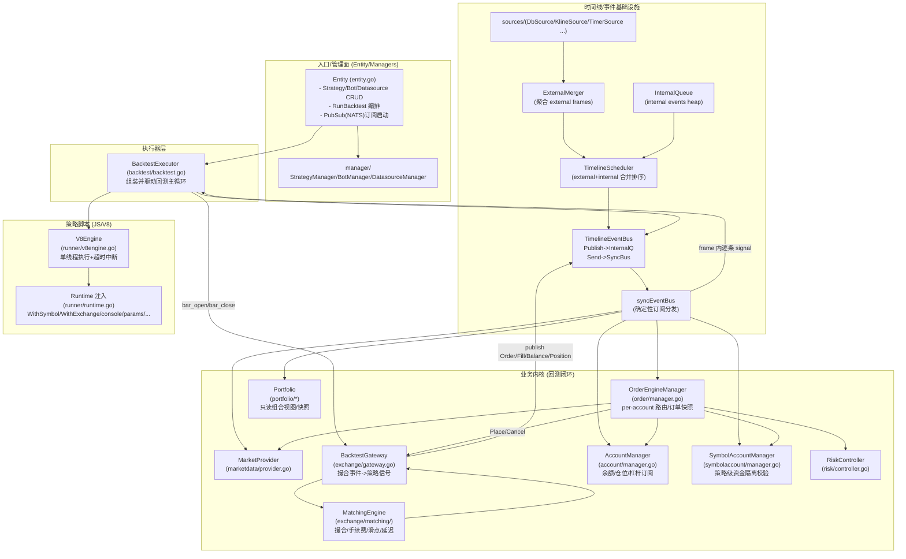
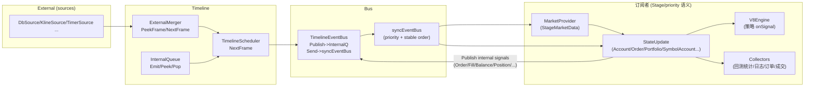
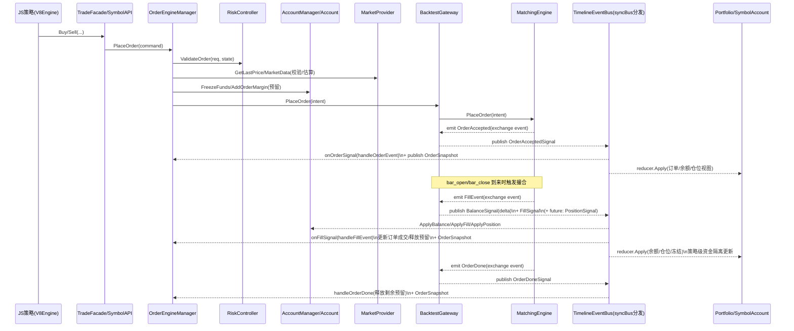
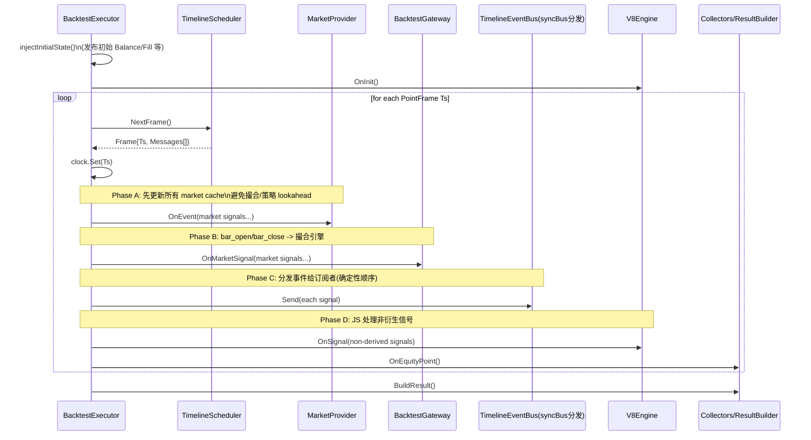
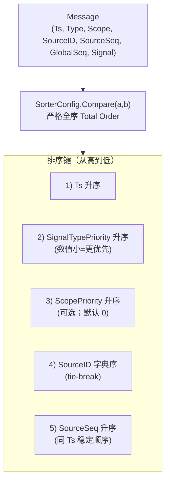
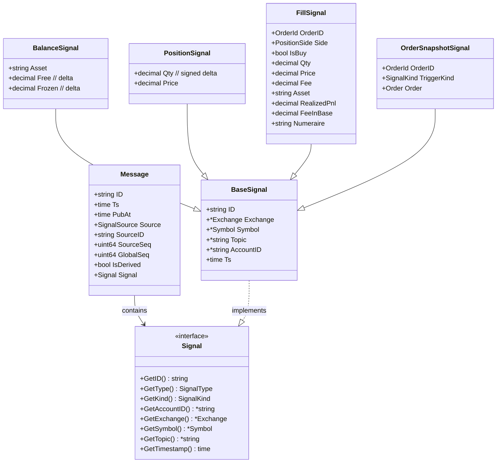

# `server/` 文档说明

本文件由**平台级架构备忘**与**策略子域历史 Markdown 合并**而成：前半偏设计与目标态，自 [文档汇总](#文档汇总) 起为实现细节与清单。下文中的路径、import、命令已按**当前仓库**校对（模块根目录见 [仓库现状](#仓库现状单体)）。

## 仓库现状（单体）

| 项 | 说明 |
| --- | --- |
| Go 模块 | `github.com/wangliang139/llt-trade/server`（见 `server/go.mod`） |
| 进程入口 | `cmd/app`：GraphQL（gqlgen）、策略运行时、市场连接器、定时任务等在同一进程 |
| 前端 | 仓库内 `frontend/`，包管理使用 **pnpm**（非 npm） |
| 策略代码根 | `pkg/strategy/`（不再对应已废弃目录名 `services/llt-strategy-api`） |
| 行情/交易对接 | `pkg/strategy/proxy` 通过 `Stub` 注入；请求/响应类型多在 `pkg/types` |
| 数据持久化 | `pkg/repos`（sqlc）、业务实体 `pkg/entity` |

在 `server/` 下常用命令：

| 命令 | 作用 |
| --- | --- |
| `make lint` / `make lint-fix` | golangci-lint |
| `make repo` | `sqlc generate`（`pkg/repos`） |
| `make convert` | goverter |
| `make gqlgen` | 生成 GraphQL |
| `make build` | `CGO_ENABLED=1 go build -o ./bin ./cmd/app` |
| `make docker build` 等 | 自**仓库根**构建镜像，见 `server/Makefile` |

文中若仍出现「llt-data-api / llt-backoffice-gateway」等**旧多服务**名称，一般指「账户与行情数据能力」；在**当前单体**中由本模块内 `pkg/repos`、`pkg/entity`、GraphQL resolver 等与 `proxy` 注入共同承担，而非独立仓库路径。

---

以下方案基于**可长期演进的量化交易平台**设计目标，对你给出的需求进行了**结构化补充、隐含约束显性化、以及工程可落地的系统化抽象**。整体假设你希望构建的是一个**平台级（Platform-grade）**而非单一策略引擎。

---

## 一、总体设计原则（补充与澄清）

在进入架构细节前，先明确几条**顶层设计原则**，它们将贯穿后续所有模块设计：

1. **事件即事实（Event as Source of Truth）**

   * 所有状态变更必须由事件驱动并可回放
   * 回测 / 模拟 / 实盘仅是「事件来源不同」

2. **策略无环境感知（Strategy Is Environment-Agnostic）**

   * 策略代码不感知当前运行模式
   * 不允许出现 `if backtest / if live` 分支

3. **账户 / 资金 / 风控 为平台能力，而非策略能力**

4. **多租户 ≠ 多实例**

   * 租户隔离优先通过 **逻辑隔离 + 资源配额**
   * 而非进程级强隔离（否则吞吐和成本不可控）

---

## 二、整体系统架构（逻辑分层）

```
┌──────────────────────────────┐
│        API / Control Plane    │
│  (Tenant / Strategy / Config) │
└──────────────▲───────────────┘
               │
┌──────────────┴───────────────┐
│     Strategy Runtime Layer    │
│  - Strategy Instance Manager  │
│  - JS Sandbox / Scheduler     │
│  - Event Subscription         │
└──────────────▲───────────────┘
               │
┌──────────────┴───────────────┐
│        Event Bus Layer        │
│  (In-Memory + Durable Stream) │
└──────────────▲───────────────┘
               │
┌──────────────┴───────────────┐
│ Trading & Account Core Layer  │
│ - Order Manager               │
│ - Portfolio / Position        │
│ - PnL / Fee / Margin Engine   │
│ - Risk Controller             │
└──────────────▲───────────────┘
               │
┌──────────────┴───────────────┐
│ Exchange Adapter / Simulator  │
│ - CEX Adapter                 │
│ - Matching Engine (BT / Sim)  │
└──────────────▲───────────────┘
               │
┌──────────────┴───────────────┐
│        Market Data Layer      │
│  - WS / REST / Replay         │
└──────────────────────────────┘
```

---

## 三、核心模块划分与职责

### 1️⃣ Exchange Adapter Layer（交易所适配层）

**目标**：彻底屏蔽交易所差异，仅暴露统一语义

#### 关键抽象接口

```go
type Exchange interface {
    PlaceOrder(cmd OrderCommand) OrderAck
    CancelOrder(orderID)
    SubscribeMarketData(symbol)
    SubscribeAccountEvents()
}
```

#### 特别设计点

* **实盘**：Adapter → CEX API
* **模拟盘**：Adapter → 内置撮合引擎
* **回测**：Adapter → 历史事件 Replay

> Adapter **不做业务决策**，只做协议与语义转换

---

### 2️⃣ Trading & Account Core（交易与资金核心）

这是**系统最重要的稳定内核**

#### 子模块拆分

##### ▪ Order Manager

* 接收策略下单意图（OrderIntent）
* 转换为标准 OrderCommand
* 维护订单生命周期（NEW / PARTIAL / FILLED / CANCELED）

##### ▪ Portfolio / Position Engine

* 现货：Asset Balance
* 合约：

  * 双向持仓（Long / Short）
  * 全仓保证金
  * 单币种保证金

##### ▪ Margin / PnL / Fee Engine

* 所有结果 **统一折算为 USDT**
* 核心点：

  * 手续费币种 ≠ 计价币种
  * 合约 PnL ≠ 资金变动事件（需拆分）

##### ▪ Risk Controller

* 资金可用性校验
* 下单前风控（Pre-Trade）
* 可插拔规则引擎（后期支持用户自定义）

---

### 3️⃣ Event Bus（事件系统）

#### 事件分级

| 类型   | 示例                          |
| ---- | --------------------------- |
| 市场事件 | Tick / Kline                |
| 策略事件 | StrategyStart / Pause       |
| 交易事件 | OrderFilled / OrderRejected |
| 资金事件 | BalanceChanged / PnLUpdated |

#### 技术实现建议

* **内存事件总线**：低延迟策略驱动
* **持久化事件流**：恢复 / 回放 / 审计
  （Kafka / Pulsar / Redpanda）

---

### 4️⃣ Strategy Runtime Layer（策略执行层）

#### 策略模型

```
Strategy Template
        ↓ 参数化
Strategy Instance
        ↓
(Symbol × Account × Capital)
```

#### JS 策略运行

* 每个策略实例 = 独立 JS Runtime（V8 / QuickJS）
* 禁止直接访问系统资源
* 仅允许通过 **事件 + API**

#### 策略可见状态

* Read-only：

  * Position View
  * Order View
  * Account Snapshot

---

### 5️⃣ Strategy Instance Manager（策略运行管理器）

职责：

* 生命周期管理（Start / Pause / Resume）
* 状态持久化
* 重启后恢复：

  * 策略参数
  * 已绑定 symbol / account
  * 当前持仓与订单状态（通过事件回放）

---

### 6️⃣ 多租户设计（Tenant Isolation）

#### 隔离维度

| 层级 | 隔离方式                      |
| -- | ------------------------- |
| 数据 | tenant_id 强制分区            |
| 事件 | tenant event namespace    |
| 策略 | Runtime 级隔离               |
| 资源 | CPU / Memory / Rate Limit |

---

## 四、关键数据流（端到端）

### 行情 → 策略 → 成交 → 资金

```
Market Data
   ↓
Event Bus (Tick/Kline)
   ↓
Strategy Instance
   ↓ OrderIntent
Order Manager
   ↓
Risk Controller
   ↓
Exchange Adapter
   ↓
Execution Report
   ↓
Order / Position / Balance Update
   ↓
Event Bus
   ↓
Strategy & UI
```

---

## 五、多运行模式的统一抽象（核心设计）

| 维度      | 回测     | 模拟盘       | 实盘   |
| ------- | ------ | --------- | ---- |
| 行情源     | 历史数据   | 实时行情      | 实时行情 |
| 撮合      | 本地     | 本地        | CEX  |
| 账户      | 虚拟     | 虚拟        | 真实   |
| Adapter | Replay | Simulator | CEX  |

> **Strategy / Order / Portfolio 层完全不感知模式差异**

---

## 六、事件驱动与策略订阅模型

### 事件接口示例

```ts
onTick(event)
onOrderFilled(event)
onPositionChanged(event)
```

### 策略行为限制

* 不允许主动查询「未来数据」
* 所有决策必须由事件触发

---

## 七、扩展性与演进设计

### 新增交易所

* 实现 `Exchange Adapter`
* 注册能力矩阵（是否支持 Hedge / USDC）

### 新增策略类型

* 新 JS Template
* 不影响底层执行引擎

### 横向扩展

* Strategy Runtime 可水平扩容
* Event Bus 分区（tenant / symbol）

---

## 八、你当前需求中**隐含但关键的点（已补充）**

1. **PnL ≠ Balance Change（尤其是合约）**
2. **事件回放是系统恢复的唯一方式**
3. **策略只拥有“意图”，不拥有“执行权”**
4. **多租户下策略不是进程，而是调度单元**

---

## 九、下一步可深入的方向（可选）

如果你愿意，我可以继续细化以下任一方向：

* 📐 事件数据结构（Golang 定义）
* 🧮 合约保证金 / PnL 计算公式与事件拆分
* 🧠 Strategy JS API 设计
* 🔄 系统重启后的精确恢复流程
* 🧪 回测引擎的时间推进模型（Bar vs Tick）

你可以直接指定下一步要深入的模块。

---

## 文档汇总

以下内容历史上由多份策略子服务文档合并而来；**权威路径**为当前仓库 `server/pkg/strategy/`（见上文 [仓库现状](#server-文档说明)）。

### `pkg/strategy/README.md`

# 策略执行模块（统一文档）

策略子域文档以 **`server/pkg/strategy/`** 下代码与本文对应章节为准。
## 目录

- [功能特性](#功能特性)
- [目录结构](#目录结构)
- [配置](#配置)
- [架构与流程（含结构图/数据流/时序图）](#架构与流程含结构图数据流时序图)
- [合约保证金：OrderMargin/MarginUsed（专题）](#合约保证金ordermarginmarginused专题)
- [JS 策略 API（WithSymbol / WithExchange）](#js-策略-apiwithsymbol--withexchange)
- [信号处理（JS Handler 约定）](#信号处理js-handler-约定)
- [数据库 Schema](#数据库-schema)
- [注意事项与后续优化](#注意事项与后续优化)

## 功能特性

- ✅ **多模式支持**：实盘、模拟盘、回测
- ✅ **JavaScript 策略**：使用 v8go 执行 JS 策略代码
- ✅ **事件驱动**：kline/trade/depth/ticker/social/timer 等信号统一进入时间线与事件总线
- ✅ **沙箱隔离**：每个策略运行在独立的 V8 沙箱（CPU 超时中断）
- ✅ **版本管理**：策略支持版本管理
- ✅ **订单闭环（回测）**：撮合/手续费/滑点/延迟/资金与仓位增量事件

## 目录结构

```
pkg/strategy/
├── iface.go            # 策略域对外接口聚合
├── types/              # 领域类型（Strategy/Bot/Signal/Backtest 等）
├── manager/            # 管理器（Strategy/Bot/Datasource）
├── runner/             # JS 引擎（V8Engine/Runtime/Sandbox）
│   ├── api/            # JS API（Symbol/Exchange/Console/Time 等）
│   └── api/facade/     # market / trade 门面
├── executor/           # 执行器：backtest / live / paper
├── infra/
│   ├── bus/            # 消息总线（sync/async、Timeline 等）
│   ├── timeline/       # 时间线合并与调度
│   ├── clock/
│   └── logging/        # 策略日志（含 ClickHouse 等存储）
├── pubsub/             # 信号订阅/分发（NATS + Dispatcher）
├── sources/            # 外部信号源（DB/Fetcher/Timer/Market）
├── signalflow/         # 信号流记录与查询
├── marketdata/         # 市场数据缓存/查询
├── proxy/              # 行情与交易等能力 Stub（进程启动时注入）
├── exchange/           # 交易所网关、撮合、bridge
├── order/              # 订单引擎
├── account/            # 账户/账本/仓位
├── portfolio/          # 只读组合视图
├── symbolaccount/      # 交易对级资金隔离（可选）
├── risk/               # 风控
├── registry/           # 执行器注册
├── misc/               # V8 辅助（如 V8ValueToMap）
└── validator/          # 配置校验
```

## 配置

通过环境变量配置：

```bash
STRATEGY_ENABLED=true
STRATEGY_NATS_SERVERS=nats://127.0.0.1:4222
STRATEGY_NATS_NAME=llt-strategy
STRATEGY_TOPIC_PREFIX=md
```

## 架构与流程（含结构图/数据流/时序图）

### 总体架构

策略执行模块支持**实盘、模拟盘、回测**三种模式，使用 **JavaScript** 编写策略代码，通过 **V8 引擎**执行。

#### 架构图（概念）

```
┌─────────────────────────────────────────────────────────────┐
│                      Entity Layer                           │
│  (StrategyManager / BotManager / DatasourceManager)        │
└───────────────────────┬─────────────────────────────────────┘
                        │
┌───────────────────────▼─────────────────────────────────────┐
│                   Executor Layer                             │
│  (BacktestExecutor / LiveExecutor / PaperExecutor)           │
└───────────────────────┬─────────────────────────────────────┘
                        │
        ┌───────────────┼───────────────┐
        │               │               │
┌───────▼──────┐ ┌──────▼──────┐ ┌─────▼──────────┐
│  JS Engine   │ │ Event Bus    │ │ Timeline      │
│  (V8Engine)  │ │              │ │ Scheduler     │
└───────┬──────┘ └──────┬───────┘ └─────┬──────────┘
        │               │               │
┌───────▼───────────────▼───────────────▼──────────┐
│              Business Logic Layer                 │
│  ┌──────────┐ ┌──────────┐ ┌──────────┐         │
│  │  Order   │ │ Account  │ │ Matching │         │
│  │  Engine  │ │ Manager  │ │ Engine   │         │
│  └──────────┘ └──────────┘ └──────────┘         │
│  ┌──────────┐ ┌──────────┐ ┌──────────┐         │
│  │Portfolio │ │  Risk    │ │  Market  │         │
│  │          │ │Controller│ │  Data    │         │
│  └──────────┘ └──────────┘ └──────────┘         │
└──────────────────────────────────────────────────┘
        │
┌───────▼───────────────────────────────────────────┐
│           Infrastructure Layer                    │
│  (Clock / MarketProvider / Sources)           │
└───────────────────────────────────────────────────┘
```

### 结构图（模块依赖/分层）

> 说明：这是“回测闭环”的实际依赖关系（`BacktestExecutor` 组装并驱动）。实盘/模拟盘会在 `exchange/gateway`、sources、账户同步等位置替换实现。



### 分层结构（职责划分）

#### Entity 层

- **位置**：`entity.go`
- **职责**：策略/机器人/数据源管理；回测入口与 sources 构建；PubSub 订阅启动

#### Executor 层

- **位置**：`backtest/backtest.go`
- **职责**：回测执行流程控制；组件初始化与编排；结果构建

#### Runner（JS）层

- **位置**：`runner/v8engine.go` / `runner/runtime.go`
- **职责**：JS 执行（单线程任务队列 + 超时中断）；API 注入与保护

#### API（JS 暴露）层

- **位置**：`runner/api/`（由 runtime 注入到 JS 全局）

#### Business Logic 层

- **订单引擎**：`order/manager.go`（`OrderEngineManager`）+ `order/engine.go`（`OrderEngine`）
- **账户**：`account/account.go` + `account/manager.go`
- **网关/撮合**： `exchange/gateway.go` + `exchange/matching/engine.go`
- **组合视图**：`portfolio/*`
- **风控**：`risk/controller.go`

#### Infrastructure 层

- **总线**：`bus/*`
- **时间线**：`timeline/*`
- **市场数据缓存**：`marketdata/provider.go`
- **数据源**：`sources/*`

### 数据流（事件流转）

#### 整体事件流（概念）

```
┌─────────────┐
│ Data Source │ (外部数据源：数据库、实时数据)
└──────┬──────┘
       │ EventEnvelope
       ▼
┌──────────────────┐
│ External Merger  │ (外部事件合并)
└──────┬───────────┘
       │
       ▼
┌──────────────────┐
│ Timeline         │
│ Scheduler        │ ◄──┐
└──────┬───────────┘    │
       │                │ EventEnvelope
       │ Point Frame    │
       ▼                │
┌──────────────────┐    │
│ Event Bus        │    │
└──────┬───────────┘    │
       │                │
       ├───────────────┘
       │
       ├──► MarketProvider (更新价格缓存)
       ├──► Portfolio (更新投资组合状态)
       ├──► Account (更新账户状态)
       ├──► MatchingEngine (撮合订单)
       ├──► OrderEngine (更新订单状态)
       ├──► V8Engine (策略信号处理)
       └──► Collectors (收集回测数据)
```

#### 数据流图（external + internal 合并与投递）



### 下单流程（概念）

```
策略代码 (JS)
    │
    ├─► SymbolHandle.Buy() / Sell()
    │
    ▼
OrderEngineManager.PlaceOrder()
    │
    ├─► 风险控制校验
    ├─► 交易对校验
    │
    ▼
EventBus.Publish(OrderIntent)
    │
    ▼
MatchingEngine.handlePlace()
    │
    ├─► 市场数据校验
    ├─► 资金/持仓校验
    ├─► 订单入簿
    │
    ▼
EventBus.Publish(OrderEvent) ──┐
    │                          │
    ▼                          │
OrderEngine.handleOrderEvent() │
    │                          │
    ├─► 更新订单状态           │
    ├─► 预留资金/保证金占用     │
    └─► 存储订单               │
                               │
MatchingEngine.matchOrders()   │
    │                          │
    ├─► 撮合市价单             │
    ├─► 撮合限价单             │
    │                          │
    ▼                          │
EventBus.Publish(FillEvent) ───┘
    │
    ├─► Account.ApplyBalance/ApplyPosition
    ├─► OrderEngine.handleFillEvent()
    └─► Portfolio.OnEvent()
```

### 下单/撮合/结算时序图（回测）



### 回测主循环（point frame）时序图



### 同时间点 Total Order（排序器 Compare）



### 关键数据模型（Message/Signal）



## 合约保证金：OrderMargin/MarginUsed（专题）

### 概述

本节梳理合约（期货）场景下**保证金预留（挂单保证金）**与**已用保证金（持仓保证金）**的语义、当前实现现状与待完善项。

### 核心概念

在账户账本 `AssetLedger`（`account/ledger.go`）中定义了两个保证金相关字段（注意：它们不是 `BalanceSignal` 的一部分）：

1. **MarginUsed**：已占用保证金（由持仓计算）
   - 表示已成交持仓占用的保证金
   - 根据持仓数量和价格计算：`notional / leverage`

2. **OrderMargin**：挂单占用保证金（未成交部分的预留）
   - 表示未成交订单占用的保证金
   - 用于期货**开仓**下单时预留（避免超额开仓）

合约使用 **Quote 资产**（如 USDT）作为保证金资产（collateral）。

### 当前实现状态

#### 1) 下单阶段（期货开仓）

- **位置**：`order/engine.go`（`OrderEngine.prepareOrder` + `OrderEngine.PlaceOrder`）
- **要点（回测闭环）**：
  - 保证金预估：\(margin = notional / leverage\)
  - 手续费缓冲校验：要求账户 quote 可用余额覆盖 \(margin + feeBuf\)
  - 占用方式：期货开仓不走 `FreezeFunds`，而是 `AccountManager.AddOrderMargin()` 累加 `OrderMargin`
  - 订单级记录：`reservation{IsFuture:true, IsOpenPosition:true, MarginAmount:margin}`

#### 2) 成交阶段（Fill/Position/Balance）

- 撮合成交输出：`exchange/matching/*` → `exchange/gateway.go`
- 资金增量：`exchange/gateway.go` 发布 `BalanceSignal(delta)`（期货：已实现盈亏 + 手续费）
- 仓位增量：`exchange/gateway.go`（期货）发布 `PositionSignal(delta)`
- 现状：
  - ✅ 手续费通过 `BalanceSignal(delta)` 扣减 quote
  - ✅ 平仓收益/亏损通过 `BalanceSignal(delta)` 计入 quote
  - ✅ 仓位变化通过 `PositionSignal(delta)` 驱动 `Account.ApplyPosition()`
  - ⚠️ `OrderMargin` 在 fill 时不按成交比例递减（当前选择订单结束时释放剩余）
  - ❌ `MarginUsed` 目前未形成自动更新闭环（字段存在，但缺少计算/回写）

#### 3) 订单结束阶段（Done / Canceled / Rejected / Expired）

- **位置**：`order/engine.go`（`handleOrderDone/handleOrderCanceled/handleOrderRejected/handleOrderExpired`）
- 现状：
  - 现货：释放剩余冻结资金（`UnfreezeFunds`）
  - 期货开仓：
    - Rejected/Canceled/Expired：释放全部挂单保证金（`SubOrderMargin(MarginAmount)`）
    - Done：按未成交比例释放剩余挂单保证金

### 数据流图（保证金相关）

```mermaid
flowchart TD
    OE[OrderEngine.PlaceOrder(期货开仓)] -->|计算 margin/feeBuf| CalcMargin[margin = notional/leverage\nfeeBuf = notional*takerFeeRate]
    CalcMargin -->|校验 quote.Free >= margin+feeBuf| CheckCollateral[collateral check]
    CheckCollateral -->|AddOrderMargin| OrderMargin[AccountLedger.OrderMargin += margin]

    ME[MatchingEngine emit Fill] --> GW[BacktestGateway]
    GW -->|BalanceSignal(delta)\nfee/pnl| Bal[Account.ApplyBalance]
    GW -->|PositionSignal(delta)| Pos[Account.ApplyPosition]

    Done[OrderDone/Canceled/Rejected/Expired] -->|释放保证金| Release[SubOrderMargin(全部或未成交部分)]

    Pos -->|待完善| MU[SetMarginUsed(posNotional/leverage)]
```

### 待实现功能（保证金）

- **MarginUsed（持仓保证金）闭环**
  - [ ] 在 `PositionSignal` 后，根据 `posNotional/leverage` 计算并 `SetMarginUsed`
  - [ ] 明确净仓/双向仓下的 notional 定义与价格选择（mark/last/avg）
- **OrderMargin 事件化（如果需要展示/风控）**
  - [ ] 新增 `SignalTypeMargin` 或在 `SignalTypeRisk` 下增加 `MarginOccupied/MarginReleased` 事件
  - [ ] Portfolio/SymbolView 增加字段并在 reducer 中归约
- **更细粒度释放策略（可选）**
  - [ ] 每次 fill 按成交比例递减 `OrderMargin`
  - [ ] 与撮合引擎的部分成交/撤单/过期场景做一致性校验

## JS 策略 API（WithSymbol / WithExchange）

### Symbol API（`SymbolHandle`）

```javascript
// 获取一个带缓存的 SymbolHandle（同 exchange+symbol 永远返回同一实例）
var sym = WithSymbol("binance", "BTC/USDT:SPOT");

// 行情
var ticker = sym.GetTicker("5m");
var depth = sym.GetDepth(20);
var klines = sym.GetKlines("1m", 100);
var trades = sym.GetTrades("1h");

// 交易（回测/撮合环境下可用；实盘私有 RPC 需额外实现）
// sym.Buy({ type: "market", quoteQty: "10" });
// sym.Sell({ type: "market", quantity: "0.01" });
// sym.CancelOrder("client_order_id");

// 账户/仓位
var positions = sym.GetPositions();
var quoteAsset = sym.GetAsset(sym.quote);
```

### Exchange API（`ExchangeHandle`）

```javascript
var ex = WithExchange("binance");
var markets = ex.GetMarkets("spot"); // "spot" / "future" / "all"
var tickers = ex.GetTickers("5m");   // 默认按 ex.symbols 过滤
```

### 技术指标 API

```javascript
const ma = indicator.MA(data, 5);
const ema = indicator.EMA(data, 12);
const rsi = indicator.RSI(data, 14);
const macd = indicator.MACD(data);
```

### 工具 API

```javascript
console.log("策略执行中...");
```

## 信号处理（JS Handler 约定）

策略可以响应以下信号：

- `onKline(kline)` - K 线数据
- `onTrade(trade)` - 成交数据
- `onDepth(depth)` - 深度数据
- `onTicker(ticker)` - Ticker 数据
- `onSocial(social)` - 社交信号
- `onTimer()` - 定时器信号

## 数据库 Schema

数据库表定义在 `pkg/repos/strategy_repo/schema.sql`：

- `strategies` - 策略表
- `bots` - Bot 实例表
- `strategy_orders` - 订单记录表
- `backtest_results` - 回测结果表

## 注意事项与后续优化

### 注意事项

1. **实盘 Connector 接口**：实盘下单链路需要补齐/对齐 `exchange.Gateway` 的真实实现（回测当前为 `BacktestGateway`）。
2. **数据库集成**：管理器层依赖 repo（需要实现/完善对应 repo 层）。
3. **序列化与指标**：JS API 的 JSON 转换与部分指标实现如需扩展，需补齐算法与边界处理。

### 后续优化

- [ ] 实现完整的数据库 repo 层
- [ ] 实盘/模拟盘交易所 connector（Place/Cancel + 账户同步 + 限流）
- [ ] 完善指标与工具函数库
- [ ] 策略性能监控与可观测性
- [ ] 支持策略热更新
- [ ] 回测报告与可视化输出

### `BOT_USAGE.md`

# Bot 功能使用指南

## 概述
Bot 是策略实例，代表一个运行中的策略。支持模拟盘（paper）和实盘（live）两种模式，可以通过前端创建、启动、停止和查看运行状态。
## 功能特性

### 后端功能

1. **策略实例管理**
   - 创建 Bot：从策略模板创建运行实例
   - 启动/停止 Bot：控制策略运行状态
   - 删除 Bot：清理不需要的实例
   - 查询 Bot：获取运行状态和配置

2. **数据查询**
   - 订单/资产/持仓/流水/收益：通过 GraphQL / `pkg/repos` 等按账户维度查询
   - 运行快照：状态快照存入 `kv` 表

3. **自动恢复**
   - 服务启动时自动恢复运行中的 Bot
   - 从快照恢复余额和持仓
   - 在途订单自动取消并记录
   - 策略继续执行

### 前端功能

1. **Bot 列表页面** (`/strategy/bots`)
   - 查看所有 Bot 实例
   - 按策略/模式/状态筛选
   - 启动/停止/删除操作
   - 查看 Bot 详情

2. **Bot 创建对话框**
   - 选择策略和版本
   - 配置运行参数
   - 设置初始资产（模拟盘）
   - 指定交易所和交易对

3. **Bot 详情对话框**
   - 查看基本信息和状态
   - 收益曲线图表
   - 订单历史列表
   - 资金流水列表

## 使用流程

### 1. 创建策略

首先需要在"策略管理"页面创建一个策略（如果还没有）。

### 2. 创建 Bot

在"Bot 管理"页面点击"创建 Bot"按钮：

```json
{
  "strategyId": "my-strategy-id",
  "strategyVer": "latest",
  "mode": "paper",
  "exchange": "binance",
  "symbol": "BTC/USDT:SPOT",
  "accountId": "",
  "config": {
    "initialAssets": [
      { "asset": "USDT", "total": "10000", "walletType": "spot" },
      { "asset": "BTC", "total": "0.1", "walletType": "spot" }
    ]
  },
  "params": {
    "param1": "value1"
  }
}
```

### 3. 启动 Bot

创建后，Bot 处于 `stopped` 状态，点击"启动"按钮启动运行：

- Bot 状态变为 `running`
- 开始接收实时行情信号
- 策略开始执行交易逻辑

### 4. 查看运行状态

点击 Bot ID 或"详情"按钮，查看：

- **收益曲线**：实时净值变化图表
- **订单历史**：所有下单记录
- **资金流水**：余额变化明细

### 5. 停止 Bot

点击"停止"按钮停止运行：

- Bot 状态变为 `stopped`
- 保存最终快照
- 停止信号处理

## API 接口

### GraphQL Queries

```graphql
# 查询 Bot 列表
query QueryBots {
  Bots(input: { limit: 10, offset: 0, status: running }) {
    totalCount
    list {
      id
      strategyName
      mode
      status
      exchange
      symbol
      createdAt
    }
  }
}

# 查询单个 Bot
query QueryBot {
  Bot(id: "bot-id") {
    id
    strategyId
    strategyVer
    mode
    status
    errorMessage
  }
}

# 查询 Bot 订单
query QueryBotOrders {
  BotOrders(botId: "bot-id", limit: 100, offset: 0) {
    totalCount
    list {
      id
      symbol
      side
      orderType
      price
      quantity
      status
      createdAt
    }
  }
}

# 查询 Bot 资金流水
query QueryBotLedger {
  BotLedger(botId: "bot-id", limit: 100, offset: 0) {
    totalCount
    list {
      id
      asset
      signalType
      freeDelta
      frozenDelta
      ts
    }
  }
}

# 查询 Bot 收益曲线
query QueryBotEquity {
  BotEquity(botId: "bot-id", limit: 1000, offset: 0) {
    totalCount
    list {
      id
      totalNetValue
      baseCurrency
      ts
    }
  }
}
```

### GraphQL Mutations

```graphql
# 创建 Bot
mutation CreateBot {
  CreateBot(input: {
    strategyId: "strategy-id"
    strategyVer: "v1"
    mode: paper
    exchange: "binance"
    symbol: "BTC/USDT:SPOT"
    accountId: "paper-001"
    config: "{\"initialBalance\":{\"USDT\":\"10000\"}}"
    params: "{\"param1\":\"value1\"}"
  }) {
    id
    status
  }
}

# 启动 Bot
mutation StartBot {
  StartBot(id: "bot-id")
}

# 停止 Bot
mutation StopBot {
  StopBot(id: "bot-id")
}

# 删除 Bot
mutation DeleteBot {
  DeleteBot(id: "bot-id")
}
```

## 数据库表结构

### bots

Bot 实例表

| 字段 | 类型 | 说明 |
|------|------|------|
| id | VARCHAR(64) | Bot ID |
| strategy_id | VARCHAR(64) | 策略 ID |
| strategy_version | VARCHAR(16) | 策略版本 |
| mode | VARCHAR(16) | 运行模式（live/paper） |
| exchange | VARCHAR(32) | 交易所 |
| symbol | VARCHAR(64) | 交易对 |
| account_id | VARCHAR(64) | 账户 ID |
| config | JSONB | 配置参数 |
| status | VARCHAR(16) | 状态（stopped/running/error） |
| error_message | TEXT | 错误信息 |
| created_at | TIMESTAMP | 创建时间 |
| started_at | TIMESTAMP | 启动时间 |
| stopped_at | TIMESTAMP | 停止时间 |

### orders

订单记录表

| 字段 | 类型 | 说明 |
|------|------|------|
| id | VARCHAR(64) | 订单 ID |
| bot_id | VARCHAR(64) | Bot ID |
| client_order_id | VARCHAR(128) | 客户端订单 ID |
| symbol | VARCHAR(64) | 交易对 |
| side | VARCHAR(16) | 方向 |
| order_type | VARCHAR(16) | 订单类型 |
| price | DECIMAL | 价格 |
| quantity | DECIMAL | 数量 |
| executed_qty | DECIMAL | 已成交数量 |
| status | VARCHAR(16) | 状态 |
| created_at | TIMESTAMP | 创建时间 |
| updated_at | TIMESTAMP | 更新时间 |

### ledger

资金流水表

| 字段 | 类型 | 说明 |
|------|------|------|
| id | BIGSERIAL | 流水 ID |
| bot_id | VARCHAR(64) | Bot ID |
| account_id | VARCHAR(64) | 账户 ID |
| asset | VARCHAR(16) | 资产 |
| signal_type | VARCHAR(32) | 信号类型 |
| free_delta | DECIMAL | 可用余额变化 |
| frozen_delta | DECIMAL | 冻结余额变化 |
| amount | DECIMAL | 其他金额 |
| ts | TIMESTAMP | 事件时间 |
| created_at | TIMESTAMP | 创建时间 |

### equity_points

收益曲线表

| 字段 | 类型 | 说明 |
|------|------|------|
| id | BIGSERIAL | 记录 ID |
| bot_id | VARCHAR(64) | Bot ID |
| total_net_value | DECIMAL | 总净值 |
| base_currency | VARCHAR(16) | 计价货币 |
| symbols | JSONB | 各标的详情 |
| ts | TIMESTAMP | 采样时间 |
| created_at | TIMESTAMP | 创建时间 |

### kv

键值存储（快照）

| 字段 | 类型 | 说明 |
|------|------|------|
| key | VARCHAR(255) | 键（bot:{id}:snapshot） |
| value | TEXT | 值（JSON 快照） |
| updated_at | TIMESTAMP | 更新时间 |

## 重启恢复机制

### 恢复流程

1. 服务启动时查询 `status=running` 的 Bot
2. 从 kv 表加载快照（如果存在）
3. 恢复余额：total = free + frozen 全部作为 free
4. 恢复持仓：发布 PositionSignal
5. **取消在途订单**：所有未完成订单标记为 CANCELED 并写入数据库
6. 策略重新执行 OnInit() 并开始处理信号

### 订单取消策略

恢复时所有在途订单（NEW/PENDING/PARTIAL_DONE）会被取消：

- 包括部分成交订单（已成交部分不会回滚）
- 订单记录保存到 orders 表，状态为 CANCELED
- 冻结资金已在恢复余额时释放
- 策略需要根据当前市场情况重新生成订单

### 快照保存

- 每 30 秒自动保存一次
- Bot 停止时保存最终快照
- 快照包含：余额、持仓、未完成订单

## 注意事项

1. **模拟盘初始余额**：创建时必须在 config 中指定 initialBalance
2. **交易对格式**：必须包含类型后缀，如 `BTC/USDT:SPOT` 或 `BTC/USDT:FUTURE`
3. **策略参数**：必须符合策略定义的 params 结构
4. **账户 ID**：模拟盘可以使用任意字符串，实盘需要对应真实账户
5. **重启恢复**：订单会被取消，策略需要重新下单
6. **错误处理**：Bot 运行出错时会自动标记为 error 状态

## 故障排查

### Bot 无法启动

检查：
- 策略是否存在且状态为 active
- 初始余额配置是否正确（模拟盘）
- 交易对格式是否正确
- 查看 error_message 字段

### Bot 自动停止

检查：
- 服务日志中的错误信息
- Bot 的 error_message 字段
- 策略代码是否有异常

### 数据未落库

检查：
- 数据库表是否已创建（运行 schema.sql）
- repos.Entity 是否正确初始化
- PersistenceManager 是否正常启动

## 扩展功能

### 实盘模式

实盘模式（live）预留接口，需要实现：
- LiveExecutor：对接真实交易所 API
- 实盘账户管理
- 风控和限流
- 实时订单同步

### 高级功能

- 多交易对支持：一个 Bot 运行多个交易对
- 资金隔离：不同交易对独立资金管理
- 性能优化：批量落库、异步写入
- 实时推送：WebSocket 推送 Bot 状态变化

### `CLICKHOUSE_SCHEMA.md`

# ClickHouse Schema - Bot Console Logs

## Table

```sql
CREATE TABLE IF NOT EXISTS trade.bot_console_log (
    id Int64,
    bot_id Int32,
    strategy_id String,
    level LowCardinality(String),
    message String,
    ts DateTime64(3)
) ENGINE = MergeTree
PARTITION BY bot_id
ORDER BY (bot_id, ts, id);
```

## Environment Variables

ClickHouse connection is initialized with prefix `STRATEGY_CH`:

- `STRATEGY_CH_ADDR`
- `STRATEGY_CH_DATABASE` (default: `trade`)
- `STRATEGY_CH_USERNAME`
- `STRATEGY_CH_PASSWORD`

### `JS_API_IMPLEMENTATION_STATUS.md`

# JS API 易用性提升 - 实现状态

## 已完成的工作

### 1. ✅ V8 Runtime 扩展（runtime-symbols-inject）

**文件**: `pkg/strategy/runner/runtime.go`

**新增功能**:
- 添加了运行时上下文字段：`symbols`, `defaultExchange`, `accountID`, `runMode`
- 新增链式方法：
  - `WithSymbols([]ctypes.ExSymbol)`
  - `WithDefaultExchange(ctypes.Exchange)`
  - `WithAccountID(string)`
  - `WithMode(types.RunMode)`
  - `WithSymbolAPI(*api.SymbolAPI)`
  - `WithExchangeAPI(*api.ExchangeAPI)`
- 注入逻辑：
  - 全局 `symbols` 数组（SymbolHandle 实例）
  - 全局 `WithSymbol(exchange, symbol)` 工厂函数
  - 全局 `WithExchange(exchange)` 工厂函数
  - 可选的默认 `exchange` 实例

### 2. ✅ SymbolAPI 和 ExchangeAPI（symbol-exchange-api）

**文件**:
- `pkg/strategy/runner/api/symbol.go` - 新建
- `pkg/strategy/runner/api/exchange.go` - 新建
- `pkg/strategy/misc/v8go.go` - 扩展了 `V8ValueToMap` 函数

**SymbolAPI 实现的方法**:
- ✅ **行情类**: GetTicker, GetDepth, GetTrades, GetKlines
- ⚠️  **交易类**: Buy, Sell, CancelOrder, GetOrders, GetOrder（框架已就绪，但未连接实现）
- ⚠️  **账户类**: GetFills, GetPositions, GetLeverage, SetLeverage, GetFundings, GetAccount, GetAssets（框架已就绪，但未连接实现）
- ✅ **元信息**: GetExchange, GetBase, GetQuote

**ExchangeAPI 实现的方法**:
- ⚠️  GetMarkets（框架已就绪，但未连接实现）
- ⚠️  GetTickers（框架已就绪，但未连接实现）
- ✅ GetExchange

**设计亮点**:
- 统一的 `period` 参数解析（支持字符串 "5m" 和数字毫秒）
- 使用 `isolate.ThrowException()` 进行统一错误抛出
- 通过 `info.This()` 读取绑定属性（exchange/symbol），避免维护对象实例表

### 3. ✅ Market Proxy 补齐（market-proxy-complete）

**文件**: `pkg/strategy/proxy/proxy.go`

**新增函数**:
- ✅ `GetLatestTicker` - 从缓存获取最新 ticker
- ✅ `GetLatestTrades` - 从缓存获取最新成交
- ✅ `GetLatestOrderBook` - 从缓存获取最新订单簿
- ✅ `GetLatestKlines` - 从缓存获取最新 K 线
- ✅ `GetTicker` - 实时请求交易所 ticker
- ✅ `GetTrades` - 实时请求交易所成交
- ✅ `GetOrderBook` - 实时请求交易所订单簿
- ✅ `GetKlines` - 实时请求交易所 K 线
- ✅ `GetOrder` - 获取单个订单

这些函数对应**已注入**的行情/交易客户端（历史上可能为独立 market gRPC 客户端）。

### 4. ✅ 回测执行器市场能力注入（backtest-wire-market）

**文件**:
- `pkg/strategy/executor/backtest/backtest.go` - 修改
- `pkg/strategy/runner/api/facade/market.go` - 新建

**新增组件**:
- **MarketFacade**: 统一回测和实盘的市场数据访问
  - 回测场景：优先使用 `MarketProvider` 缓存
  - 实盘场景/Fallback：调用已注入的行情服务实现
  - 支持 `period` 时间窗口过滤

**回测注入改动**:
- 创建 `MarketFacade` 并传入 `SymbolAPI`
- 提取 `config.Symbols` 为 `symbols` 数组
- 确定 `defaultExchange`（优先 BaseExchange）
- 通过 `runtime.WithSymbols/WithSymbolAPI/WithExchangeAPI/WithDefaultExchange/WithMode` 完整配置

### 5. 实盘交易私有能力（live-trade wiring）

**状态**：`pkg/strategy/proxy.Stub` 已预留下单、撤单、资金/仓位查询等函数槽位；是否可在实盘使用取决于 `cmd/app` 对 `proxy.AssignStub` 的注入是否覆盖对应能力。

#### 能力清单（历史独立 Market gRPC 命名参考；单体以 `pkg/types` + `proxy` 注入为准）

| 功能 | 需要的 RPC | 当前状态 |
|-----|-----------|---------|
| Buy/Sell | `PlaceOrder(PlaceOrderRequest) returns (PlaceOrderResponse)` | ❌ Proto 未定义 |
| CancelOrder | `CancelOrder(CancelOrderRequest) returns (CancelOrderResponse)` | ❌ Proto 未定义 |
| GetFills | `GetFills(GetFillsRequest) returns (GetFillsResponse)` | ❌ Proto 未定义 |
| SetLeverage | `SetLeverage(SetLeverageRequest) returns (SetLeverageResponse)` | ❌ Proto 未定义 |
| GetFundings | `GetFundings(GetFundingsRequest) returns (GetFundingsResponse)` | ❌ Proto 未定义 |
| GetAssets | *可能可以用现有的 `GetBalance`* | ⚠️  需确认是否满足需求 |
| GetMarkets | ✅ 已存在 | ✅ 可用 |
| GetOrders | ✅ 已存在 | ✅ 可用 |
| GetOrder | ✅ 已存在 | ✅ 可用 |
| GetPositions | ✅ 已存在 | ✅ 可用 |
| GetLeverage | *可通过 `GetPositions` 或 `GetSymbolConfig` 获取* | ⚠️  需确认 |

> 表中「❌ Proto 未定义」等表述针对**旧多服务仓库**；当前仓库以 Stub 字段与注入实现为准，开发时请以代码为准更新本文。

## 使用示例

### 回测脚本示例（新 API）

```javascript
// onInit() - 策略初始化
function onInit() {
  console.log("策略初始化");
  console.log("可交易标的数量:", symbols.length);
  
  // 遍历所有 symbols
  for (var i = 0; i < symbols.length; i++) {
    var sym = symbols[i];
    console.log("标的", i, ":", sym.GetExchange(), sym.GetBase(), sym.GetQuote());
  }
}

// onSignal(signal) - 处理信号
function onSignal(signal) {
  if (signal.type !== "kline") {
    return;
  }
  
  // 使用 symbols[0] 获取 ticker（5分钟窗口）
  var sym = symbols[0];
  var ticker = sym.GetTicker("5m");
  if (ticker) {
    console.log("当前价格:", ticker.price);
    console.log("买一:", ticker.best_bid, "卖一:", ticker.best_ask);
  }
  
  // 获取 K 线
  var klines = sym.GetKlines("1m", 10); // 最近 10 根 1 分钟 K 线
  console.log("K线数量:", klines.length);
  
  // 获取成交记录（最近 1 小时）
  var trades = sym.GetTrades("1h");
  console.log("成交记录数:", trades.length);
  
  // 获取订单簿
  var depth = sym.GetDepth(20);
  console.log("买盘档位:", depth.bids.length, "卖盘档位:", depth.asks.length);
}

// 使用 WithSymbol 创建新的 symbol（带缓存，多次调用返回同一实例）
var btcSymbol = WithSymbol("binance", "BTC/USDT:SPOT");
var btcTicker = btcSymbol.GetTicker();
console.log("BTC 价格:", btcTicker.price);

// WithSymbol 缓存机制：
// - WithSymbol 在 JS 层包装了底层工厂 _WithSymbol
// - 同一 exchange+symbol 永远返回同一 SymbolHandle 实例
// - 这样 sym.Set()/Get() 能跨调用保持状态一致

// 使用默认 exchange（如果配置了）
// var markets = exchange.GetMarkets("spot");
```

### 关于旧 API（已移除）

原有的全局 `market/order/account` 入口已移除，统一使用：
- `WithSymbol(exchange, symbol)` 得到 `SymbolHandle`，通过 `sym.GetTicker()/sym.Buy()/sym.GetPositions()` 等完成大部分策略能力
- `WithExchange(exchange)` 得到 `ExchangeHandle`，通过 `ex.GetMarkets()/ex.GetTickers()` 获取交易所维度信息

### WithSymbol 缓存机制说明

- **`_WithSymbol(exchange, symbol)`**（Go 层）: 底层工厂函数，每次调用创建新的 SymbolHandle 实例，不应由策略直接调用。
- **`WithSymbol(exchange, symbol)`**（JS 层）: 缓存包装，内部调用 `_WithSymbol` 创建实例并缓存，同一 key 永远返回同一实例，确保 `sym.Set()/Get()` 状态一致。

## 下一步工作（契约与注入；历史多服务方案参考）

> **单体现状**：行情与交易调用通过 `pkg/strategy/proxy` 的 `Stub` 与 `pkg/types` 中请求/响应类型对接，在 `cmd/app` 启动时注入具体实现。若你仍维护**独立 gRPC 数据服务**，可继续按下文 proto 扩展；否则应在**本仓库**内补齐类型、`AssignStub` 实现与连接器逻辑。

### 扩展 market.proto（独立服务场景示例）

在独立数据服务的 `market.proto`（历史路径示例：`.../marketpb/v1/market.proto`）中添加：

```protobuf
service MarketService {
  // ... 现有 RPC ...

  // === 新增：交易私有接口 ===
  rpc PlaceOrder(PlaceOrderRequest) returns (PlaceOrderResponse);
  rpc CancelOrder(CancelOrderRequest) returns (CancelOrderResponse);
  rpc GetFills(GetFillsRequest) returns (GetFillsResponse);
  rpc SetLeverage(SetLeverageRequest) returns (SetLeverageResponse);
  rpc GetFundings(GetFundingsRequest) returns (GetFundingsResponse);
}

message PlaceOrderRequest {
  Exchange exchange = 1;
  int64 account_id = 2;
  string symbol = 3;
  string side = 4; // "long" / "short"
  bool is_buy = 5;
  string order_type = 6; // "market" / "limit"
  optional string price = 7;
  optional string quantity = 8;
  optional string quote_qty = 9;
  optional string time_in_force = 10;
}

message PlaceOrderResponse {
  string order_id = 1;
  string client_order_id = 2;
  string status = 3;
  optional string error = 4;
}

message CancelOrderRequest {
  Exchange exchange = 1;
  int64 account_id = 2;
  string symbol = 3;
  string order_id = 4;
}

message CancelOrderResponse {
  bool success = 1;
  optional string error = 2;
}

message Fill {
  string fill_id = 1;
  string order_id = 2;
  string symbol = 3;
  string price = 4;
  string quantity = 5;
  string commission = 6;
  string commission_asset = 7;
  int64 ts = 8;
}

message GetFillsRequest {
  Exchange exchange = 1;
  int64 account_id = 2;
  string symbol = 3;
  optional int64 start_ts = 4;
  optional int64 end_ts = 5;
  optional int32 limit = 6;
}

message GetFillsResponse {
  repeated Fill fills = 1;
}

message SetLeverageRequest {
  Exchange exchange = 1;
  int64 account_id = 2;
  string symbol = 3;
  string side = 4; // "long" / "short"
  int32 leverage = 5;
}

message SetLeverageResponse {
  bool success = 1;
  optional string error = 2;
}

message Funding {
  string symbol = 1;
  string funding_rate = 2;
  int64 funding_time = 3;
}

message GetFundingsRequest {
  Exchange exchange = 1;
  string symbol = 2;
  optional int64 start_ts = 3;
  optional int64 end_ts = 4;
  optional int32 limit = 5;
}

message GetFundingsResponse {
  repeated Funding fundings = 1;
}
```

### 在 `server/` 内完成集成

1. **生成代码**：若修改了独立 proto 仓库则在其侧执行生成；单体下保证 `pkg/types` 与注入侧一致即可。
2. **依赖**：同一 Go module 下**无需** `go get` 跨服务 api 包。
3. **扩展 `pkg/strategy/proxy`**：在 `proxy.go` / `Stub` 上补齐或转发 `PlaceOrder`、`CancelOrder`、`GetFills`、`SetLeverage`、`GetFundings` 等（当前 `Stub` 已预留函数字段，需保证启动注入完整）。
4. **`pkg/strategy/runner/api/facade/trade.go`**：统一回测与实盘交易能力（与 executor wiring 对齐）。
5. **更新 `SymbolAPI` 构造**：在 `executor/backtest/backtest.go` 与 `executor/live` 等路径连接真实实现。
6. **`ExchangeAPI.GetMarkets` / `GetTickers`**：对接已注入的行情实现（或原 market 服务客户端）。

## 技术债务和注意事项

1. **时间窗口过滤**: 当前 `period` 参数在某些场景下可能不精确（例如回测中 marketData 没有 timestamp），需要进一步优化
2. **错误处理一致性**: 确保回测和实盘抛出的错误格式一致，方便脚本捕获
3. **性能优化**: `GetTickers` 全市场查询可能较慢，需要考虑并发控制和缓存策略
4. **实盘 AccountID**: 脚本/API/存储层对账户 ID 的类型（字符串与整型等）需统一
5. **Bot 多标的支持**: 目前 Bot 只支持单个 exchange/symbol，需要扩展 bot config 支持 `symbols` 数组

## 文件清单

### 新建文件（相对 `server/`）
- `pkg/strategy/runner/api/symbol.go`
- `pkg/strategy/runner/api/exchange.go`
- `pkg/strategy/runner/api/facade/market.go`
- 原独立文档 `JS_API_IMPLEMENTATION_STATUS.md` 已并入本文对应章节

### 修改文件
- `pkg/strategy/runner/runtime.go`
- `pkg/strategy/misc/v8go.go`
- `pkg/strategy/proxy/proxy.go`
- `pkg/strategy/executor/backtest/backtest.go`

### 待修改 / 可选（独立 gRPC 服务场景）
- 外部 `market.proto` 或本仓库内契约定义
- `pkg/strategy/runner/api/facade/trade.go`（与实盘/回测桥接持续演进）

### `IMPLEMENTATION_SUMMARY.md`

# JS API 易用性提升 - 实现总结

## ✅ 完成的全部任务

### 1. ✅ V8 Runtime 扩展（扩展注入能力）

**文件**: `pkg/strategy/runner/runtime.go`

**实现内容**:
- 添加运行时上下文字段用于支持新的 API：
  - `symbols []ctypes.ExSymbol` - 策略可交易标的列表
  - `defaultExchange *ctypes.Exchange` - 默认交易所
  - `accountID *string` - 账户ID
  - `runMode stypes.RunMode` - 运行模式（回测/模拟/实盘）
  - `symbolAPI *api.SymbolAPI` - Symbol 对象 API
  - `exchangeAPI *api.ExchangeAPI` - Exchange 对象 API

- 新增链式配置方法：
  ```go
  WithSymbols([]ctypes.ExSymbol)
  WithDefaultExchange(ctypes.Exchange)
  WithAccountID(string)
  WithMode(types.RunMode)
  WithSymbolAPI(*api.SymbolAPI)
  WithExchangeAPI(*api.ExchangeAPI)
  ```

- 注入逻辑：
  - 全局 `symbols` 数组（SymbolHandle 实例数组）
  - 全局 `WithSymbol(exchange, symbol)` 工厂函数
  - 全局 `WithExchange(exchange)` 工厂函数
  - 可选的默认 `exchange` 全局实例

### 2. ✅ SymbolAPI 和 ExchangeAPI 实现（symbol.go + exchange.go）

**新建文件**:
- `pkg/strategy/runner/api/symbol.go` - 完整实现
- `pkg/strategy/runner/api/exchange.go` - 完整实现

**SymbolAPI 已实现的方法**:

| 方法 | 说明 | 状态 |
|-----|------|------|
| GetTicker(period) | 获取最新 ticker | ✅ |
| GetDepth(depth) | 获取订单簿 | ✅ |
| GetTrades(period) | 获取成交记录 | ✅ |
| GetKlines(interval, limit, start, end) | 获取 K 线 | ✅ |
| Buy(opts) | 买入（框架就绪，回测部分实现） | ⚠️ |
| Sell(opts) | 卖出（框架就绪，回测部分实现） | ⚠️ |
| CancelOrder(orderId) | 撤单（框架就绪） | ⚠️ |
| GetOrders() | 获取当前订单（框架就绪） | ⚠️ |
| GetOrder(orderId) | 获取单个订单（框架就绪） | ⚠️ |
| GetFills(period) | 获取成交记录（回测已实现） | ⚠️ |
| GetPositions(side) | 获取仓位（框架就绪） | ⚠️ |
| GetLeverage(side) | 获取杠杆（框架就绪） | ⚠️ |
| SetLeverage(side, leverage) | 设置杠杆（框架就绪） | ⚠️ |
| GetFundings(period) | 获取资金费率（框架就绪） | ⚠️ |
| GetAccount() | 获取账户信息（框架就绪） | ⚠️ |
| GetAssets(type) | 获取资产信息（框架就绪） | ⚠️ |
| GetExchange() | 获取交易所 | ✅ |
| GetBase() | 获取 base 资产 | ✅ |
| GetQuote() | 获取 quote 资产 | ✅ |

**ExchangeAPI 已实现的方法**:

| 方法 | 说明 | 状态 |
|-----|------|------|
| GetMarkets(type) | 获取市场列表（框架就绪） | ⚠️ |
| GetTickers(period) | 获取全市场 ticker（框架就绪） | ⚠️ |
| GetExchange() | 获取交易所 | ✅ |

**技术亮点**:
- ✅ 统一的 `period` 参数解析（支持字符串 "5m" / "1h" 和数字毫秒）
- ✅ 使用 `isolate.ThrowException()` 进行统一错误抛出
- ✅ 通过 `info.This()` 读取绑定属性（exchange/symbol），无需维护对象实例表
- ✅ 扩展 `pkg/strategy/misc/v8go.go`（`V8ValueToMap` 等）支持对象参数解析

### 3. ✅ Market Proxy 补齐（`pkg/strategy/proxy` 封装）

**文件**: `pkg/strategy/proxy/proxy.go`

**新增 RPC 包装函数**:

| 函数 | RPC | 说明 |
|-----|-----|------|
| GetLatestTicker | GetLatestTicker | 从缓存获取最新 ticker |
| GetLatestTrades | GetLatestTrades | 从缓存获取最新成交 |
| GetLatestOrderBook | GetLatestOrderBook | 从缓存获取最新订单簿 |
| GetLatestKlines | GetLatestKlines | 从缓存获取最新 K 线 |
| GetTicker | GetTicker | 实时请求交易所 ticker |
| GetTrades | GetTrades | 实时请求交易所成交 |
| GetOrderBook | GetOrderBook | 实时请求交易所订单簿 |
| GetKlines | GetKlines | 实时请求交易所 K 线 |
| GetOrder | GetOrder | 获取单个订单 |

所有函数经 `pkg/strategy/proxy` 转发到启动时注入的实现，并完成类型转换。

### 4. ✅ 回测执行器市场能力注入（MarketFacade + TradeFacade）

**新建文件**:
- `pkg/strategy/runner/api/facade/market.go` - 市场数据外观
- `pkg/strategy/runner/api/facade/trade.go` - 交易能力外观

**修改文件**:
- `pkg/strategy/executor/backtest/backtest.go` - 集成 Facade 并注入到 Runtime

**MarketFacade 功能**:
- ✅ 统一回测和实盘的市场数据访问
- ✅ 回测场景：优先使用 `MarketProvider` 缓存
- ✅ 实盘场景/Fallback：调用已注入的行情实现
- ✅ 支持 `period` 时间窗口过滤

**TradeFacade 功能**:
- ✅ 统一回测和实盘的交易能力（框架完整）
- ⚠️ 回测场景：部分功能集成（Buy/Sell 提示使用旧 API，GetFills 已实现）
- ⚠️ 实盘场景：待完善（需补齐 `proxy` 注入与连接器）

**回测注入完整性**:
- ✅ 创建 `MarketFacade` 并传入 `SymbolAPI`
- ✅ 创建 `TradeFacade` 并传入 `SymbolAPI`
- ✅ 提取 `config.Symbols` 为 `symbols` 数组
- ✅ 确定 `defaultExchange`（优先 BaseExchange）
- ✅ 通过 `runtime.WithSymbols/WithSymbolAPI/WithExchangeAPI/WithDefaultExchange/WithMode` 完整配置

### 5. ✅ 交易 RPC 契约扩展（历史：独立 data-api / market.proto）

**文件**（历史路径示例；单体内以 `pkg/types` 与 `proxy` 为准）: 外部 `marketpb/v1/market.proto` 或等价契约仓库

**新增 RPC**:
```protobuf
// 交易私有接口
rpc PlaceOrder(PlaceOrderRequest) returns (PlaceOrderResponse);
rpc CancelOrder(CancelOrderRequest) returns (CancelOrderResponse);
rpc GetFills(GetFillsRequest) returns (GetFillsResponse);
rpc SetLeverage(SetLeverageRequest) returns (SetLeverageResponse);
rpc GetFundings(GetFundingsRequest) returns (GetFundingsResponse);
```

**新增 Message 定义**:
- ✅ `PlaceOrderRequest` / `PlaceOrderResponse`
- ✅ `CancelOrderRequest` / `CancelOrderResponse`
- ✅ `Fill` / `GetFillsRequest` / `GetFillsResponse`
- ✅ `SetLeverageRequest` / `SetLeverageResponse`
- ✅ `Funding` / `GetFundingsRequest` / `GetFundingsResponse`

**注意**：若仍使用独立 proto 仓库，在其侧 `make proto` 并令本服务依赖对齐；**单体同 module** 下则直接改 `pkg/types` 与注入实现并保持编译通过即可。

## 完整使用示例

### 回测脚本示例（新 API）

```javascript
// onInit() - 策略初始化
function onInit() {
  console.log("策略初始化，可交易标的:", symbols.length);
  
  // 遍历所有 symbols
  for (var i = 0; i < symbols.length; i++) {
    var sym = symbols[i];
    console.log(
      "标的", i, ":", 
      sym.GetExchange(), 
      sym.GetBase(), 
      "/", 
      sym.GetQuote()
    );
  }
}

// onSignal(signal) - 处理信号
function onSignal(signal) {
  if (signal.type !== "kline") {
    return;
  }
  
  // 使用 symbols[0] 获取行情
  var sym = symbols[0];
  
  // 获取 ticker（5分钟时间窗口）
  var ticker = sym.GetTicker("5m");
  if (ticker) {
    console.log("当前价格:", ticker.price);
    console.log("买一:", ticker.best_bid, "卖一:", ticker.best_ask);
  }
  
  // 获取最近 10 根 1 分钟 K 线
  var klines = sym.GetKlines("1m", 10);
  console.log("K线数量:", klines.length);
  if (klines.length > 0) {
    var lastKline = klines[klines.length - 1];
    console.log("最后一根K线:", 
      "开:", lastKline.open,
      "高:", lastKline.high,
      "低:", lastKline.low,
      "收:", lastKline.close
    );
  }
  
  // 获取最近 1 小时的成交记录
  var trades = sym.GetTrades("1h");
  console.log("成交记录数:", trades.length);
  
  // 获取 20 档订单簿
  var depth = sym.GetDepth(20);
  if (depth) {
    console.log("买盘档位:", depth.bids.length, "卖盘档位:", depth.asks.length);
    if (depth.bids.length > 0) {
      console.log("最优买单:", depth.bids[0].price, "@", depth.bids[0].size);
    }
  }
  
  // 获取成交记录（Fills）
  var fills = sym.GetFills("24h");
  console.log("24小时成交记录:", fills.length);
  
  // 元信息
  console.log("交易所:", sym.GetExchange());
  console.log("Base:", sym.GetBase());
  console.log("Quote:", sym.GetQuote());
}

// 动态创建 symbol
var btcSymbol = WithSymbol("binance", "BTC/USDT@spot");
var btcTicker = btcSymbol.GetTicker("5m");
if (btcTicker) {
  console.log("BTC 价格:", btcTicker.price);
}

// 使用默认 exchange（如果配置了）
// var markets = exchange.GetMarkets("spot");
// console.log("现货市场数量:", markets.length);
```

### 兼容性

旧的 API 仍然完全可用，不会破坏现有脚本：

```javascript
// 旧 API 仍可用
var positions = account.getPositions({
  exchange: "binance",
  symbol: "BTC/USDT@spot"
});

var result = order.buy({
  exchange: "binance",
  symbol: "BTC/USDT@spot",
  type: "market",
  quantity: "0.001"
});
```

## 文件清单

### 本仓库涉及文件（相对 `server/`）
- `pkg/strategy/runner/api/symbol.go` - SymbolAPI 实现
- `pkg/strategy/runner/api/exchange.go` - ExchangeAPI 实现
- `pkg/strategy/runner/api/facade/market.go` - 市场数据外观
- `pkg/strategy/runner/api/facade/trade.go` - 交易能力外观
- 原 `JS_API_IMPLEMENTATION_STATUS.md`、`IMPLEMENTATION_SUMMARY.md` 已并入本文对应章节

### 本仓库修改文件
- `pkg/strategy/runner/runtime.go` - 扩展运行时注入
- `pkg/strategy/misc/v8go.go` - `V8ValueToMap` 等
- `pkg/strategy/proxy/proxy.go` - 行情/交易等 Stub 封装
- `pkg/strategy/executor/backtest/backtest.go` - 集成 Facade

### 独立 gRPC 服务场景（可选）
- 外部 `market.proto` 等契约 - 新增交易私有 RPC

## 下一步工作

### 1. 契约与生成物
若使用**独立 proto 仓库**：在其目录执行 `make proto`（或等价命令），并保证本服务依赖的版本一致。  
**单体**：直接维护 `pkg/types` 与 `proxy`，`go build ./...` 校验。

### 2. 实现行情/交易后端
在注入链路的实现包中补齐（历史文档曾写在独立服务的 `market.go`）：
- `PlaceOrder`
- `CancelOrder`
- `GetFills`
- `SetLeverage`
- `GetFundings`

### 3. 依赖
同一 module **无需** `go get` 拉取已合并进本仓库的类型包。

### 4. 补齐实盘集成
确保 `cmd/app` 对 `proxy.AssignStub` 传入上述能力（`pkg/strategy/proxy/proxy.go` 中已声明对应函数字段）。

### 5. 完善回测集成
- 实现 Buy/Sell/CancelOrder 从 TradeFacade 到回测 orderManager 的完整桥接
- 实现 GetPositions 的类型转换

### 6. 实现 ExchangeAPI 的完整功能
- `GetMarkets` - 调用已有 market.GetMarkets
- `GetTickers` - 并发批量获取 ticker

### 7. Bot 多标的支持
扩展 bot 配置支持 `symbols` 数组，而不是单个 `exchange/symbol`

## 技术债务

1. **回测中的 Buy/Sell**: 当前提示使用旧 API，需要桥接到 orderManager
2. **GetPositions 类型转换**: account.Position 和 ctypes.Position 类型不同，需转换
3. **实盘 AccountID 类型**: API/存储/脚本侧需统一
4. **时间窗口精度**: 某些场景下 period 过滤可能不精确（marketData 无 timestamp）
5. **ExchangeAPI 实现**: GetMarkets 和 GetTickers 待连接真实数据源

## 测试建议

1. **单元测试**: 为 SymbolAPI/ExchangeAPI 的各个方法添加单元测试
2. **集成测试**: 创建简单的回测脚本测试新 API
3. **兼容性测试**: 确保旧脚本仍能正常运行
4. **实盘测试**: 注入链路就绪后，在模拟盘测试新 API

## 总结

本次实现完成了 JS API 易用性提升的核心框架，包括：

1. ✅ **完整的 V8 注入机制**：symbols、WithSymbol、WithExchange
2. ✅ **SymbolAPI 和 ExchangeAPI 框架**：所有方法签名和错误处理就绪
3. ✅ **MarketFacade**：统一回测和实盘的市场数据访问
4. ✅ **TradeFacade**：统一回测和实盘的交易能力（框架就绪）
5. ✅ **交易契约扩展**：为实盘补齐了必要的 RPC/类型定义（按部署形态落在 proto 或 `pkg/types`）
6. ✅ **回测集成**：SymbolAPI/ExchangeAPI 已接入回测（行情/交易/仓位等通过 facades 注入）

剩余工作主要集中在：
- 在注入实现中补齐行情/交易 RPC 或服务逻辑
- 完善实盘与回测的交易能力集成（executor + facade）
- ExchangeAPI 的完整实现

### `SCHEMA_ADJUSTMENT_SUMMARY.md`

# Bot 表结构调整完成总结

## 调整概述
根据用户对 `bots` 表结构的调整，已完成所有相关代码的适配和修复。
## 表结构变更

### 核心变更

1. **移除字段**
   - `exchange` VARCHAR(32) - 移至 `signals` JSONB
   - `symbol` VARCHAR(64) - 移至 `signals` JSONB

2. **新增字段**
   - `symbols` JSONB - 交易对列表（预留）
   - `signals` JSONB - 信号绑定配置
   - `deleted_at` TIMESTAMPTZ - 软删除

3. **类型增强**
   - `mode`: VARCHAR → `run_mode` ENUM
   - `status`: VARCHAR → `bot_status` ENUM

### 字段分工

- `config`: Bot 运行配置（如 initialBalance）
- `params`: 策略参数值（如用户输入的参数）
- `symbols`: 交易对列表（预留多交易对）
- `signals`: 完整信号绑定（signalId、exchange、symbol、datasourceId）

## 代码修改清单

### 1. 数据库层 (pkg/repos/bot/)

**schema.sql**
- ✅ 添加自定义枚举类型
- ✅ 调整字段定义
- ✅ 添加 deleted_at

**query.sql**
- ✅ CreateBot: 11 个参数 → 12 个参数（+symbols）
- ✅ GetBot: 增加 `deleted_at IS NULL`
- ✅ ListBots: 使用 sqlc.narg，增加软删除过滤
- ✅ UpdateBotStatus: 增加软删除过滤，枚举类型转换
- ✅ DeleteBot: exec → one（软删除，返回记录）

**生成代码**
- ✅ models.go: RunMode/BotStatus 枚举类型
- ✅ query.sql.go: 参数类型使用 NullRunMode/NullBotStatus

### 2. 类型层 (pkg/strategy/types/)

**bot.go**
- ✅ 移除 `Exchange` 和 `Symbol` 字段
- ✅ 新增 `Signals []SignalBinding` 字段
- ✅ 新增 `GetPrimaryExchange()` 辅助方法
- ✅ 新增 `GetPrimarySymbol()` 辅助方法
- ✅ CreateBotRequest 同步调整
- ✅ BotFilter 移除 exchange/symbol 过滤

### 3. Bot 管理层 (pkg/strategy/manager/)

**bot.go**
- ✅ CreateBot: 分别序列化 config/params/signals 到三个独立字段
- ✅ CreateBot: 使用 bot.RunMode/bot.BotStatus 枚举类型
- ✅ ListBots: 使用 NullRunMode/NullBotStatus
- ✅ botPoToTypes: 分别反序列化 config/params/signals
- ✅ 新增 getNullRunMode() 辅助函数
- ✅ 新增 getNullBotStatus() 辅助函数
- ✅ 移除未使用的 ctypes 导入

### 4. 执行器层 (pkg/strategy/executor/paper/)

**paper.go**
- ✅ PaperExecutor 新增 `primaryExchange` 和 `primarySymbol` 字段
- ✅ NewPaperExecutor: 从 `bot.Signals[0]` 提取主交易所和交易对
- ✅ 所有使用 `bot.Exchange` 的地方 → `primaryExchange`
- ✅ 所有使用 `bot.Symbol` 的地方 → `primarySymbol`
- ✅ AccountManagerConfig 使用 primaryExchange

### 5. gRPC 服务层 (pkg/service/strategysvc/)

**svc.go**
- ✅ CreateBot: 将 proto 的 exchange/symbol 转换为 SignalBinding
- ✅ ListBots: 移除 exchange/symbol 过滤逻辑

### 6. Converter 层 (pkg/converter/)

**strategy.go**
- ✅ ConvertBotToPb: 从 `bot.Signals[0]` 提取 exchange/symbol 填充 proto 字段（向后兼容）

### 7. 前端 (frontend/)

**types.ts**
- ✅ Bot.config: `Record<string, any>` → `string` (JSON 字符串)
- ✅ Bot.params: `Record<string, any>` → `string` (JSON 字符串)
- ✅ Bot.exchange: 标注为从 signals 提取
- ✅ Bot.symbol: 标注为从 signals 提取
- ✅ QueryBotsParams: 移除 exchange/symbol 过滤

**components/BotModal.tsx**
- ✅ handleSubmit: 序列化 config/params 为 JSON 字符串
- ✅ 添加 JSON 格式验证

## 向后兼容策略

### gRPC/GraphQL API

protobuf 和 GraphQL schema 保留了 `exchange` 和 `symbol` 字段：

- **创建时**：前端传入 exchange/symbol，后端转换为 signals
- **查询时**：后端从 signals[0] 提取 exchange/symbol 返回

这样前端和外部调用方无需修改。

### 数据访问

代码中需要 exchange/symbol 的地方：
- PaperExecutor 在初始化时缓存 primaryExchange/primarySymbol
- Converter 动态从 signals 提取
- Proto 响应填充这两个字段

## 编译验证

### 后端（单体 `server/`）

```bash
cd server
make repo    # 若改过 SQL：sqlc
make gqlgen  # 若改过 GraphQL schema
make build   # go build -o ./bin ./cmd/app
```

### 前端（`frontend/`）

```bash
cd frontend
pnpm run build
```

## 关键设计决策

### 1. 使用 signals 而非独立字段

**优点：**
- 支持多交易对
- 信号与数据源绑定
- 配置更灵活

**实现：**
- 目前仍使用 signals[0] 作为主交易对
- 预留多交易对扩展能力

### 2. config/params/signals 分离

**原因：**
- config: Bot 级别配置（initialBalance、风控参数等）
- params: 策略参数值（用户输入）
- signals: 信号绑定（exchange、symbol、datasource）

**优点：**
- 职责清晰
- 便于管理和查询
- 支持独立更新

### 3. 软删除

**优点：**
- 保留审计记录
- 支持数据恢复
- 避免外键约束问题

**实现：**
- 所有查询过滤 `deleted_at IS NULL`
- DeleteBot 检查 `status != 'running'`

### 4. 枚举类型

**优点：**
- 数据库层面约束
- 类型安全
- 减少无效值

**实现：**
- run_mode: live/paper/backtest
- bot_status: running/stopped/error

## 影响范围

### 破坏性变更

1. **数据库表结构**：需要执行 schema 迁移
2. **Bot 类型定义**：Exchange/Symbol 字段移除
3. **查询逻辑**：软删除过滤

### 非破坏性变更

1. **gRPC API**：保持兼容（exchange/symbol 仍在 proto 中）
2. **GraphQL API**：保持兼容
3. **前端界面**：保持兼容

## 迁移步骤

### 对于新环境

直接执行新的 schema.sql 即可。

### 对于已有数据

```sql
-- 1. 添加新字段
ALTER TABLE bots ADD COLUMN symbols JSONB;
ALTER TABLE bots ADD COLUMN signals JSONB;
ALTER TABLE bots ADD COLUMN deleted_at TIMESTAMPTZ;

-- 2. 迁移数据（如果有 exchange/symbol 字段）
UPDATE bots
SET signals = jsonb_build_array(
    jsonb_build_object(
        'signalId', 'main',
        'datasourceId', 0,
        'exchange', exchange,
        'symbol', symbol
    )
)
WHERE signals IS NULL;

-- 3. 创建枚举类型
CREATE TYPE run_mode AS ENUM ('live', 'paper', 'backtest');
CREATE TYPE bot_status AS ENUM ('running', 'stopped', 'error');

-- 4. 转换字段类型（需要先停止所有服务）
ALTER TABLE bots ALTER COLUMN mode TYPE run_mode USING mode::run_mode;
ALTER TABLE bots ALTER COLUMN status TYPE bot_status USING status::bot_status;

-- 5. 删除旧字段（可选，建议保留一段时间）
-- ALTER TABLE bots DROP COLUMN exchange;
-- ALTER TABLE bots DROP COLUMN symbol;
```

## 验证清单

- [x] 数据库 schema 更新
- [x] sqlc 代码重新生成
- [x] Bot 类型定义调整
- [x] BotManager 适配新结构
- [x] PaperExecutor 适配新结构
- [x] gRPC Service 适配
- [x] Converter 适配
- [x] GraphQL Resolver 适配
- [x] 前端类型和服务适配
- [x] 所有包编译通过
- [x] 向后兼容性验证

## 总结

本次调整完成了 Bot 表结构的现代化改造：
- 从单交易对到多交易对架构
- 从硬删除到软删除
- 从字符串到枚举类型
- 配置字段职责分离

所有代码已适配新结构并通过编译验证，保持了 API 的向后兼容性。

### `SCHEMA_MIGRATION.md`

# Bot 表结构调整说明

## 变更概述
对 `bots` 表进行了架构性调整，以支持多交易对和更灵活的配置管理。
## 主要变更

### 1. 字段调整

#### 移除字段
- ❌ `exchange` VARCHAR(32) - 交易所字段（移至 signals）
- ❌ `symbol` VARCHAR(64) - 交易对字段（移至 signals）

#### 新增字段
- ✅ `symbols` JSONB - 交易对列表（预留多交易对支持）
- ✅ `signals` JSONB - 信号绑定配置（包含 exchange、symbol、datasource 等）
- ✅ `deleted_at` TIMESTAMPTZ - 软删除时间戳

#### 字段类型调整
- `mode` VARCHAR(16) → `run_mode` ENUM ('live', 'paper', 'backtest')
- `status` VARCHAR(16) → `bot_status` ENUM ('running', 'stopped', 'error')
- `config` JSONB（保留，用于 Bot 配置，如 initialBalance）
- `params` JSONB（保留，用于策略参数）

### 2. 新表结构

```sql
CREATE TYPE run_mode AS ENUM ('live', 'paper', 'backtest');
CREATE TYPE bot_status AS ENUM ('running', 'stopped', 'error');

CREATE TABLE IF NOT EXISTS bots (
    id VARCHAR(64) PRIMARY KEY,
    strategy_id VARCHAR(64) NOT NULL,
    strategy_version VARCHAR(32) NOT NULL,
    account_id VARCHAR(64),
    mode run_mode NOT NULL,
    config JSONB,
    params JSONB,
    symbols JSONB,
    signals JSONB,
    status bot_status NOT NULL DEFAULT 'stopped',
    error_message TEXT,
    started_at TIMESTAMPTZ,
    stopped_at TIMESTAMPTZ,
    created_at TIMESTAMPTZ NOT NULL DEFAULT CURRENT_TIMESTAMP,
    updated_at TIMESTAMPTZ NOT NULL DEFAULT CURRENT_TIMESTAMP,
    deleted_at TIMESTAMPTZ
);
```

### 3. 软删除实现

- 所有查询都增加 `deleted_at IS NULL` 过滤
- DeleteBot 改为 UPDATE 设置 `deleted_at`，而非物理删除
- 防止删除运行中的 Bot：`WHERE status != 'running'`

## 代码调整

### 1. Bot 类型定义

**文件：** `pkg/strategy/types/bot.go`

**变更：**
```go
// 移除
- Exchange     mdtypes.Exchange
- Symbol       mdtypes.Symbol

// 新增
+ Signals      []SignalBinding // 信号绑定配置

// 辅助方法
+ func (b *Bot) GetPrimaryExchange() string
+ func (b *Bot) GetPrimarySymbol() string
```

### 2. PaperExecutor

**文件：** `pkg/strategy/executor/paper/paper.go`

**变更：**
```go
type PaperExecutor struct {
    // 新增缓存字段
    + primaryExchange ctypes.Exchange
    + primarySymbol   ctypes.Symbol
    ...
}

// 初始化时从 bot.Signals[0] 提取
func NewPaperExecutor(config PaperExecutorConfig) (*PaperExecutor, error) {
    if len(config.Bot.Signals) > 0 {
        primaryExchange = *config.Bot.Signals[0].Exchange
        primarySymbol = *config.Bot.Signals[0].Symbol
    }
    ...
}
```

**影响范围：**
- 所有 `e.bot.Exchange` → `e.primaryExchange`
- 所有 `e.bot.Symbol` → `e.primarySymbol`

### 3. BotManager

**文件：** `pkg/strategy/manager/bot.go`

**变更：**
```go
// CreateBot - 新增 signals 序列化
signalsBytes, err := sonic.Marshal(req.Signals)

CreateBotParams{
    + Signals: signalsBytes,
    ...
}

// botPoToTypes - 新增 signals 反序列化
var signals []stypes.SignalBinding
sonic.Unmarshal(po.Signals, &signals)

Bot{
    + Signals: signals,
    - Exchange: (removed)
    - Symbol: (removed)
}

// ListBots - 使用 NullRunMode 和 NullBotStatus
ListBotsParams{
    - Column2: getStringValue(mode),
    + Mode: getNullRunMode(mode),
    - Column3: getStringValue(status),
    + Status: getNullBotStatus(status),
}
```

### 4. gRPC Service

**文件：** `pkg/service/strategysvc/svc.go`

**变更：**
```go
// CreateBot - 将 exchange/symbol 转换为 signals
signals := []stypes.SignalBinding{
    {
        SignalID:     "main",
        Exchange:     &exchange,
        Symbol:       &symbol,
    },
}

input := &stypes.CreateBotRequest{
    + Signals: signals,
    - Exchange: (removed)
    - Symbol: (removed)
}

// ListBots - 移除 exchange/symbol 过滤
- if req.Exchange != nil { ... }
- if req.Symbol != nil { ... }
```

### 5. Converter

**文件：** `pkg/converter/strategy.go`

**变更：**
```go
// ConvertBotToPb - 从 signals 提取 exchange/symbol
func ConvertBotToPb(bot *stypes.Bot) (*strategypbv1.Bot, error) {
    exchange := ""
    symbol := ""
    if len(bot.Signals) > 0 {
        exchange = bot.Signals[0].Exchange.String()
        symbol = bot.Signals[0].Symbol.String()
    }
    return &strategypbv1.Bot{
        Exchange: exchange,
        Symbol:   symbol,
        ...
    }
}
```

### 6. 前端

**文件：** `frontend/src/pages/strategy/bots/types.ts`

**变更：**
```typescript
export type Bot = {
  - exchange: Exchange;
  + exchange: string; // 从 signals 提取，仅用于显示
  - symbol: string;
  + symbol: string; // 从 signals 提取，仅用于显示
  - config?: Record<string, any>;
  + config?: string; // JSON 字符串
  - params?: Record<string, any>;
  + params?: string; // JSON 字符串
};

export type QueryBotsParams = {
  - exchange?: Exchange;  // 移除
  - symbol?: string;      // 移除
};
```

## 兼容性处理

### Proto API 保持兼容

protobuf 定义中保留了 `exchange` 和 `symbol` 字段：

```protobuf
message Bot {
  Exchange exchange = 6;  // 从 signals[0] 提取
  string symbol = 7;    // 从 signals[0] 提取
  ...
}

message CreateBotRequest {
  Exchange exchange = 4;  // 转换为 signals
  string symbol = 5;    // 转换为 signals
  ...
}
```

这样前端和外部调用方无需修改，向后兼容。

### 数据迁移

如果已有数据需要迁移：

```sql
-- 将 exchange 和 symbol 迁移到 signals
UPDATE bots
SET signals = jsonb_build_array(
    jsonb_build_object(
        'signalId', 'main',
        'datasourceId', 0,
        'exchange', exchange,
        'symbol', symbol
    )
)
WHERE signals IS NULL OR signals = '[]'::jsonb;

-- 然后可以删除旧字段（如果需要）
-- ALTER TABLE bots DROP COLUMN exchange;
-- ALTER TABLE bots DROP COLUMN symbol;
```

## 设计优势

### 1. 多交易对支持

现在一个 Bot 可以支持多个交易对，通过 `signals` 配置：

```json
{
  "signals": [
    {
      "signalId": "main",
      "exchange": "binance",
      "symbol": "BTC/USDT:SPOT",
      "datasourceId": 1001
    },
    {
      "signalId": "hedge",
      "exchange": "okx",
      "symbol": "BTC/USDT:FUTURE",
      "datasourceId": 1002
    }
  ]
}
```

### 2. 灵活的信号绑定

每个信号可以独立配置：
- 信号 ID（对应策略定义）
- 数据源 ID（历史数据）
- 交易所和交易对

### 3. 软删除

- 保留历史记录用于审计
- 避免数据丢失
- 支持恢复操作（如需要）

### 4. 枚举类型

- 类型安全
- 减少字符串错误
- 数据库层面约束

## 测试验证

### 单元测试

- ✅ Bot 创建（含 signals 序列化）
- ✅ Bot 查询（含 signals 反序列化）
- ✅ 软删除功能
- ✅ 枚举类型转换

### 集成测试

- ✅ gRPC API 调用
- ✅ GraphQL API 调用
- ✅ 前端创建 Bot
- ✅ PaperExecutor 从 signals 提取 exchange/symbol

### 编译验证

- ✅ `server`: `make build`（或 `go build -o ./bin ./cmd/app`）成功
- ✅ `frontend`: `pnpm run build` 成功

## 后续优化

1. **多交易对执行**：扩展 PaperExecutor 支持多 symbols
2. **资金隔离**：不同交易对独立账户
3. **信号路由**：根据 signalId 路由到对应处理器
4. **数据源管理**：自动创建和绑定历史数据源

### `pkg/strategy/executor/paper/README.md`

# Paper 模拟盘执行器

## 概述
Paper 模拟盘执行器实现了策略在模拟环境下的实时运行，支持：

- 策略实例（Bot）的创建、启动、停止
- 从 NATS 订阅实时行情信号
- 使用撮合引擎模拟交易执行
- 账户资产/流水/收益通过 GraphQL / 数据访问层查询

## 核心组件

### PaperExecutor

模拟盘执行器，负责：

- 组装执行链路：Bus、MarketData、Gateway、OrderManager、AccountManager、Portfolio
- 消费外部信号（从 Dispatcher）并驱动策略执行

### ExecutorRegistry

执行器注册表，负责：

- 管理所有运行中的执行器实例
- 提供启动/停止接口
- 与 Dispatcher 集成（注册/注销信号通道）

## 数据查询

策略侧不再维护 bot 维度资产/流水/收益表，统一通过平台数据访问层按账户维度查询。

## 使用方式

### 创建 Bot

```go
req := &stypes.CreateBotRequest{
    StrategyID:  "my-strategy",
    StrategyVer: "v1",
    Mode:        stypes.BotModePaper,
    AccountID:   "paper-account-001",
    Symbols: []stypes.BotSymbol{
        { Exchange: ctypes.ExchangeBinance, Symbol: ctypes.NewSymbol("BTC", "USDT", ctypes.MarketTypeSpot) },
    },
    Config: map[string]any{
        "initialAssets": []map[string]string{
            { "asset": "USDT", "total": "10000", "walletType": "spot" },
            { "asset": "BTC", "total": "0.1", "walletType": "spot" },
        },
    },
    Params: map[string]any{
        "param1": "value1",
    },
}

bot, err := botManager.CreateBot(ctx, req)
```

### 启动 Bot

```go
err := botManager.StartBot(ctx, bot.ID)
```

Bot 启动后会：

1. 创建 PaperExecutor
2. 从配置初始化余额
3. 注册到 Dispatcher 接收行情信号
4. 调用策略 OnInit()
5. 开始处理信号并执行策略逻辑

### 停止 Bot

```go
err := botManager.StopBot(ctx, bot.ID)
```

停止时会：

1. 停止信号处理循环
2. 关闭所有组件
3. 更新数据库状态

## 重启恢复

服务启动时，自动恢复 `status=running` 的 Bots：

1. 查询数据库获取运行中的 Bots
2. 从配置初始化余额
3. 注册 Dispatcher 并继续执行

### 订单取消策略

- 所有快照中的未完成订单都会被标记为 CANCELED
- 包括部分成交订单（executedQty > 0），已成交部分不会回滚
- 订单记录会写入 orders 表，保留执行历史
- 冻结资金已在恢复余额时全部释放（作为 free）
- 策略恢复后需要根据当前市场情况重新生成订单

## 快照结构

```json
{
  "bot_id": "xxx",
  "balances": {
    "USDT": {"asset": "USDT", "free": "9500", "frozen": "500"},
    "BTC": {"asset": "BTC", "free": "0.1", "frozen": "0"}
  },
  "positions": {
    "binance:BTC/USDT:spot:LONG": {
      "exchange": "binance",
      "symbol": "BTC/USDT:spot",
      "side": "LONG",
      "qty": "0.1",
      "entry_price": "50000"
    }
  },
  "orders": [
    {
      "client_order_id": "xxx",
      "exchange": "binance",
      "symbol": "BTC/USDT:spot",
      "side": "LONG",
      "is_buy": true,
      "order_type": "limit",
      "price": "49000",
      "quantity": "0.01",
      "executed_qty": "0",
      "time_in_force": "GTC",
      "reduce_only": false,
      "post_only": false
    }
  ],
  "updated_at": "2026-01-17T10:30:00Z"
}
```

## 注意事项

1. 快照每 30 秒自动保存一次
2. 重启时所有在途订单会被取消，策略需要重新生成订单
3. 订单取消记录会保存到数据库，可供查询和审计
4. 收益曲线在每根 K 线关闭时采样

### `pkg/strategy/infra/bus/README.md`

# 消息总线 (Event Bus)

消息总线负责在策略服务的各个模块之间进行消息订阅和转发，实现模块间的解耦通信。

## 功能特性

- **发布-订阅模式**：支持多个订阅者订阅同一事件
- **类型安全**：基于 Go 的类型系统，确保事件类型安全
- **过滤器支持**：支持按事件类型、交易所/交易对等条件过滤事件
- **线程安全**：所有操作都是线程安全的，支持并发发布和订阅
- **两种模式**：支持异步和同步两种事件分发模式
- **优雅关闭**：支持优雅地停止总线并处理剩余事件

## 消息总线类型

消息总线提供两种实现：

### 异步消息总线 (AsyncEventBus)

- **用途**：用于生产环境，提供高性能的异步事件处理
- **特点**：
  - 事件处理是异步的，不会阻塞发布者
  - 使用 goroutine 和 channel 进行事件分发
  - 支持并发处理多个订阅者
  - 使用缓冲通道（1000）避免阻塞

### 同步消息总线 (SyncEventBus)

- **用途**：用于回测场景，保证事件处理的确定性和顺序性
- **特点**：
  - 事件处理是同步的，按订阅顺序依次调用处理器
  - 不经过 channel，直接调用处理器
  - 保证事件处理的确定性，适合回测场景
  - 无需启动 goroutine，简化生命周期管理

## 基本使用

### 创建异步消息总线（生产环境）

```go
import "github.com/wangliang139/llt-trade/server/pkg/strategy/infra/bus"

bus := bus.NewAsync()
ctx := context.Background()

// 启动总线
err := bus.Start(ctx)
if err != nil {
    log.Fatal(err)
}
defer bus.Stop(ctx)
```

### 创建同步消息总线（回测场景）

```go
import "github.com/wangliang139/llt-trade/server/pkg/strategy/infra/bus"

bus := bus.NewSync()
ctx := context.Background()

// 启动总线
err := bus.Start(ctx)
if err != nil {
    log.Fatal(err)
}
defer bus.Stop(ctx)
```

### 订阅事件

```go
// 订阅所有事件
handler := func(ctx context.Context, event stypes.Event) error {
    // 处理事件
    log.Info().Str("event_id", event.EventID()).Msg("received event")
    return nil
}

subID, err := bus.Subscribe(handler)
if err != nil {
    log.Fatal(err)
}

// 取消订阅
defer bus.Unsubscribe(subID)
```

### 发布事件

```go
event := &stypes.OrderEvent{
    ID:       "order-1",
    ExSymbol: ctypes.NewExSymbol(ctypes.ExchangeBinance, ctypes.Symbol{Base: "BTC", Quote: "USDT"}),
    UpdateAt: time.Now(),
}

err := bus.Publish(ctx, event)
if err != nil {
    log.Error().Err(err).Msg("failed to publish event")
}
```

## 过滤器

### 按事件类型过滤

只订阅特定类型的事件：

```go
// 只订阅订单事件
filter := bus.NewTypeFilter(&stypes.OrderEvent{})
subID, err := bus.Subscribe(handler, filter)
```

### 按交易所和交易对过滤

只订阅特定交易对的事件：

```go
// 只订阅 BTC/USDT 的事件
btcSymbol := ctypes.NewExSymbol(ctypes.ExchangeBinance, ctypes.Symbol{Base: "BTC", Quote: "USDT"})
filter := bus.NewExSymbolFilter(btcSymbol)
subID, err := bus.Subscribe(handler, filter)
```

### 组合过滤器

使用多个过滤器组合：

```go
// 订阅 BTC/USDT 的订单事件
typeFilter := bus.NewTypeFilter(&stypes.OrderEvent{})
symbolFilter := bus.NewExSymbolFilter(btcSymbol)
compositeFilter := bus.NewCompositeFilter(typeFilter, symbolFilter)

subID, err := bus.Subscribe(handler, compositeFilter)
```

## 使用场景

### 1. 订单管理器发布订单事件

```go
// 在订单管理器中
orderEvent := &stypes.OrderEvent{
    ID:       orderID,
    ExSymbol: exSymbol,
    Order:    order,
    Status:   order.Status,
    UpdateAt: time.Now(),
}
bus.Publish(ctx, orderEvent)
```

### 2. 投资组合模块订阅订单和持仓事件

```go
// 在投资组合模块中
handler := func(ctx context.Context, event stypes.Event) error {
    switch e := event.(type) {
    case *stypes.OrderEvent:
        portfolio.OnOrderEvent(e)
    case *stypes.PositionEvent:
        portfolio.OnPositionEvent(e)
    }
    return nil
}

// 订阅订单和持仓事件
orderFilter := bus.NewTypeFilter(&stypes.OrderEvent{})
positionFilter := bus.NewTypeFilter(&stypes.PositionEvent{})
compositeFilter := bus.NewCompositeFilter(orderFilter, positionFilter)

subID, err := bus.Subscribe(handler, compositeFilter)
```

### 3. 风险控制模块订阅所有交易相关事件

```go
// 在风险控制模块中
handler := func(ctx context.Context, event stypes.Event) error {
    // 更新风险状态
    riskController.UpdateState(event)
    return nil
}

// 订阅所有事件
subID, err := bus.Subscribe(handler)
```

## 事件类型

支持的事件类型（定义在 `pkg/strategy/types/event.go`）：

- `OrderEvent`: 订单状态变更事件
- `TradeEvent`: 成交事件
- `FillEvent`: 订单成交事件
- `PositionEvent`: 持仓变更事件
- `BalanceEvent`: 余额变更事件

## 注意事项

1. **事件处理错误**：如果事件处理器返回错误，错误会被记录但不会影响其他订阅者
2. **异步总线通道缓冲**：异步事件通道有 1000 的缓冲，如果通道满了，新事件会被丢弃并记录警告
3. **并发安全**：所有操作都是线程安全的，可以在多个 goroutine 中并发使用
4. **优雅关闭**：调用 `Stop()` 时会等待所有正在处理的事件完成，然后关闭总线
5. **选择合适的总线类型**：
   - 生产环境：使用 `NewAsync()` 获得最佳性能
   - 回测场景：使用 `NewSync()` 保证确定性和可重复性

## 性能考虑

### 异步消息总线

- 事件分发是并发的，每个订阅者都在独立的 goroutine 中处理事件
- 使用缓冲通道避免阻塞发布者
- 过滤器在分发前检查，避免不必要的处理

### 同步消息总线

- 事件分发是同步的，按订阅顺序依次处理
- 不经过 channel，直接调用处理器，减少开销
- 保证事件处理的确定性，适合回测场景
